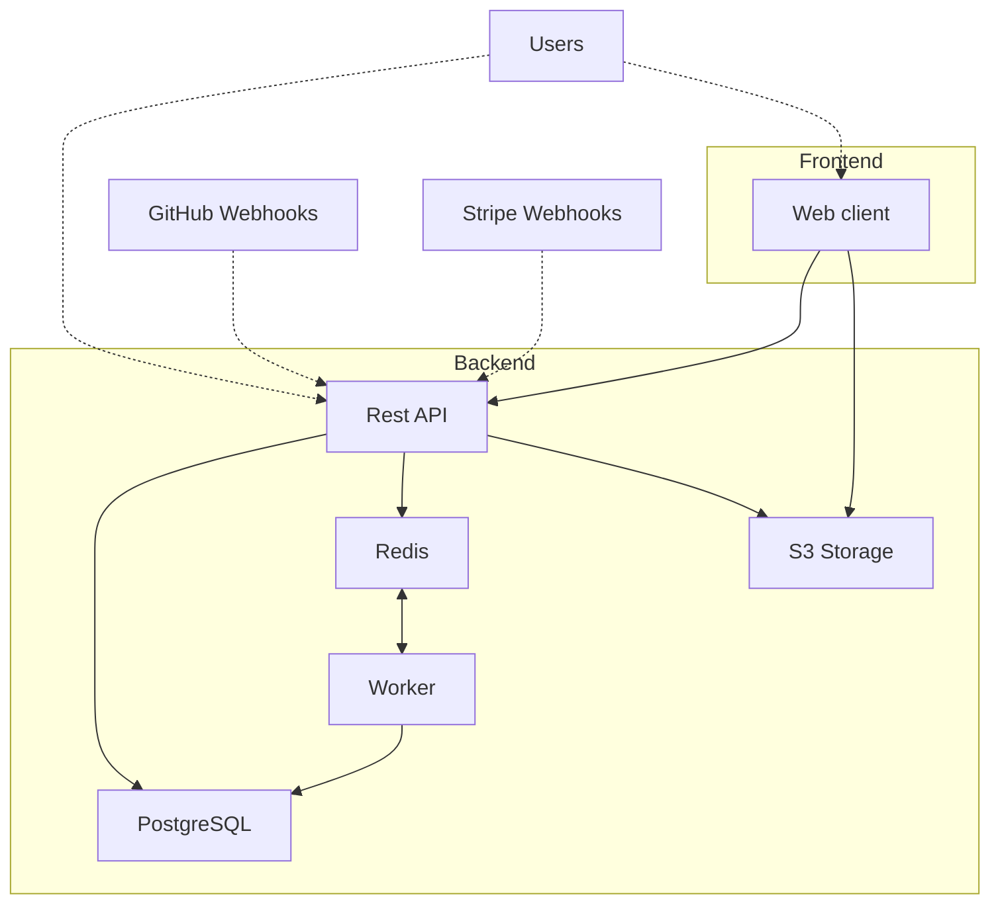

# Development

Polar's stack consist of the following elements:

* A backend written in Python, exposing a REST API and workers;
* A frontend written in JavaScript;
* A PostgreSQL database;
* A Redis database;
* A S3-compatible storage.



## Prerequisites

Polar needs a [Python 3.12](https://www.python.org/downloads/) and [Node.js 18](https://nodejs.org/en/download/package-manager) installations.

## Setup environment

> [!TIP]
> Want to get started quickly? Use GitHub Codespaces.
>
> [](https://codespaces.new/polarsource/polar?machine=standardLinux32gb)

### Setup environment variables

For the Polar stack to run properly, it needs quite a bunch of settings defined as environment variables. To ease things, we provide a script to bootstrap them. It requires [uv](https://docs.astral.sh/uv/getting-started/installation/) to be installed on your system.

```sh
./dev/setup-environment.py
```
Once done, the script will automatically create `server/.env` and `clients/apps/web/.env.local` files with the necessary environment variables.

**Optional: setup GitHub App**

If you want to work with GitHub login and issue funding, you'll need to have a [GitHub App](https://docs.github.com/en/apps/creating-github-apps/about-creating-github-apps/about-creating-github-apps) for your development environment. Our script is able to help in this task by passing the following parameters:

```sh
./dev/setup-environment.py --setup-github-app --backend-external-url mydomain.ngrok.dev
```

Note that you'll need a valid external URL that'll route to your development server. For this task, we recommend to use [ngrok](https://ngrok.com/).

Your browser will open a new page and you'll be prompted to **create a GitHub App**. You can just proceed, all the necessary configuration is already done automatically. The script will then add the necessary values to the environment files.

> [!TIP]
> If you run on **GitHub Codespaces**, you can just run it like this:
> ```sh
> ./dev/setup-environment.py --setup-github-app
> ```
> The script will automatically use your external GitHub Codespace URL.

**Optional: setup Stripe**

Currently, this setup script doesn't support to create a [Stripe Sandbox](https://docs.stripe.com/sandboxes). If you want a ready-to-use Stripe Sandbox, contact us and we'll happily provide you one.

### Setup backend

> [!TIP]
> If you run on **GitHub Codespaces**, you can **skip this step**. This is already done for you.

Setting up the backend consists of basically three things:

**1. Start the development containers**

This will start PostgreSQL, Redis and Minio (S3 storage) containers. You'll need to have [Docker](https://docs.docker.com/get-started/) installed.

```sh
cd server
```

```sh
docker compose up -d
```

**2. Install Python dependencies**

We use [uv](https://docs.astral.sh/uv/) to manage our Python dependencies. Make sure it's installed on your system.

```sh
uv sync
```

### Setup frontend

> [!TIP]
> If you run on **GitHub Codespaces**, you can **skip this step**. This is already done for you.

**1. Install JavaScript dependencies**

We use [pnpm](https://pnpm.io/installation) to manage our JavaScript dependencies. Make sure it's installed on your system.

```sh
cd clients
```

```sh
pnpm install
```

## Start environment

> [!TIP]
> Use several terminal tabs to run things in parallel.

### Start backend

The backend consists of an API server, a general-purpose worker and a worker dedicated to GitHub synchronization. You can run them like this:

```sh
cd server
```

**1. Apply the database migrations**

```sh
uv run task db_migrate
```

> [!NOTE]
> You don't necessarily need to run it each time you start the server, but it's a good idea to regularly do it nonetheless.

**2. Start server and workers**

```sh
uv run task api
```

```sh
uv run task worker
```

By default, the API server will be available at [http://127.0.0.1:8000](http://127.0.0.1:8000).

> [!TIP]
> The processes will restart automatically if you make changes to the code.

### Start frontend

The frontend mainly consist of a web client server, plus other projects useful for testing or examples. You can run them like this:

```sh
cd clients
```

```sh
pnpm run dev
```

By default, the web client will be available at [http://127.0.0.1:3000](http://127.0.0.1:3000).

> [!TIP]
> The processes will restart automatically if you make changes to the code.

> [!NOTE]
> On **GitHub Codespaces**, both API backend and web frontend will be routed on the 8080 port.
