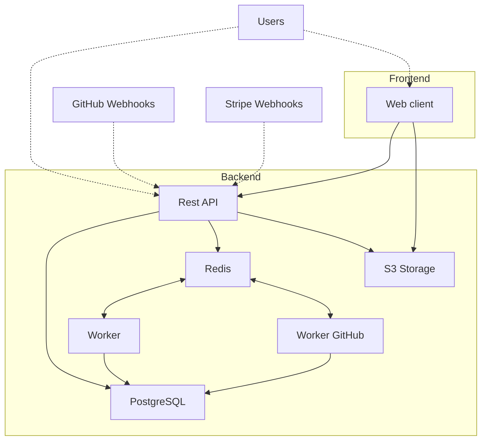

# Development

Polar's stack consists of the following elements:

- A backend written in Python, exposing a REST API and workers
- A frontend written in JavaScript
- A PostgreSQL database
- A Redis database
- An S3-compatible storage



## Prerequisites

Polar needs a [Python 3](https://www.python.org/downloads/) and [Node.js 22](https://nodejs.org/en/download/package-manager) installations.

## Setup environment

> [!TIP]
> Want to get started quickly? Use GitHub Codespaces.
>
> [](https://codespaces.new/polarsource/polar?machine=standardLinux32gb)

### Setup environment variables

For the Polar stack to run properly, it needs quite a bunch of settings defined as environment variables. To ease things, we provide a script to bootstrap them. It requires [uv](https://docs.astral.sh/uv/getting-started/installation/) to be installed on your system.

```sh
./dev/setup-environment
```

Once done, the script will automatically create `server/.env` and `clients/apps/web/.env.local` files with the necessary environment variables.

**Optional: setup GitHub App**

If you want to work with GitHub login and issue funding, you'll need to have a [GitHub App](https://docs.github.com/en/apps/creating-github-apps/about-creating-github-apps/about-creating-github-apps) for your development environment. Our script is able to help in this task by passing the following parameters:

```sh
./dev/setup-environment --setup-github-app --backend-external-url https://mydomain.ngrok.dev
```

Note that you'll need a valid external URL that'll route to your development server. For this task, we recommend to use [ngrok](https://ngrok.com/).

Your browser will open a new page and you'll be prompted to **create a GitHub App**. You can just proceed, all the necessary configuration is already done automatically. The script will then add the necessary values to the environment files.

> [!TIP]
> If you run on **GitHub Codespaces**, you can just run it like this:
>
> ```sh
> ./dev/setup-environment --setup-github-app
> ```
>
> The script will automatically use your external GitHub Codespace URL.

**Optional: setup Stripe**

> [!NOTE]
> Some functions, such as product creation, may not work as expected due to missing Stripe environment variables.

If you want to work with payments and subscriptions, you'll need to set up a Stripe development environment:

1. **Create a Stripe account** at [https://dashboard.stripe.com/register](https://dashboard.stripe.com/register)

2. **Enable billing** in your Stripe account by visiting [Stripe Billing Starter Guide](https://dashboard.stripe.com/billing/starter-guide)

3. **Copy your API keys** from the [Stripe API Keys page](https://dashboard.stripe.com/test/apikeys) and add them to your `server/.env` file:

    ```
    STRIPE_SECRET_KEY=sk_test_...
    STRIPE_PUBLISHABLE_KEY=pk_test_...
    ```

4. **Create a webhook endpoint** to handle Stripe events:
    - Go to [Stripe Webhooks](https://dashboard.stripe.com/test/webhooks)
    - Click "Add endpoint"
    - Set the endpoint URL to: `https://your-domain.ngrok-free.app/v1/integrations/stripe/webhook`
    - Set enabled events to: `*` (all events)
    - Set API version to: `2025-02-24.acacia`
    - Copy the webhook signing secret and add it to your `server/.env` file:
        ```
        STRIPE_WEBHOOK_SECRET=whsec_...
        ```

### Setup backend

> [!TIP]
> If you run on **GitHub Codespaces**, you can **skip this step**. This is already done for you.

Setting up the backend consists of basically three things:

**1. Start the development containers**

This will start PostgreSQL, Redis and Minio (S3 storage) containers. You'll need to have [Docker](https://docs.docker.com/get-started/) installed.

```sh
cd server
```

```sh
docker compose up -d
```

**2. Install Python dependencies**

We use [uv](https://docs.astral.sh/uv/) to manage our Python dependencies. Make sure it's installed on your system.

```sh
uv sync
```

### Setup frontend

> [!TIP]
> If you run on **GitHub Codespaces**, you can **skip this step**. This is already done for you.

**1. Install JavaScript dependencies**

We use [pnpm](https://pnpm.io/installation) to manage our JavaScript dependencies. Make sure it's installed on your system.

```sh
cd clients
```

```sh
pnpm install
```

## Start environment

> [!TIP]
> Use several terminal tabs to run things in parallel.

### Start backend

The backend consists of an API server, a general-purpose worker and a worker dedicated to GitHub synchronization. You can run them like this:

```sh
cd server
```

**1. Build email binary**

```sh
uv run task emails
```

> [!NOTE]
> If you're in local development, you should build the email renderer binary, as it's required for first time.

**2. Apply the database migrations**

```sh
uv run task db_migrate
```

> [!NOTE]
> You don't necessarily need to run it each time you start the server, but it's a good idea to regularly do it nonetheless.

**3. Start server and workers**

```sh
uv run task api
```

```sh
uv run task worker
```

By default, the API server will be available at [http://127.0.0.1:8000](http://127.0.0.1:8000).

> [!TIP]
> The processes will restart automatically if you make changes to the code.

### Start frontend

The frontend mainly consists of a web client server, plus other projects useful for testing or examples. You can run them like this:

```sh
cd clients
```

```sh
pnpm dev
```

By default, the web client will be available at [http://127.0.0.1:3000](http://127.0.0.1:3000).

> [!TIP]
> The processes will restart automatically if you make changes to the code.

> [!NOTE]
> On **GitHub Codespaces**, both API backend and web frontend will be routed on the 8080 port.

## Docker-Based Development (Alternative)

For a fully containerized development environment with hot-reloading, you can use the Docker-based setup. This is useful for:

- Running multiple isolated instances for testing
- Consistent environments across different machines
- AI agents that need isolated development environments

### Quick Start

```sh
./dev/docker-dev
```

This single command will:
1. Build the necessary Docker images
2. Start PostgreSQL, Redis, and MinIO
3. Install Python and Node.js dependencies
4. Run database migrations
5. Start the API server, worker, and web frontend with hot-reloading

### Access Points

| Service | URL |
|---------|-----|
| Web Frontend | http://localhost:3000 |
| API Server | http://localhost:8000 |
| MinIO Console | http://localhost:9001 |

### Common Commands

```sh
# Start in background (detached mode)
./dev/docker-dev -d

# View logs
./dev/docker-dev logs

# View logs for specific service
./dev/docker-dev logs api

# Stop all services
./dev/docker-dev down

# Rebuild images
./dev/docker-dev -b

# Open shell in container
./dev/docker-dev shell api

# Include monitoring (Prometheus + Grafana)
./dev/docker-dev --monitoring
```

### Running Multiple Instances

For parallel development or testing, you can run multiple isolated instances:

```sh
# Instance 0 (default): API on 8000, Web on 3000
./dev/docker-dev -d

# Instance 1: API on 8100, Web on 3100
./dev/docker-dev -i 1 -d

# Instance 2: API on 8200, Web on 3200
./dev/docker-dev -i 2 -d
```

Each instance has its own:
- Docker containers and networks
- PostgreSQL database
- Redis instance
- MinIO storage

### Port Mapping

| Service | Instance 0 | Instance 1 | Instance 2 |
|---------|------------|------------|------------|
| API | 8000 | 8100 | 8200 |
| Web | 3000 | 3100 | 3200 |
| PostgreSQL | 5432 | 5532 | 5632 |
| Redis | 6379 | 6479 | 6579 |
| MinIO API | 9000 | 9100 | 9200 |
| MinIO Console | 9001 | 9101 | 9201 |

### Hot-Reloading

The Docker setup supports hot-reloading:

- **Backend (API)**: Uses uvicorn with `--reload` flag
- **Backend (Worker)**: Uses dramatiq with `--watch` flag
- **Frontend (Web)**: Uses Next.js with Turbopack

Code changes on your host machine are immediately reflected in the running containers.

### Configuration

The Docker environment uses `dev/docker/.env.docker` for configuration. To customize:

```sh
# Copy template (done automatically on first run)
cp dev/docker/.env.docker.template dev/docker/.env.docker

# Edit as needed
vim dev/docker/.env.docker
```

> [!NOTE]
> The Docker-based setup is additive. The traditional host-based development workflow (`docker compose up -d` + `uv run task api`) continues to work as before.

## Login using email

To log in for the first time, follow these steps:

1. Navigate to the login page.
2. Enter your email address in the provided field.
3. Click the "Login" button.
4. Check the terminal where the API is running (`uv run task api`) to get the OTP code.
5. Enter the OTP code in the login form.
