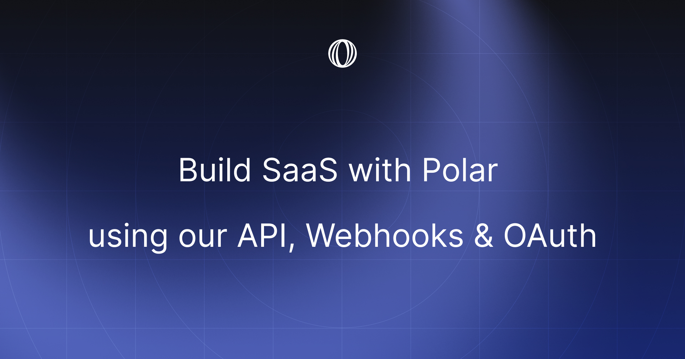
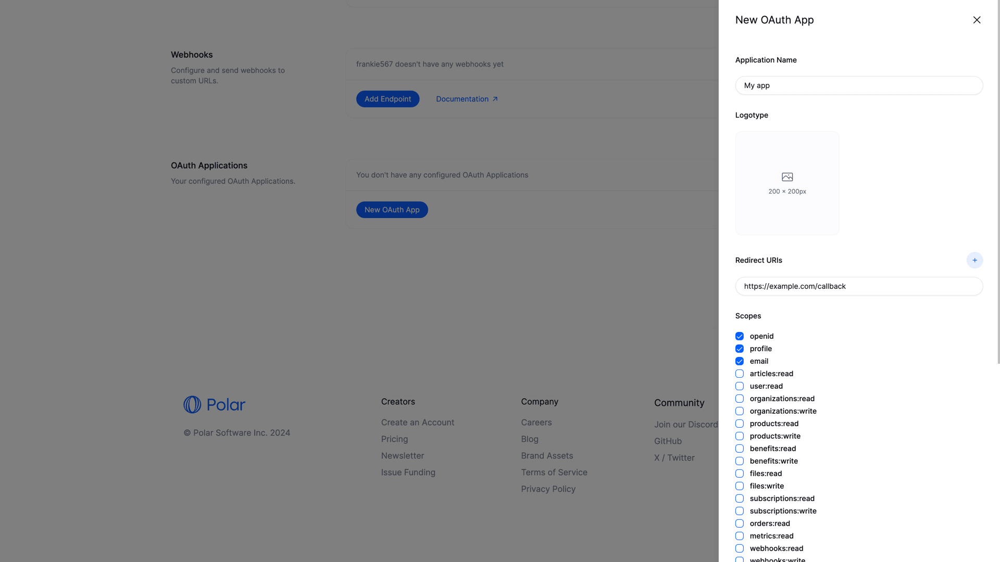
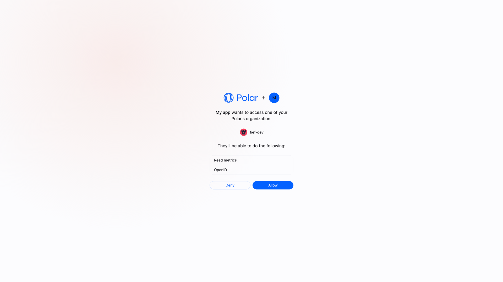
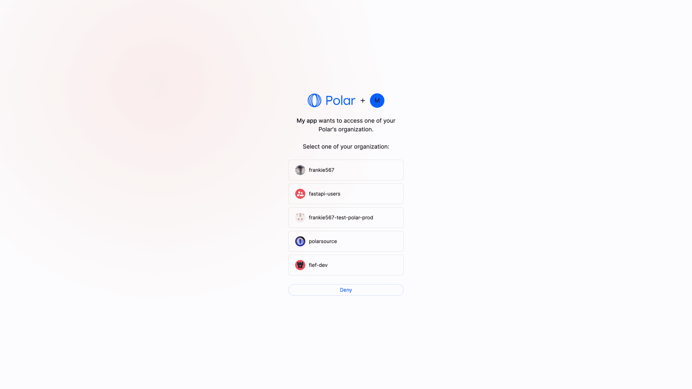
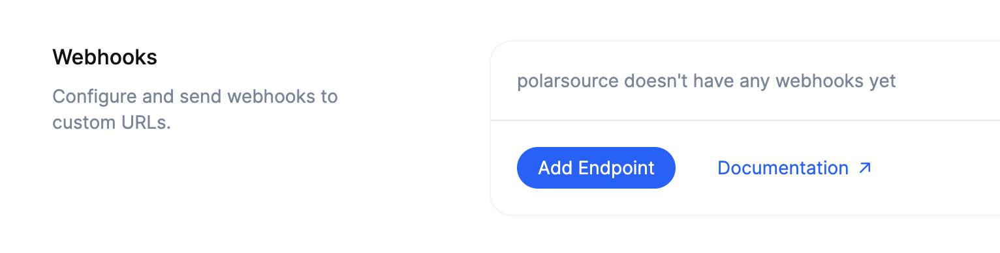
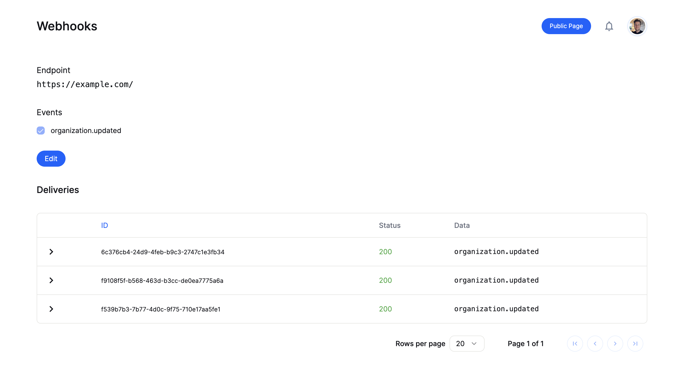

# Build SaaS with Polar using our API, Webhooks & OAuth



Our mission at Polar is for developers to get paid coding on their passions. Empowering open source- and indie developers to build independent careers and businesses. All the way from first donation to IPO.

Today, we're introducing OAuth & Webhooks to support developers to build custom community- and customer experiences across their docs, sites and services. 

Enabling use cases like:
- Celebrate & reward sponsors, donors & issue backers on your sites
- Grant access to online courses
- Unlock premium content for subscribers
- Enable cloud services for customers

We can't wait to see what you build 🚀 Have an exciting idea and want to build it open source? Join our Discord and let's chat - we'd love to sponsor a few promising efforts ♥️

--------------

### OAuth 2.0 with OpenID Connect support

Polar is now an OAuth 2.0 provider with OpenID Connect support to automatically work with existing - compatible - clients using our discovery endpoint: `https://api.polar.sh/.well-known/openid-configuration`

Let's start with creating your first Polar OAuth App.

#### Create Polar OAuth App



1. Go to your [user settings](https://polar.sh/settings)
2. Scroll down to the `Developer Settings` section
3. Click `New OAuth App`
4. Set the `Application Name`, `Redirect URIs`, `Homepage URL` and select desired `Scopes`.
5. Optional: Add a `Logotype` and link to your custom `Terms of Service` & `Privacy Policy` for the application.
6. Click `Create`. 
7. Store the given `Client ID` and `Client Secret` somewhere safe & secret.


You're now ready to integrate the Polar OAuth App 🎉 [Follow our complete integration guide here](https://polar.sh/docs/api-reference/authentication).

#### User Authentication Flow

Your docs, site or services can now authenticate users with their Polar account to gain access to their profile, subscriptions, orders, granted benefits and more. All you need to build completely custom experiences for your community members, sponsors and customers.



Just redirect users to the generated OAuth `authorize` URL and they'll be able to grant the permissions requested before being redirected back to your `redirect_uri` with an authorization code.

You then exchange it for an access token `polar_at_XXX` and you're ready to make API requests.

```curl
curl -X GET https://api.polar.sh/api/v1/oauth2/userinfo \
  -H 'Authorization: Bearer polar_at_XXX'
```
#### Organization Authentication Flow

We also support authenticating an organization similar to GitHub. Admins will then be prompted to grant access for a specific organization they manage.



Great, that covers synchronous requests, but what about asynchronous updates? Polling is so 2010.

### Webhooks

Polar supports the following Webhook events (with more to come):
- `subscription.created`
- `subscription.updated`
- `product.created`
- `product.updated`
- `benefit.created`
- `benefit.updated`
- `organization.updated`
- `pledge.created`
- `pledge.updated`
- `donation.created`

We follow the [Standard Webhook](https://www.standardwebhooks.com/) guidelines to make integration intuitive and familiar. [Checkout our docs](https://polar.sh/docs/api-reference/webhooks) for integration details and payload schemas for the available events.

#### Add Webhook Endpoint(s)


1. Go back to your [Developer Settings](https://polar.sh/settings)
2. Click `Add Endpoint` in the `Webhooks` section
3. Set the endpoint `URL`, `Secret` (for webhook validation) and the events you want to subscribe to.

That's it. Get ready to start receiving webhooks for the requested events 😍

#### Delivery Log


We also provide a delivery overview for each Webhook Endpoint URL to make development easy. So you can debug historic webhooks sent along with their entire payload.

> [!NOTE]
> This is meant to aid development or debugging recent production issues vs. be an all-time historic database. Don't rely on more than 24-48h worth of history in the future. 

### API & Docs (beta)  🏗️

Our ambition is to make the Polar REST API world-class with innovative documentation features and outstanding content. It's going to be our #1 product with Polar itself being an excellent [open source example](https://github.com/polarsource/polar) of how to integrate all of it's capabilities.

So we've committed to something crazy... We're building our own docs engine to support the groundbreaking DX features we have in mind. Combined with updating our API endpoints to be :chef-kiss:

We're building it in public and [open source](https://github.com/polarsource/polar) (as always). Over the coming months a lot is going to be improved with our current docs (early iteration in need of love and content) and API. So make sure to join our [Discord](https://discord.gg/MUwRRvV5UQ) for continuous updates and integration support as needed in the meantime.

### Sponsoring Open Source Integration Kits

We love open source at Polar. Do you have an exciting idea for an integration use case and want to build it open source? We'd love to chat with you as we're excited to sponsor a few developers and use cases. Join our [Discord](https://discord.gg/MUwRRvV5UQ) and let's explore!

We're going to do a lot more of this towards the autumn too 😎
