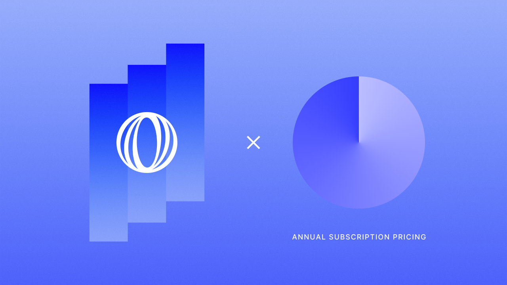
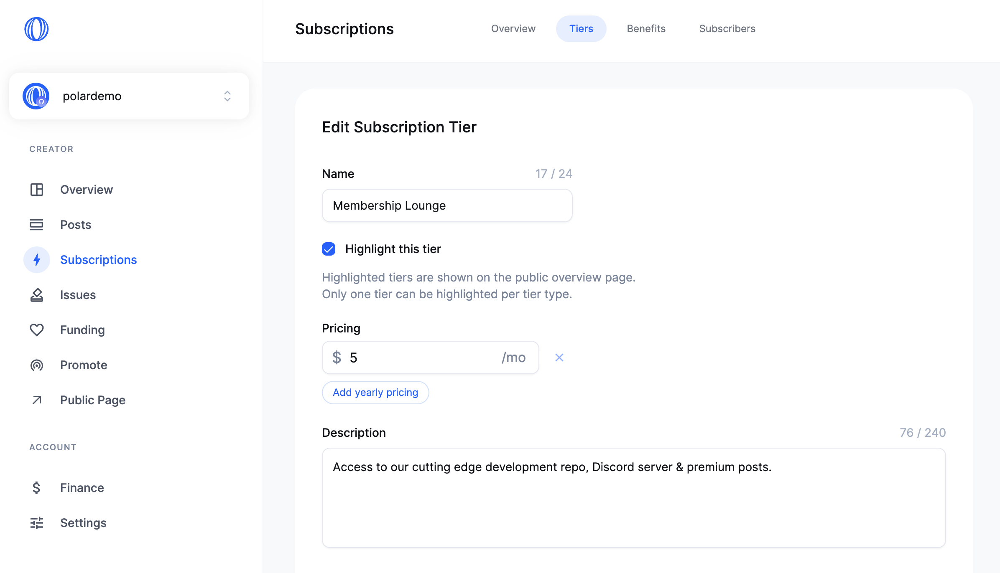
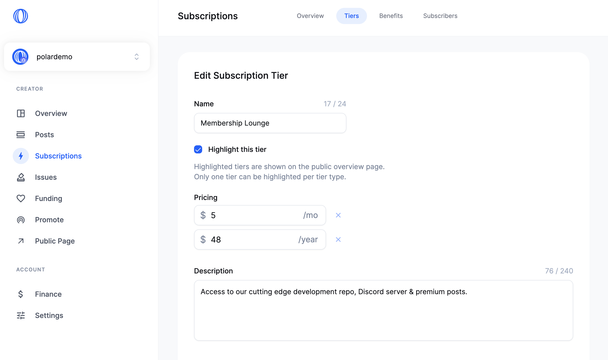
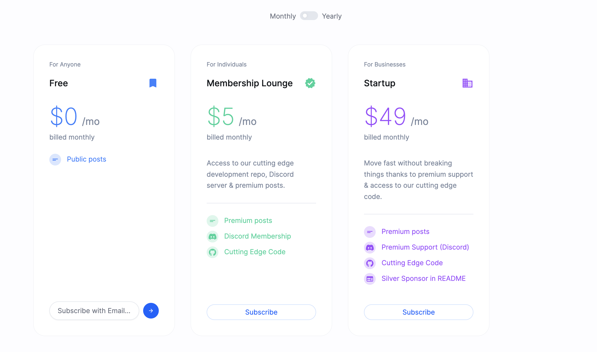
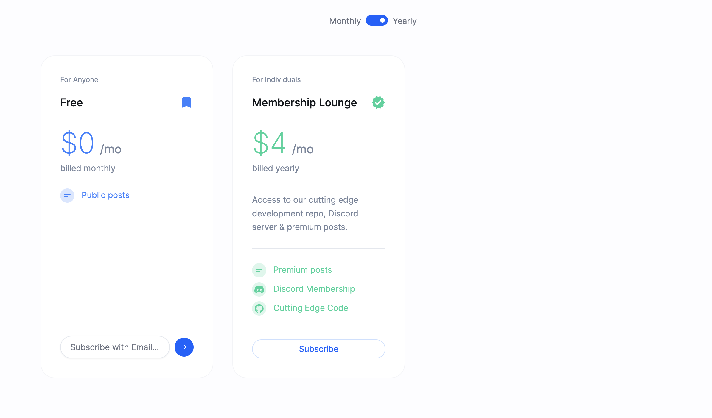
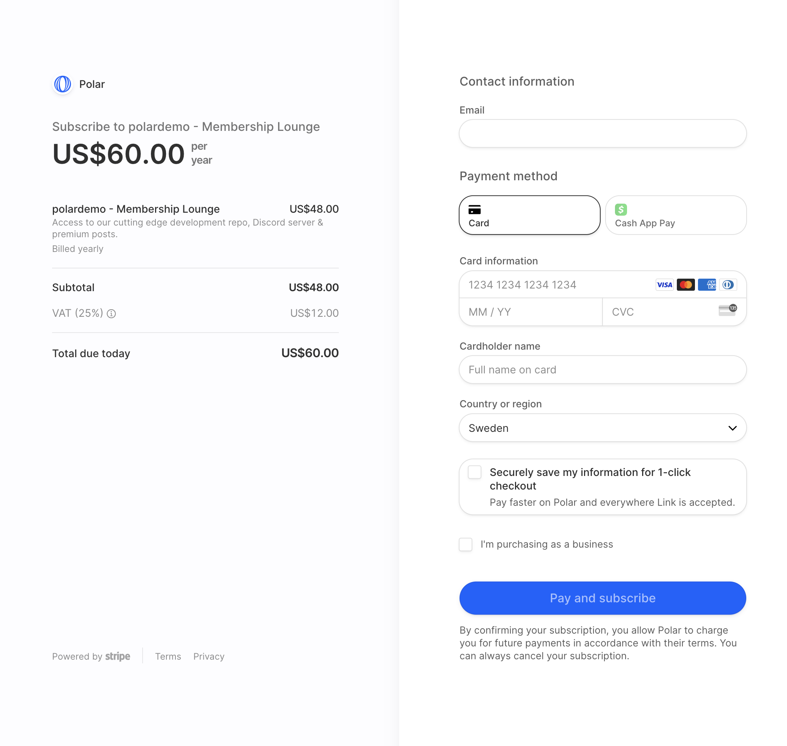
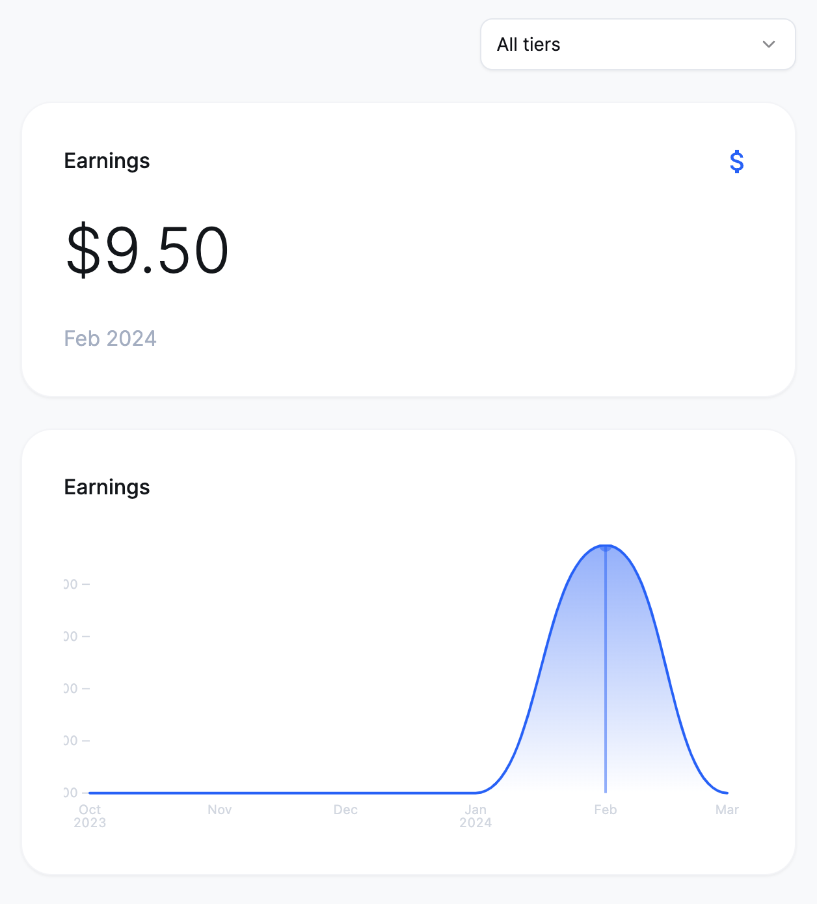

# Introducing Annual Subscriptions

Great news: You can now offer annual subscriptions with Polar 🌍↺🌞

Up until now, subscriptions have only been monthly. Today, we're introducing the ability to setup subscription tiers to be priced monthly, annually or both - offering complete flexibility.

It's been a highly requested feature lately so we're delighted to introduce it today - let's take a look at how it works. 

----

### Setup annual prices

Let's edit one of our existing subscription tiers at $5/month to be $48/year - offering a classic 20% discount.

You'll notice a new button above: `Add yearly pricing`. Clickety, click, click.

Now we can enter `48`, hit `Save` and we're done. Our first annual subscription tier.

**Annual only?**

Next to each price point (monthly or annually) there's an ❌-button. Just click it to remove that offering and hit `Save`. 

Making it entirely possible to offer annual-only tiers. Just like existing tiers are only offered at a monthly price until you specifically add annual prices.

### Offering more choices to subscribers

Subscribers can then easily toggle subscription tiers to show monthly or annual pricing with monthly as the default.

Once I switch to `Yearly` the tiers are updated instantly.

Wait, where did the third tier go? Since it only offered a monthly plan, it was automatically hidden to only showcase available options for the users desired billing plan.

**How do they pay?**

Subscribers pay the amount upfront and in full. So either $5 for the upcoming month from today or $48 for the upcoming year. Including potential sales taxes or value-added tax (VAT), e.g 25% for a Swede like me.

They can choose their desired billing plan for each subscription, i.e pay annually towards one organization and monthly to another individual developer.

### From MRR to Earnings

Up until now, we showed MRR insights within your Polar dashboard. It's now called _Earnings_ instead since it can include upfront annual subscriptions too.

We could have shown annual subscriptions in terms of their relative monthly contribution to stick with MRR. However, we decided ([GitHub Discussion](https://github.com/polarsource/polar/issues/2534)) it would only be confusing and cause cognitive overload. It's better to show earnings that map to real cash flow and what's available to withdraw.

### Just getting started

We're thrilled to introduce this feature today since it's been highly requested. However, we can already hear you thinking: What about...
- Pay once, i.e products (merchandise, downloads, license keys etc)
- One off donations
- ... and more

Well, let's just say that we won't disappoint in the coming months ahead 😉

After all, our mission is to build a platform empowering open source- and indie developers to get paid working on their passions. So it's in our wheelhouse. On that note...

### PS. Polar is an official GitHub funding option now

Make sure to link your Polar page on GitHub - we're an official funding option on GitHub since February 15th 🎉 It's super easy and only takes a minute - [checkout the GitHub docs on how](https://docs.github.com/en/repositories/managing-your-repositorys-settings-and-features/customizing-your-repository/displaying-a-sponsor-button-in-your-repository)

Also if you love our mission and the product we're building, we'd highly appreciate you sharing it with friends, followers & collaborators. Be it on Mastodon, Twitter, GitHub or AFK. We're building Polar [open source](https://github.com/polarsource/polar) and want the entire community to be a part of shaping the the long-term product. So we greatly appreciate & welcome social shares ♥️🐻‍❄️

We're here to serve.

Until next time,
The Polar Team

