# Introducing Digital Products

Today, we're thrilled to announce two big - new - features towards our vision of building the all-in-one funding & monetization platform for developers.

**Products.** Sell your digital services and goods for a pay once price vs. subscriptions only. There is no limit to what you can sell and our built-in benefits make it super easy to offer:
- Access to private GitHub repo(s)
- Discord invites & roles
- Premium- or early access newsletter content
- Newsletter sponsorship (ads)
- Secret links & messages
- Custom integrations & logic (API & SDK)
- and...

**File Downloads.** From educational material (.pdf), books (.epub), zip, tarballs to full-fledged applications and executables (.dmg, .flatpak, .exe). Upload any files (10GB each) you want customers and subscribers to gain access to. SHA256 checksum validation is done throughout and exposed to customers for peace of mind before running that executable.

**Worried about VAT & Sales Tax? We got you covered.** We're the merchant of record and deal with accountants and international tax authorities so you don't have to.

-----------

### Create a product

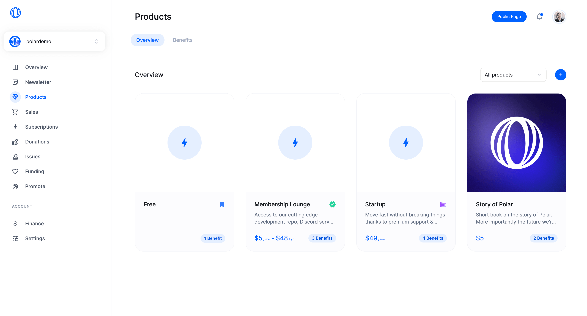

1. Go to `Products` in your Polar dashboard
2. Click `+` to create a new product

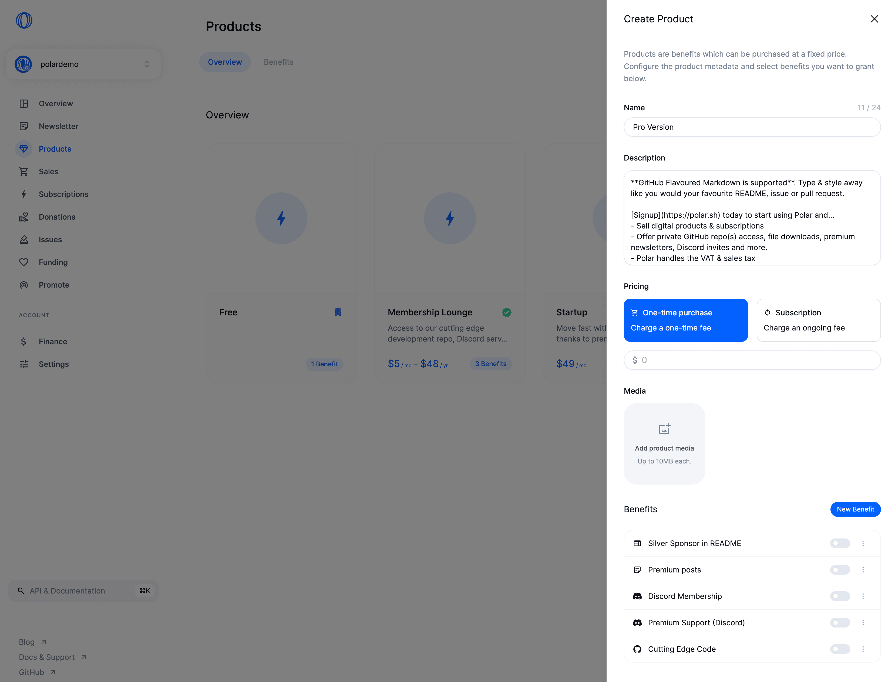

1. Give it a name
2. Write a description (GitHub flavoured markdown supported)
3. How do you want to charge for it? `One-time purchase` or `Subscription` (monthly/annually). Let's go with pay once.
4. Set the price (USD)

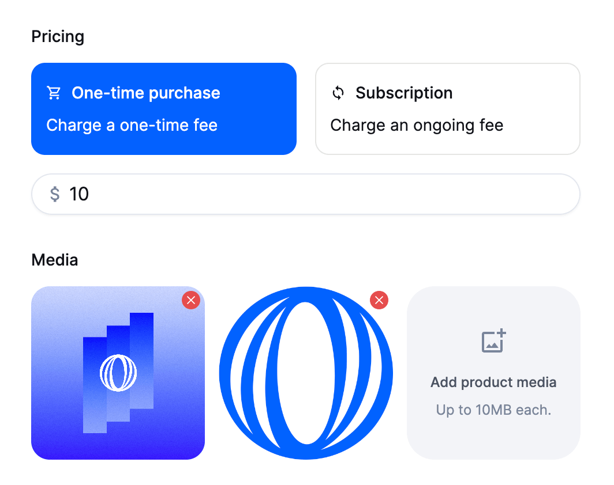

Upload image assets to showcase your product and to trigger some "shut up and take my money"-vibes. First image will be used as the cover.

**New:** Product media is supported for subscription tiers too. _They are shown on the product page and not across tier upsells on your Polar page._

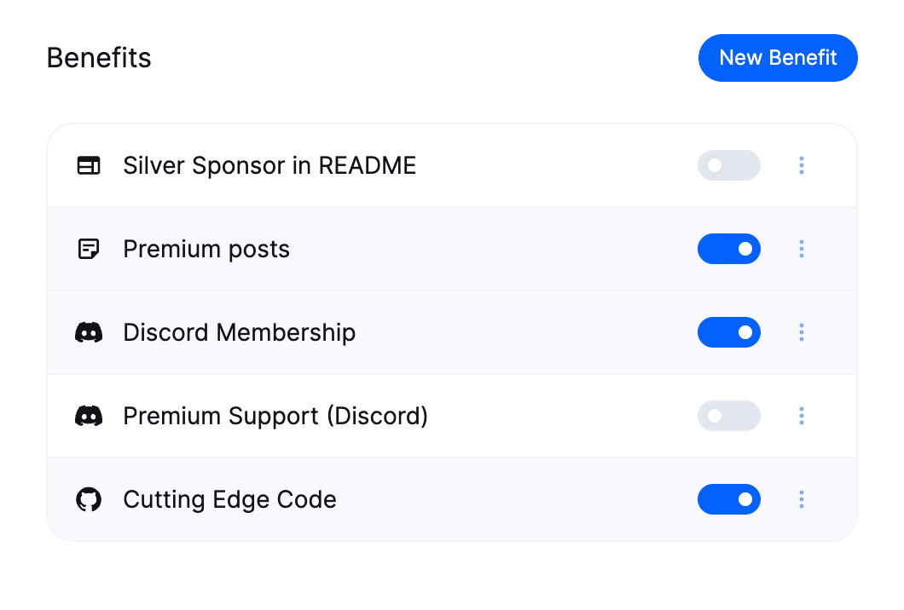

You can select existing benefits to enable for buyers of this product. Let's go with:
- Private GitHub repo(s) access
- Premium newsletter access
- Discord membership

Of course, let's also create a new one: File Downloads.

### Upload & manage downloadable files

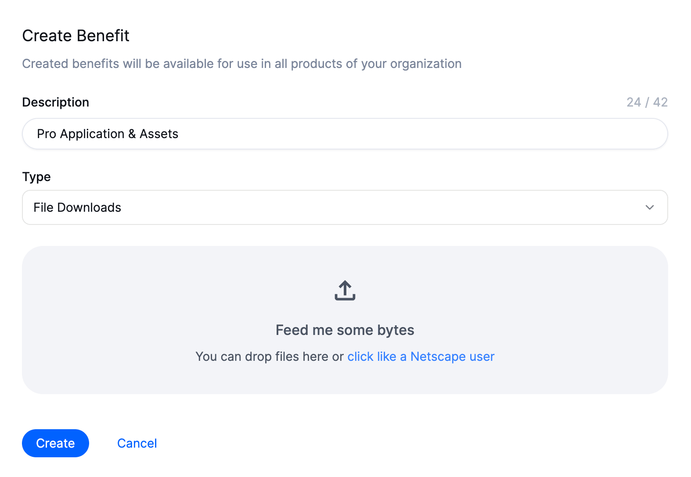
1. Click `New benefit` within the product management view
2. Write a short description (shown to potential buyers)
3. Choose `File Downloads` as the type
4. Click the dropzone (Netscape for life) and select 1 or more files to upload

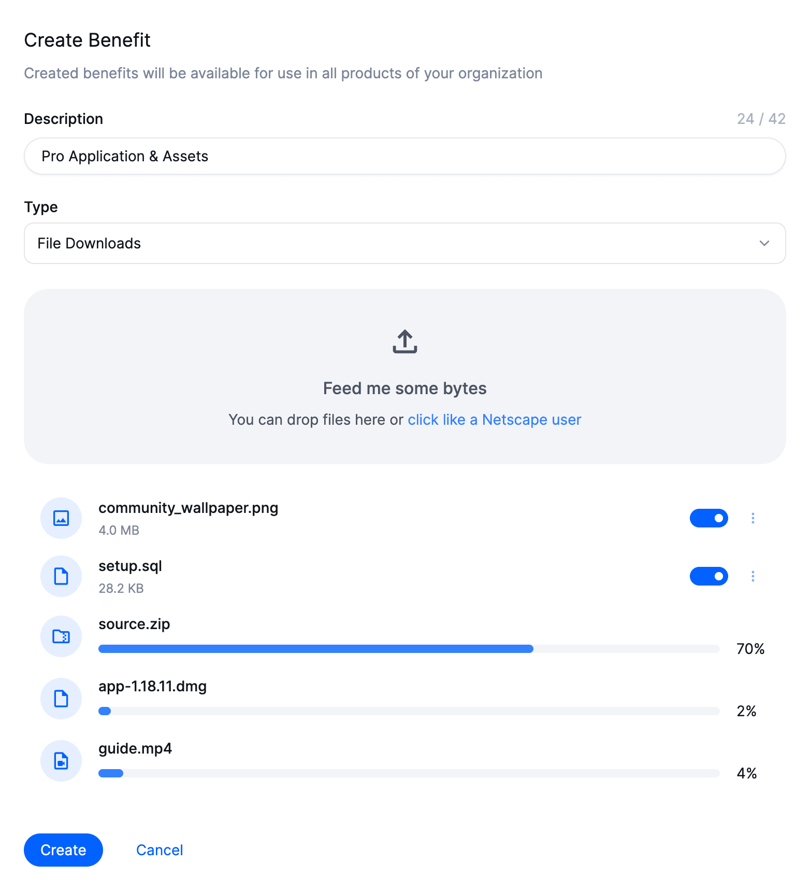
- Click on the filenames to rename them (if desired)
- Drag & drop on the file icons to change their order
- You can also disable files for new subscribers & buyers (existing buyers keep legacy access)
- You can click the three dots to open a contextual menu to `Copy SHA256 Checksum` or `Delete` the file.

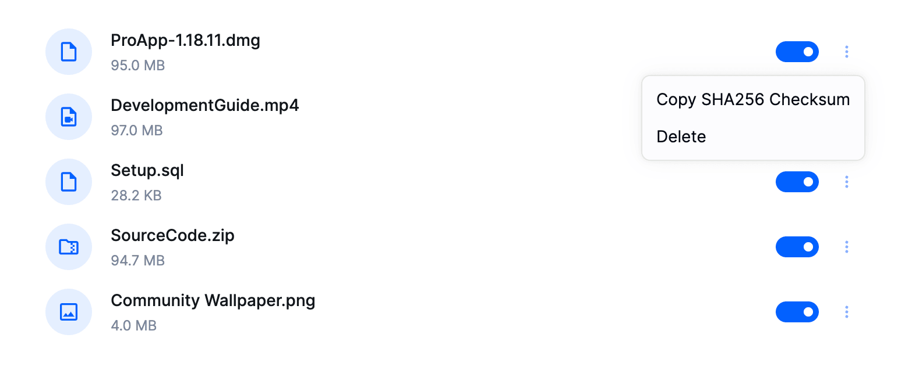

When you're done click `Create` to save the file benefit. Making it enabled for this product by default and available to enable for other products & subscriptions too.

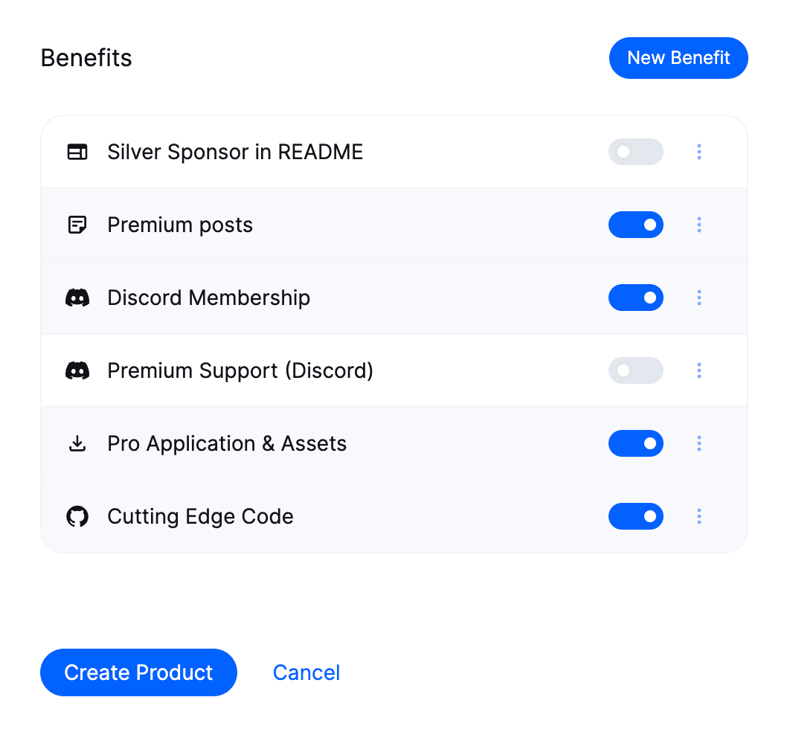

Final review of the product benefits we're offering. Looks great! Time to hit `Create product` and we're done.

### Buyer experience

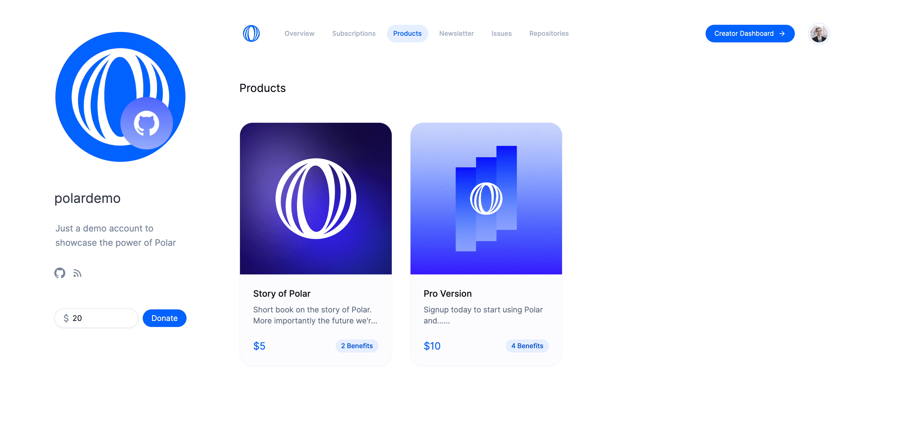

Your Polar page now automatically shows `Products` in the navigation. Showing all the handcrafted digital products, services & benefits you offer to your community or commercial customers.

> [!TIP]
> Link your Polar page in a [GitHub FUNDING.yaml](https://docs.github.com/en/repositories/managing-your-repositorys-settings-and-features/customizing-your-repository/displaying-a-sponsor-button-in-your-repository) - we're an official funding partner so your page will be beautifully linked with your repositories.

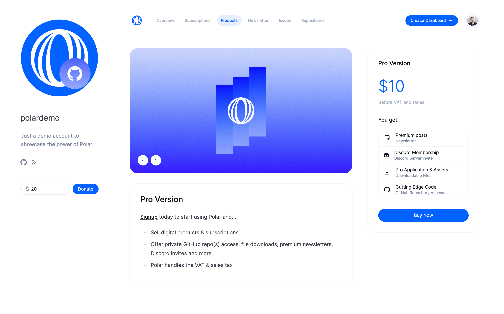

Each product has it's own dedicated page too. Showing all the images in a carousel, full GitHub flavoured markdown description and all the benefit details.

> [!TIP]
> **Want to integrate Polar on your own site or service instead?** You can use our API & TS SDK to easily integrate everything we have to offer. Just like [Your Next Store](https://yournextstore.com/) has on their gorgeous - custom - page. 

Once users click `Buy Now` they're redirected to our checkout. It's hosted with Stripe (soon an embeddable checkout without redirects) offering a wide range of payment methods internationally.

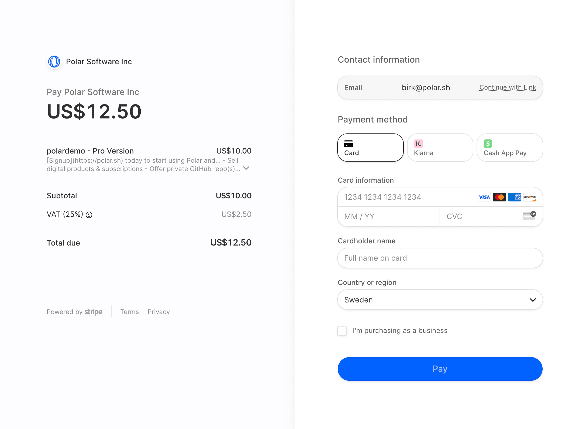

You'll notice VAT being added if necessary and automatically captured & remitted by Polar with the local tax authorities.

So you can focus on your passion - we'll handle the infrastructure to get you paid.

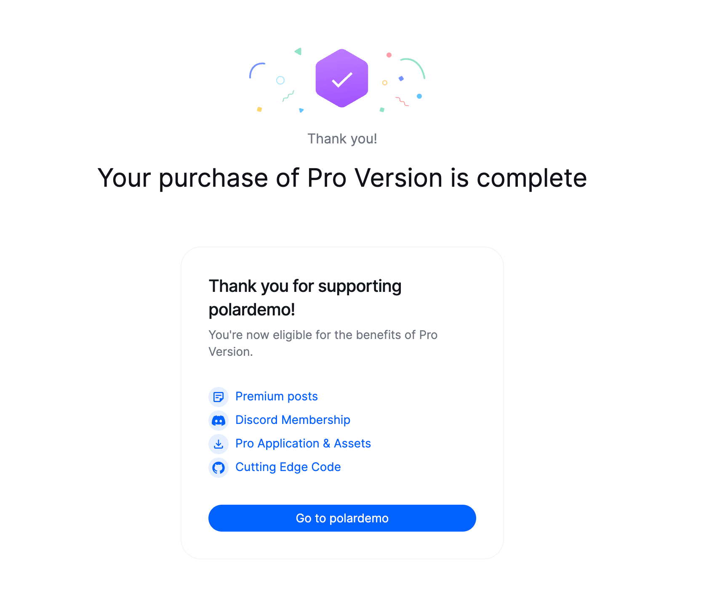

Now customers can access all their products & subscriptions through their Polar profile.

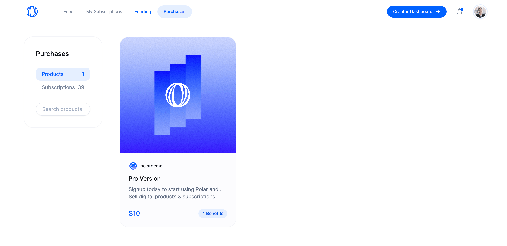

Seeing the full product-, payment- and invoice details and of course having seamless access to all the available benefits.

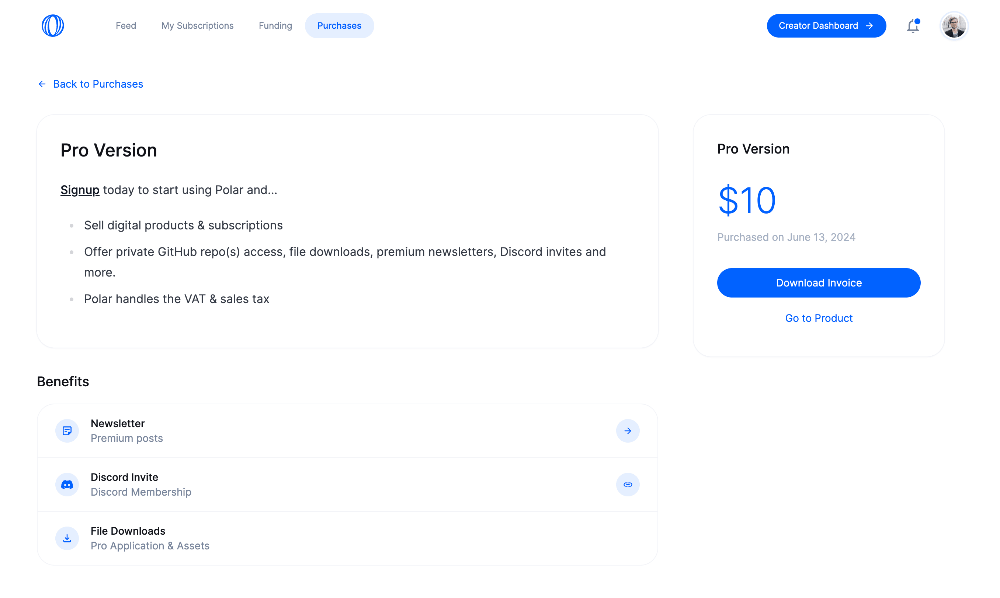

Customers or community members can now easily download the files and access the SHA256 checksum if they want to verify the download. 

### Future enhancements

Polar is built entirely [open source](https://github.com/polarsource/polar). Below are some of the relevant GitHub issues we have planned in the near-term.
- Support versioning of files [(#3456)](https://github.com/polarsource/polar/issues/3456).
- GitHub Action to automate uploading releases
  ($500 reward) [(#3457)](https://github.com/polarsource/polar/issues/3457)
- Pricing: Pay what you want [(#3458)](https://github.com/polarsource/polar/issues/3458)
- Embedded Checkout (no redirect) [(#3248)](https://github.com/polarsource/polar/issues/3248)
- New benefit: License keys [(#3459)](https://github.com/polarsource/polar/issues/3459)

We'd love to hear from you and help support and build for your use case. Join our Discord to chat with us directly or feel free to submit a [GitHub discussion topic](https://github.com/orgs/polarsource/discussions/categories/feature-requests) if you prefer.

### FAQ

**Do I need to manage VAT & sales taxes?**
No. We're the merchant of record and automatically capture & remit sales taxes if required. Of course, your own revenue is still something you personally need to report.

**Can subscribers still access downloadable files after cancelling their subscription?**
No. We automatically revoke their access upon cancellation. 

**Can buyers of products (pay once) ever lose access to files?** 
Only if you explicitly delete the file(s).

**Can I disable file(s) for future buyers without existing customers losing their access?**
Yes. You can easily disable files without deleting them to make them unavailable for future buyers (unless re-activated in the future). Existing customers will still have access to legacy files granted to them.

**Can I upload new versions of an existing file without creating new file entries?**
Not yet, but it's a priority of ours. We want to automate uploads of SemVer versions from GitHub (or elsewhere) and make it a great experience. Stay tuned.

