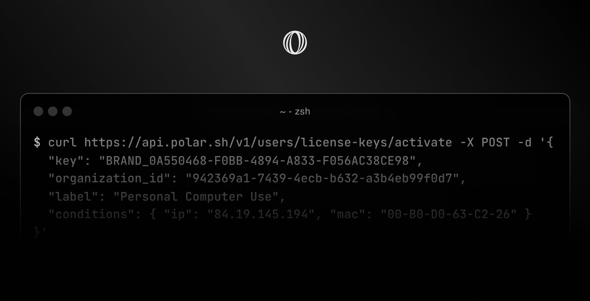

# Introducing License Keys



Today, we're excited to introduce license keys with Polar! 

Making it seamless to sell access to premium software without the headache of managing billing, international sales tax and real-time validations yourself. So you can focus on building your product. Leave the boring stuff to us.

**License keys with Polar offer a lot of powerful features built-in.**

- Custom branding. Set your own prefix, e.g `MYAPP-*****`
- Automatic expiration after N days, months or years
- Limited number of user activations, e.g devices
- Usage quotas per license key
- Custom validation conditions
- Automatic revokation upon cancelled subscriptions


### API

Paired with an easy API to integrate license key validation within your app, product or services. 

```sh
curl -X POST https://api.polar.app/v1/users/license-keys/validate
-H "Content-Type: application/json"
-d '{
  "key": "1C285B2D-6CE6-4BC7-B8BE-ADB6A7E304DA",
  "organization_id": "fda84e25-7b55-4d67-916d-60ead04ff61f",
  "activation_id": "b6724bc8-7ad9-4ca0-b143-7c896fcbb6fe",
  "conditions": { "major_version": 1 },
  "increment_usage": 15
}'
```

The example above also validates a particular activation, e.g device (`activation_id`), and custom `conditions` scoped to that activation. All optional. You could simplify validation to the license key only.

[Read more](https://docs.polar.sh/benefits/license-keys) about how to setup license key benefits across your products & integrating them within your apps & services.

We can't wait to see what you ship! Don't hesitate to reach out with any questions or feedback you might have.