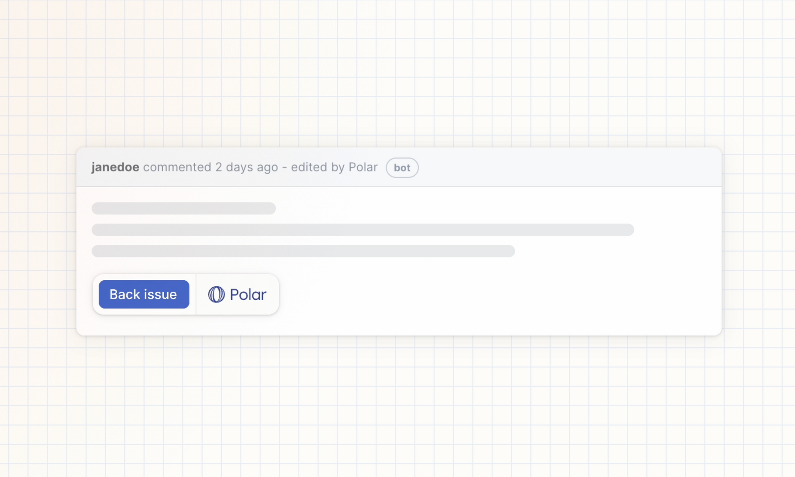
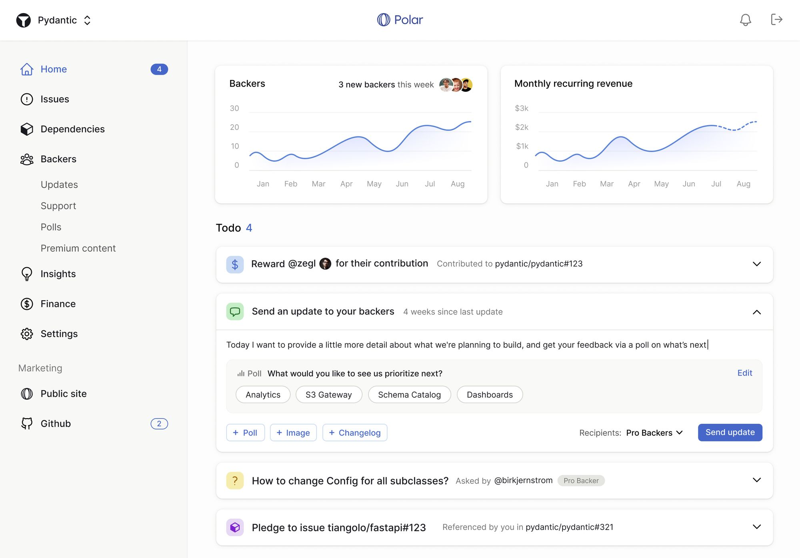

# Polar v1.0: Let’s Fix Open Source Funding

Today, we’re thrilled to share our v1.0 goals with [Polar](https://polar.sh/?ref=blog.polar.sh) and announce our $1.8M pre-seed round to help us pursue our mission of expanding the open source economy.

Open source is the greatest lever ever for human innovation. Powering all of the products and services that we use and love on a daily basis. Accelerating our ability and velocity to build towards an even better future. Doing it all in the open to push the boundaries of our craft and make knowledge and opportunities accessible to all.

It’s magical. Yet, funding means to strengthen this lever is outdated: Causing unnecessary tension for all parties involved and holding the ecosystem back from its full potential.

### It’s time to move beyond sponsorship & donations

These models standalone made sense last century when software emerged as a nascent industry built by passionate hobbyists for themselves and their peers. Since then, however, software has “eaten the world”. Dramatically increasing the adoption, usage and reliance on open source from individuals, startups to Fortune 500s.

As a result, questions, bug reports and feature requests are no longer rare and from curious peers. It’s now a constant stream creating an endless backlog of inbound issues. For maintainers, it quickly goes from a hobby to a stressful and unpaid side gig. Turning to sponsorship for support since it’s accessible, but getting little to no return. This dynamic of a growing workload with dwindling support is leading to initiatives being abandoned or worse, maintainer burnout.

In order to get meaningful capital, businesses need to invest. They won’t with the current model. Getting them – and most individuals too – to deploy capital at scale requires a narrative around additional and measurable value in return. Sponsorship offers neither: Emphasizing value given vs. ahead.

Yet, demand is clearly growing significantly for support, issues to be fixed and specific features to be built – all tangible, additional and measurable needs. The problem is we can’t leverage it with current models and workflows redirect it toward fueling the fires:

1.  More issues. _Amplifying maintainer pressure and tensions._
2.  Private forks. _Lost opportunities,_ _massively inefficient and a hidden business expense._

It’s a lose-lose. It’s time to fix it.

### Polar v0.1: Converting issues to a funded backlog

Today, Polar offers users the ability to seamlessly pledge behind impactful efforts and maintainers to go beyond chronologically sorted issues to a funded and stack ranked backlog.

Our product is designed to empower maintainers with better insights on what their users want, seek to fund and progress in flight across their community of contributors. All available through our dashboard or directly on GitHub using our Chrome Extension.

Once funded issues are marked completed, maintainers receive 90% of the capital pledged (our commission is 10%). Of course, in case such efforts were achieved together with contributors, maintainers can soon seamlessly split the rewards. Or leverage the capital for community merchandise or meetups to re-investing it behind their own issue dependencies.  

What’s issue dependencies? Whether you’re a maintainer, user or business, Polar offers the ability to easily track all the specific open source issues your own initiatives depend on. By identifying static references to them across internal issues and bringing them to life through our dashboard.

Offering a helicopter view of the state and progress of such dependencies. Making it easy to keep track, plan ahead and seamlessly pledge behind those impactful efforts to support their progress and thereby your own.

We’re just getting started.

### Polar v.1.0: Empowering maintainers to become entrepreneurs

Our goal is to build a platform for open source maintainers to seamlessly set up, operate and scale value-add services and subscriptions to their backers – individuals and businesses alike.

_**Note:** This is a sketch and not a final version of our v1.0 design._

Crafting on-demand and tiered subscription services tailored to suit their initiative, community and their users’ needs. From a suite of offerings such as:

*   **Prioritized issues.** What Polar is today with more to come.
*   **Backer management & communication.** Automated and streamlined promotions, i.e tiered logos on README/Sites, newsletters, polls etc.
*   **Premium support.** Questions, implementation guidance to consultation scheduling etc.
*   **Premium access**. Educational material, roadmap voting, early or private access to repositories and packages and more.
*   **Custom.** We’ll have a Polar API to enable unlimited creativity for other services you might want to build across your domains and other platforms.

All available in a dashboard designed to make managing these services a delightful experience. In combination with insights and marketing tools to help grow them over time.

Of course, this model is not new. Be it through dual-licensing, sponsorware or hosting in combination with professional support, it’s what defines commercial open source software (COSS) & SaaS. That’s great since such examples showcase the success and opportunities of the model. However, creating and maintaining a growing open source initiative in combination with building the infrastructure behind these services on top is a significant investment. So it’s not surprising that it’s almost exclusively deployed by open source companies with funding.

It’s time to change that. Equipping maintainers across the entire ecosystem with the infrastructure to leverage the same model with ease. In order to create an organic pathway toward independent open source entrepreneurship at scale.

That’s what we’re building towards.

  
### Shape Polar v1.0 with us – built in public & open source

We’re excited to be building Polar in public and open source ([GitHub](https://github.com/polarsource/polar?ref=blog.polar.sh)). Join our [Discord](https://discord.gg/STfRufb32V?ref=blog.polar.sh) to discuss ideas, early design proposals and upcoming features. We’d love your input and feedback: Let’s shape the future of Polar and the open source economy, together!

**Thank you to our backers**

We’re also thrilled to announce our $1.8M pre-seed to help us pursue this mission. From world-class early stage funds like Mischief & Abstract to some incredible angels like David Cramer, Tristan Handy, Gustaf Alströmer, Carl Rivera, Siavash Ghorbani, Kaj Drobin, Andrea Wang, Fredrik Björk, Joel Hellermark, Sri Batchu and a few more incoming. Thank you for believing in this mission and vision from Day 0 and making this possible!

Let’s build.

_PS. We’ll use Polar ourselves for our open source repository at Polar. However, given that we have funding, we will pledge anything we receive from Polar to our open source dependencies and others._