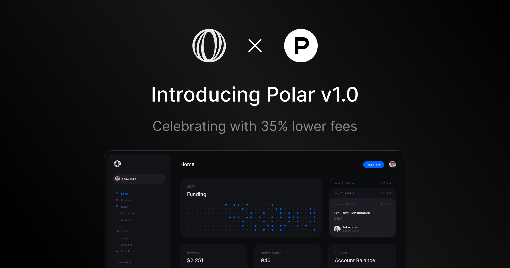

# Announcing Polar v1.0 with Lower Fees

Dear builders,

We’re thrilled to announce Polar v1.0 today with better pricing!

<iframe width="100%" height="420" src="https://www.youtube.com/embed/Rbg0f5OU4Vg"></iframe>

## Polar v1.0 - the best monetization platform for developers, built open source

We started Polar with the mission of getting open source developers paid. By building a fully open source funding & monetization platform designed for them. Today, Polar is trusted by thousands of developers and is an official GitHub funding option!

However, as we’ve been building, countless developers have been laid off all over the world, and an endless list of AI startups are emerging with the promise of replacing even more developers. Painting a grim picture of the future for developers.

We wanted to build towards a different future.

A future of developers thriving independently.
Shipping more open source, solo products and indie startups.
Getting paid to code on their passions.

So throughout 2024, we’ve expanded to focus on all developers who seek to ship independent software - builders, indie hackers and open source maintainers alike.

We've now reached v1.0 and offer:
- Donations, crowdfunding, memberships, digital products and SaaS
- Built-in product and subscription benefits. From license keys, file downloads, private GitHub repository access, Discord invites, and more.
- Powerful custom integrations using our API, Webhooks, OAuth & SDKs
- Powered by Polar as the Merchant of Record - handling sales tax & EU VAT

So you can focus on building your passion. We'll focus on the infrastructure to get you paid.

## Celebrating with lower fees

Our mission is to get you paid. So today, we’re reducing and simplifying our fees to become the most competitive merchant of record offering for developers! 🎉

Our pricing used to be 5% (excl. VAT) + Stripe payment fees (2.9% + 30¢ of the entire order value). 

Starting today, our pricing is **4% + 40¢** of the entire order value – including Stripe payment fees [^1]. 

For our community, that’s a 35-40% reduction in fees! And 20% lower than other merchant of record options.

It’s our token of appreciation to you for having been part of shaping Polar v1.0 ♥️

*Other Stripe fees (billing, payouts, international cards etc) still apply as before. [See our docs](https://docs.polar.sh/fees) for more comprehensive pricing details.*

Until next time,

Keep building
