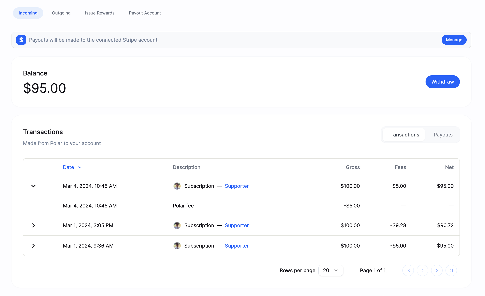

# Updated Payout Flow & Overview

Today, we've shipped some improvements to the `Finance` page on Polar along with some big & important changes to how payouts work ahead of April 1st when Stripe fees will be incurred.

---

All payments via Polar go to our US platform account first since we're the merchant of record. It also enables us to manage, capture & remit VAT on subscriptions so you don't have to.

We keep track of funds owed to you and transfer it once they're ready - minus VAT, our revenue share (5%) and Stripe fees - to your connected Polar Stripe Express account. From there it's paid out to your bank account. This is what we refer to as payouts. 

In January 2024 with the launch of our new platform, we also announced [better pricing](https://polar.sh/polarsource/posts/better-pricing) for developers:
1. Changed: 5% revenue share to Polar vs. 10% prior
2. Payment-, transfer- and payout fees (Stripe). 
3. _Polar to cover the Stripe fees until April 1st, 2024. Continued launch offering._

However, in advance of April 1st and Polar no longer being able to cover Stripe payment-, transfer- and payout fees, we wanted to ensure developers had complete insight to all fees & control of payouts and the Stripe fees associated with them.

### Challenges with the previous payout model

Up until now, we made an instant transfer for each individual transaction once it was ready. So in case you made $400 in a month through:
- 10 pledges of $20 each for an issue ($200)
- 8 community subscriptions of $10 each ($180)
- 1 business subscriber ($120)

It means 19 transactions and transfers to your Polar Stripe Express account. 

However, Stripe automatically issued daily payouts to your connected bank account in case of available funds. Depending on when transactions where made, it could mean anything between 1 to 19 separate payout events.

This approach worked, but it has three problems we wanted to solve for a better, cheaper and more scalable solution long-term.

**1. Polar payouts tightly coupled to Stripe.** 
As we grow, we want to support more international & different payout methods, e.g PayPal, Wise etc. 

**2. Frequent micro payouts.** 
We heard from customers that this understandably created noisy bank account statements and more accounting overhead. It also leads to...

**3. Higher fees.** Stripe payout fees have both variable & fixed amounts. Incurring those fixed amounts across frequent micro payouts is suboptimal vs. controlled withdrawals. 

| [Stripe Transfer & Payout Fees](https://stripe.com/connect/pricing) |  Fee (%/$) |
|---|---|---|---|---|
|  Fixed cost per active month of payout(s) | $2 (Fixed)  |
|  Cross-border transfer |  0.25 - 1% depending on country  | 
|  Payout fee | 0.25% + $0.25 (Fixed)  |  

Given these Stripe Express transfer- and payout fees, the first payout in a given month will cost $2.25 and thereafter $0.25 fixed. So it's preferable to:
1. Control when payouts occur
2. Issue fewer vs. frequent payouts

Therefore, we're introducing an updated `Finance` tab and a new payout model designed to solve these challenges today and well in advance of April 1st. Of course, Stripe fees remain 0% to you until then, i.e covered by Polar as part of our launch offering.

### Improved payout model & UI

 minus Polar revenue share & Stripe (April 1st onward) payment fees.
2. **Transparent fees.** You see individual transactions in terms of gross revenue (excl. VAT), payment fee breakdowns and net proceeds contributing to your balance.
- Polar 5% revenue share
- Stripe payment fees, e.g 2.9% + $0.3 for US domestic
3. **Manual payouts (withdrawal) with clear payout fees.** You control when payouts are made. Using the insights we offer to show what the payout fees would be and their impact on the final amount paid out. 

 

Once you issue a withdrawal, we will issue transfers for all the underlying transactions at once. Followed by scheduling only one (1) payout manually on Stripe for all of them. Payouts are scheduled with some delay (few hours) since we await finalization of the transfers on Stripe.

To facilitate this, we've changed the settings for Polar Stripe Express accounts to require manual payouts (via withdrawals on Polar) vs. frequent payouts and incurred fees outside your control.

Our goal with this update is to give you complete insight & control of how fees impact your earnings on Polar and easier accounting with fewer & larger payouts.

We're starting with manual withdrawals today since we want our default to be optimized for control & reduced fees. However, we recognise that automatic payouts might still be preferable for some. We're looking forward to hearing from the community and optimizing the product accordingly. E.g introducing automatic payout schedule and/or threshold settings. 

Finally, there are no margins or hidden fees here. These are Stripe fees 1-1 and we hope to be able to negotiate them down as the Polar community and our collective volume grows. In combination with this model making it easier for us to introduce more payout options in the future, e.g PayPal, Wise for instance.

--------

Don't hesitate to [reach out to us](https://docs.polar.sh/support/) if you have any feedback, questions or concerns about this new model.

All our best,

The Polar Team