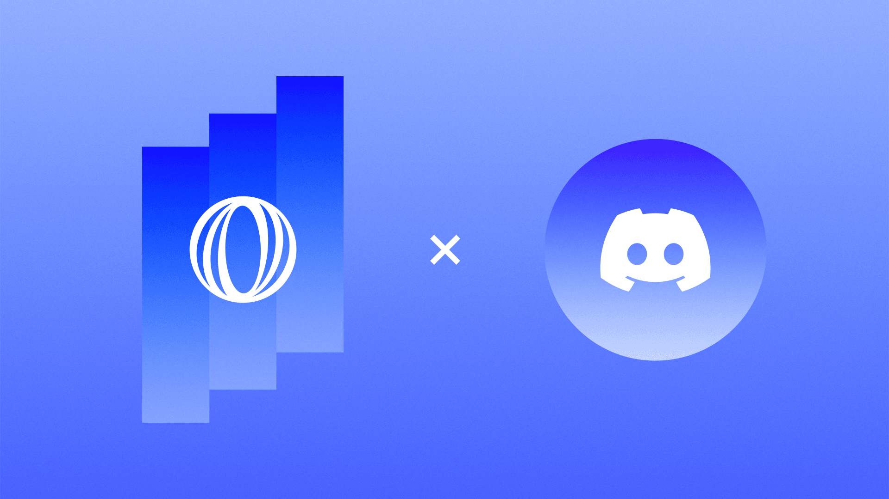
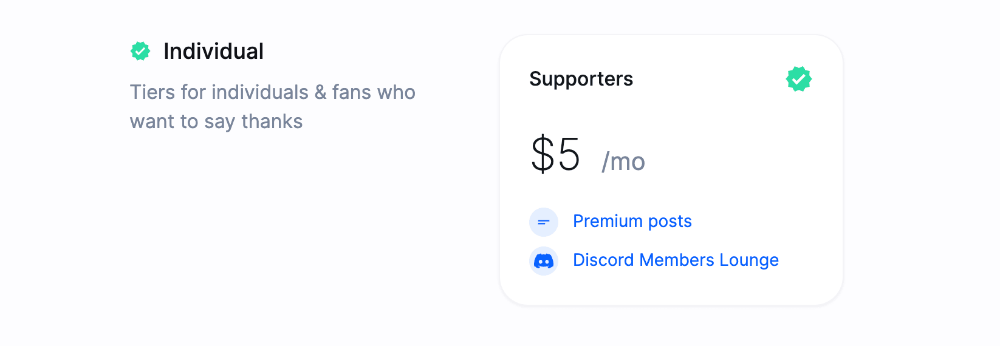
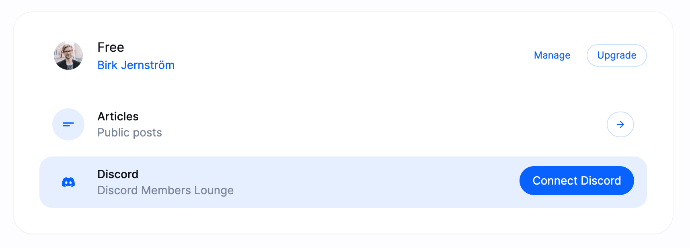
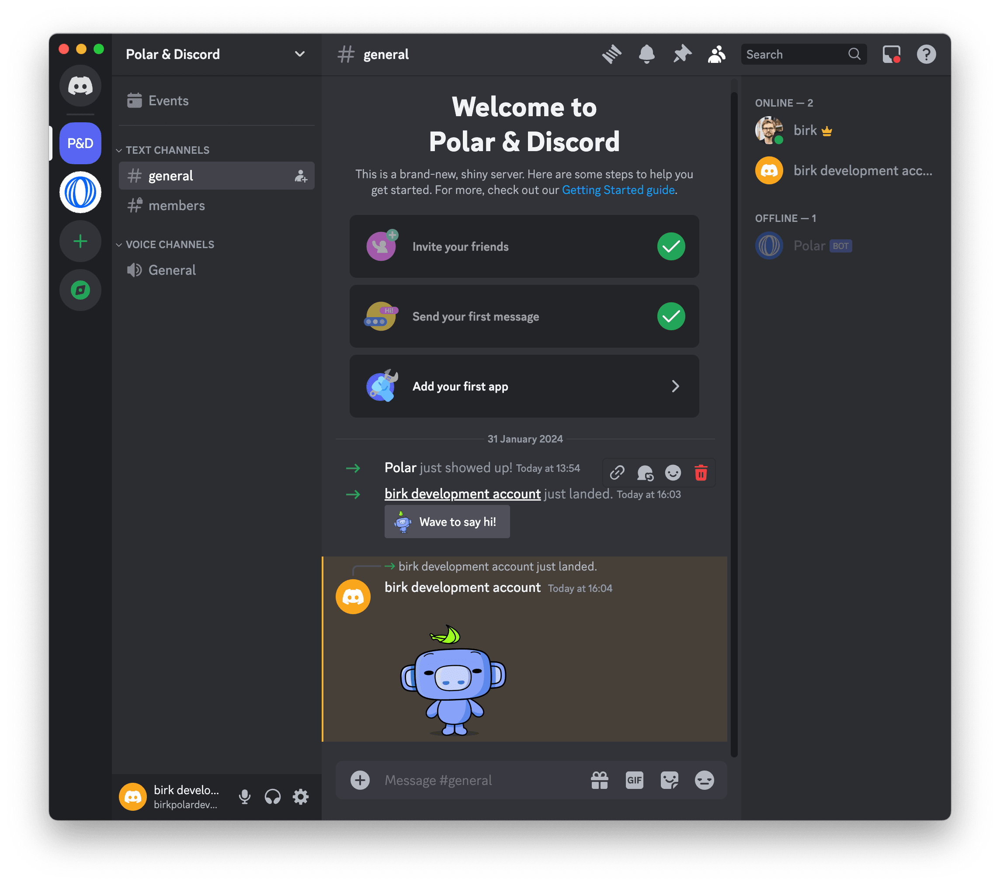
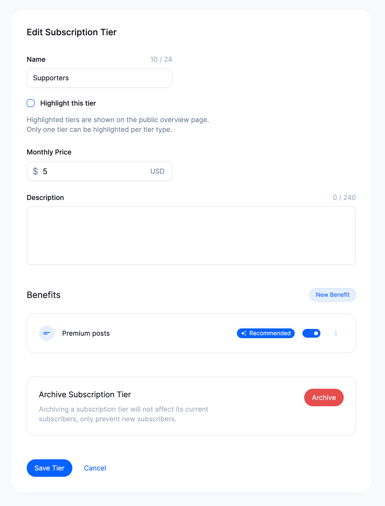
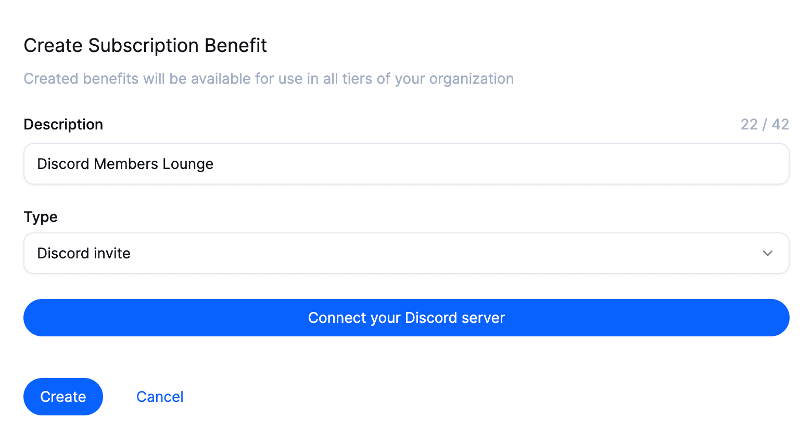
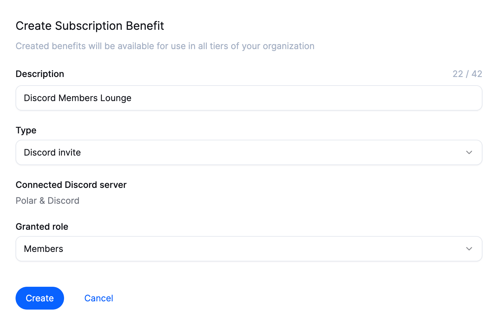
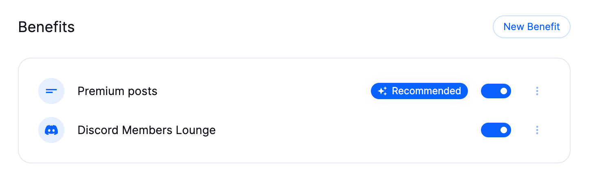

# Upsell Discord Invites

At Polar, we're building the creator platform for developers and the open source ecosystem. Empowering you to setup free- and paid subscriptions to your audience with built-in benefits that are seamless for you to manage and delightful for your audience to consume.

First, we introduced free- and paid posts & newsletters with our launch three weeks ago. In the coming days, we're excited to share 3 new subscription benefits that we've been cooking in our open s/kitchen/[repository](https://github.com/polarsource/polar). Starting with Discord invites.

## From Subscribers to Discord Members

Your audience will clearly see the Discord benefit with your custom label, e.g `Discord Members Lounge`, `console.log(chat_message)` to `OCamel My Camel` - have fun with it. Of course, you're also in complete control which tiers to enable it for - both free- and/or paid tiers.

In case the subscriber has already connected their Discord account with Polar, they'll immediately be invited to your Discord server with the appropriate role that you've set. *C'est tout* as the French say.

But if it's their first time *c'est pas un probleme*, as the French also say.

Subscribers will receive a notification that a Discord invitation via Polar is awaiting them. On Polar, they can then easily unlock it under their `Benefit`-tab by connecting their Discord account (OAuth) - instantly getting invited to your server thereafter.

Wave to say hi! It's coconut oily smooth as ThePrimeagen would say.

## Let's get you setup

It only takes a few minutes.

1. Click `Edit Tier` under `Subscriptions` within your creator dashboard on a subscription you want to enable Discord invites for. 
2. Click `New Benefit` (See below)

*PS. You could also go directly to `Benefits` to see all existing ones across subscription tiers and create a new one from there.*

 

You'll be presented with a modal to create a new Subscription Benefit. 
1. Select `Discord invite` as the type.
2. Click `Connect your Discord server`
3. You'll be redirected to Discord to install the Polar bot on your selected server & grant the required permissions

You'll now see the name of the Discord server you connected for this benefit.
1. Set a label for the benefit, e.g `Discord Members Lounge`. This is what your audience & subscribers will see.
2. Choose the Discord role you want to grant subscribers.
3. Click `Create`

**Please note:** Discord bots can only grant access to roles listed underneath the bot (`Polar`) in your permission settings. We'll show a warning if you choose a role that is listed above our bot.

You can read more about Discord roles, what they enable and how you set them up on [Discord's support page](https://support.discord.com/hc/en-us/articles/214836687-Role-Management-101). 

You now see the new Discord benefit and that it's been automatically enabled for the tier you're currently editing. Awesome. Just hit `Save Tier` and you're done.

## Upsell multiple Discord servers & roles

We've built this integration to support creating benefits across multiple Discord servers & roles 🤯 So unlike other creator platforms, we don't limit you to only upsell one role for one server across all subscription tiers. 

**Suggested upsells & roles**
1. **Supporters**. Give free subscribers a role too. Get colourful & fun with it. Fun to see Discord members who also subscribe to your Polar newsletter & posts.
2. **Backers**. Offer individual supporters with a paid subscription some additional flair. Celebrate them.
3. **Business support**. Offer commercial support to businesses.

Share your upsell on Twitter with us @polar_sh - we can't wait to see how creative you get with this feature 😍

## Coming next
We're open source so there are no spoiler alerts or stealth operations here. Here's what's coming up shortly:
1. Ads - Automate sponsor logotypes across README, Site, Docs & Posts on Polar. No more manual overhead. 
2. Private Repository Access - You can connect multiple private repositories and seamlessly invite subscribers to gain access to them. Sky is the limit in terms of which models & opportunities this enables.

🚀

*Discord was shipped by [@Francois Voron](https://polar.sh/frankie567) in Lyon, France. So I ([@birkjernstrom](https://polar.sh/birkjernstrom)) broke out my high-school French to salute his efforts properly.*