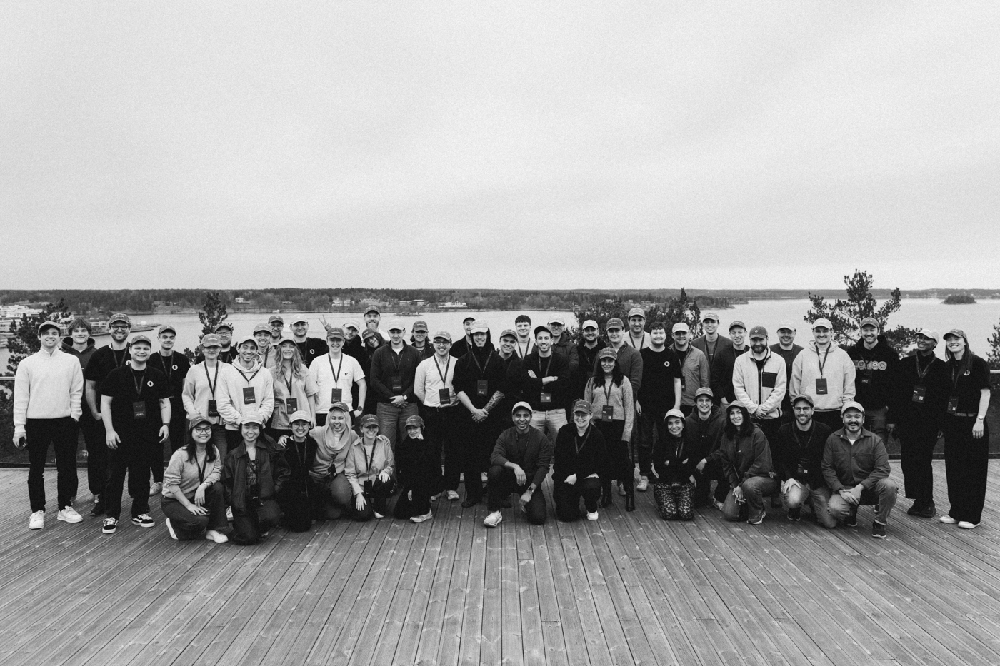
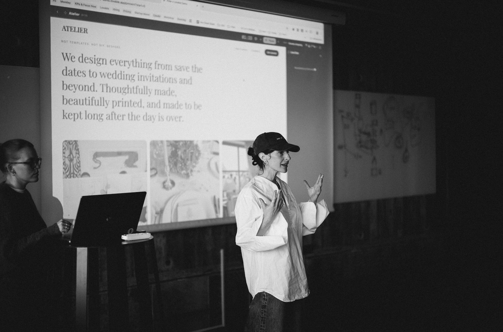

<BlogHero
  title="We held a hackathon at a luxury spa"
  description="40 builders. 24 hours. One spa in the Stockholm archipelago. Here's what happened."
  publishDate="2026-03-13"
/>

<InnerWrapper>

Last weekend, we brought together 40 builders at Yasuragi Spa & Hotel in the Stockholm archipelago for Prompt a Startup. A two-day hackathon built around a single question: how fast can a single person build and monetize a real product with AI?

The timing felt right. Tools like Lovable have made it possible to go from idea to deployed app in hours, not weeks. Polar makes it trivially easy to add payments and start charging. We wanted to see what happens when you combine the two under a deadline, with a $10,000 prize on the line.

## The challenge

The rules were simple: build something with Lovable, monetize it with Polar, start from scratch at 10am on Saturday. No pre-built code. No head starts. Just an idea and 24 hours.

</InnerWrapper>

<InnerWrapper>

The winner wouldn't be decided by a panel of judges, it would be decided by revenue. Whoever had the highest revenue one month after the hackathon takes home the $10,000. Real money from real customers.

We also opened the hackathon up virtually, so builders from around the world could participate alongside the in-person crew.

</InnerWrapper>

<InnerWrapper>

## The setting

Yasuragi is a Japanese-inspired retreat in the Stockholm archipelago. It's a beautiful, slightly surreal place to spend a weekend building software. Stone bathhouses, forest views, and excellent food. We thought getting people out of their usual environment would help them think differently. It seemed to work.

</InnerWrapper>

<InnerWrapper>

Between hacking on their ideas, people sat in the onsen, grabbed meals together, and had the kind of unplanned conversations that you can't manufacture. A lot of friendships were made. A lot of ideas were stress-tested over dinner.

</InnerWrapper>

<InnerWrapper>

## What got built

The range of projects was remarkable. In under 24 hours, participants shipped tools across dev tooling, AI productivity, niche SaaS, and consumer products. All with real payment flows live by Sunday noon.

</InnerWrapper>

<InnerWrapper>

Watching people go from "I have no idea what to build" on Saturday morning to charging their first customers by Sunday was something else. That's the world we're building toward, where a single motivated person can take an idea all the way to revenue in a weekend.

## What we learned

**Monetization is no longer the hard part.** The most common blocker used to be: "I'll add payments later." At this hackathon, people were live with pricing pages and checkout flows within hours. Polar made it a non-issue.

</InnerWrapper>

<InnerWrapper>

**AI has changed the build surface.** Lovable let participants iterate visually and fast, even those who don't consider themselves developers. The line between "technical" and "non-technical" founders is blurring faster than we expected.

**Constraints create focus.** The 24-hour deadline and revenue-as-the-metric forced people to make hard calls quickly. No over-engineering. Just "does this solve a problem someone will pay for?".

</InnerWrapper>

<InnerWrapper>

We're proud of everyone who showed up, in Stockholm & online. The winner will be announced in a month, once the revenue numbers are in.

If you missed it and want to be the first to know about the next one, [follow us on X](https://x.com/polar_sh).

Photos by [Jean Lapin](http://jeanlapin.com) & [Emil Widlund](https://x.com/emilwidlund).

</InnerWrapper>
