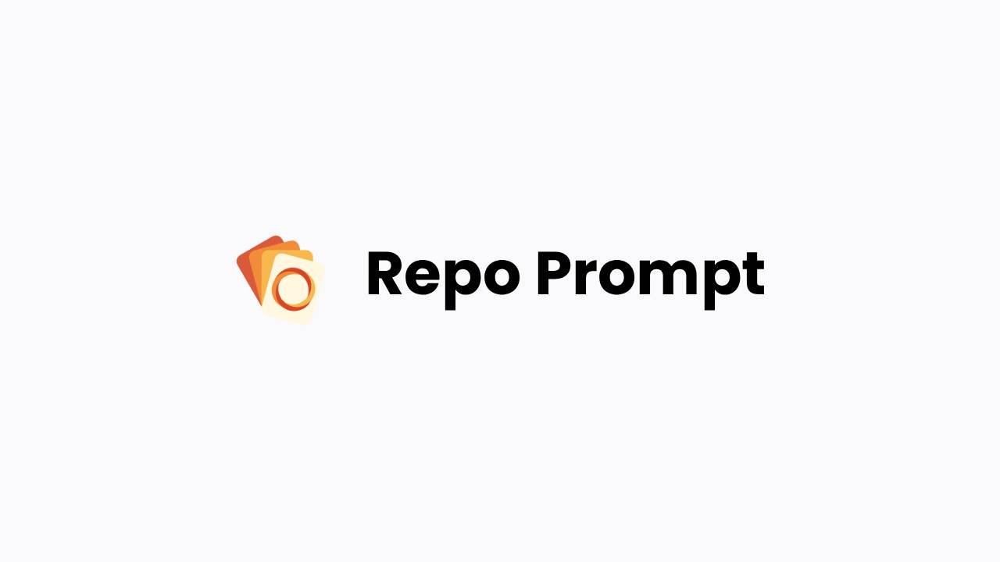

<BlogHero
  title="How Repo Prompt went from dreading payments to live in a weekend"
  description="Polar was a turning point for Repo Prompt. I went from dreading payments to having everything live in a weekend."
/>

<InnerWrapper>

### What payment or billing challenges were you facing before using Polar?

When I started Repo Prompt — a native macOS app — I was initially set on shipping through the App Store. Payment processing was something I had no idea how to handle, and combining auth with billing felt pretty daunting. The App Store meant going through review for every release, being limited in my release cadence, paying hefty fees to Apple, and being restricted in what features I could ship. The straw that broke the camel's back came when TestFlight stopped working because the number of users I had signed up caused a backend glitch, preventing many from accessing the app.

### Why did you choose Polar for your payment infrastructure over other providers?

I first looked at Paddle. They had great support and helped me with fast-tracked verification, but their license key solution was only available through Paddle Classic — long deprecated. I would have needed a middleware like Keygen to get native licensing working, and they no longer had any native Swift SDKs.

Polar had what no other provider offered: a built-in license key system that worked natively. Their fees are the lowest in the industry. I didn't need to set up a backend just to handle billing, and I didn't have to think about taxes.

### How has Polar's payment platform helped solve your challenges or improve your business operations?

The ability to spin up a checkout link, drop it into my static website and app, and automatically generate license keys with a built-in customer portal made integration so simple I had it all working in a weekend. Polar also let me enable billing on my own schedule — doing verification after launch — which removed a huge blocker.

No backend. No tax headaches. No App Store review delays. Just a checkout link and a license key system that worked out of the box.

### How was the help when you ran into problems?

The team has been incredibly responsive to customer issues and quick to ship fixes — from small UI bugs to customer-facing UX improvements. Working with Birk and Rishi felt collaborative, not transactional. That kind of support is rare.

> "Polar was a turning point for Repo Prompt. I went from dreading payments to having everything live in a weekend."
> — Eric

</InnerWrapper>
