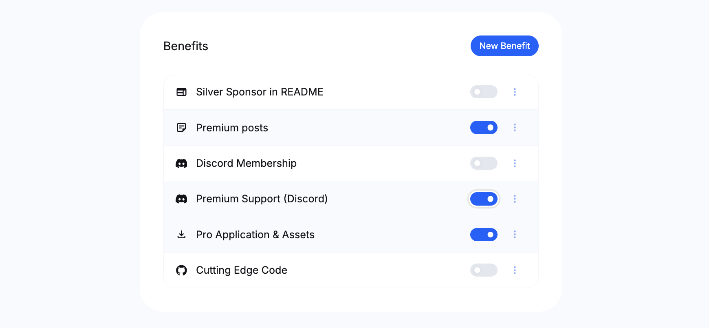
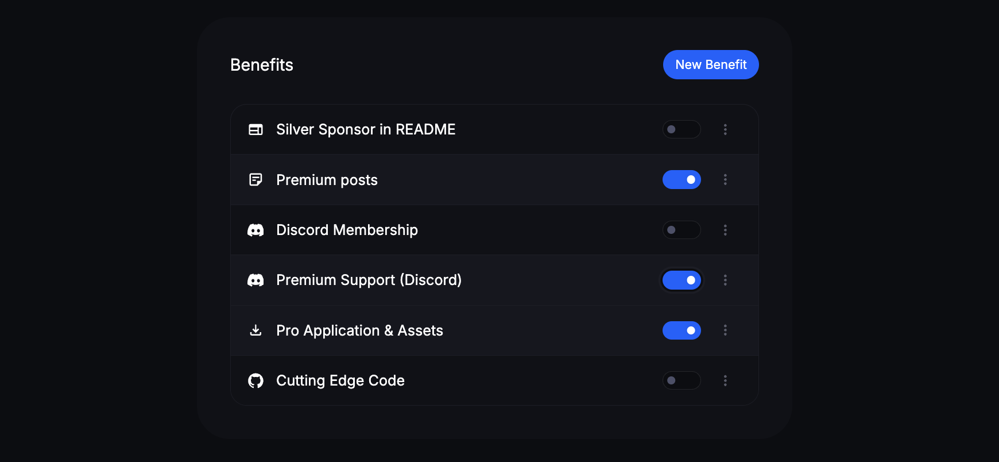
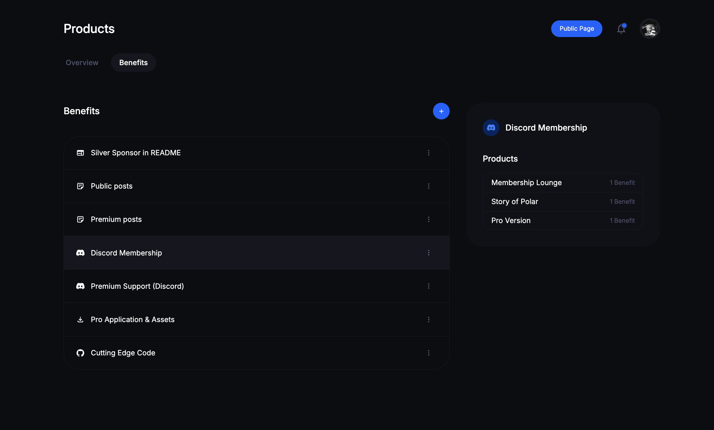
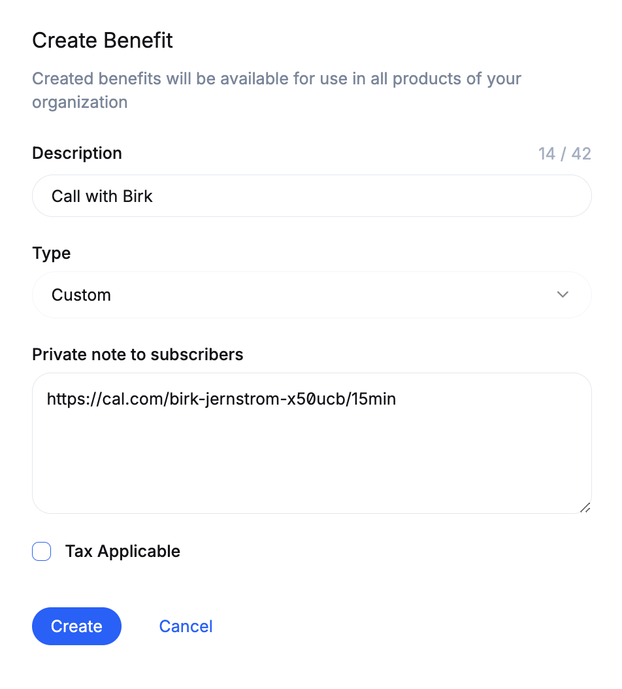
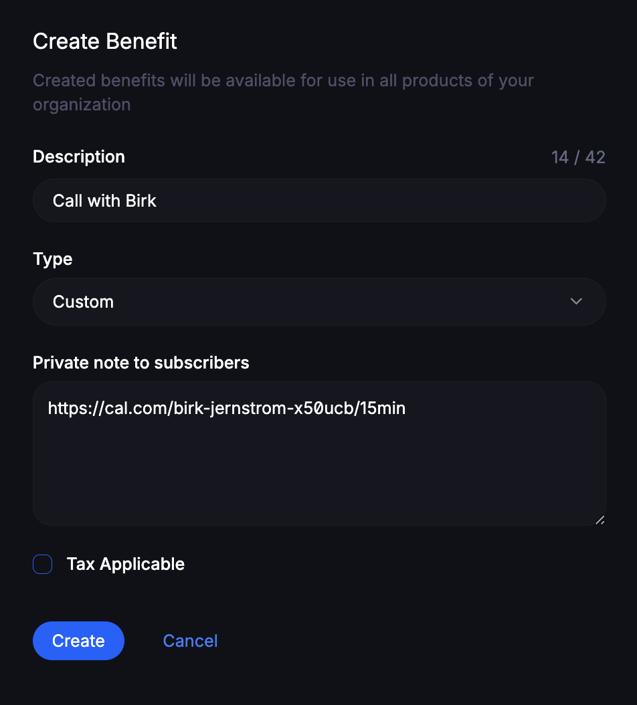

# Product & Subscription Benefits

Product and subscription benefits are standalone resources in Polar - connected to one or many products or subscription tiers.

This approach is a bit different from other platforms, but offers many advantages:
- Easy to enable the same benefit across multiple products & subscriptions
- You can change a benefit in one place vs. many
- No duplicate data or work (error prone)
- More intuitive UI for you and your customers

**How customers get access to benefits:**
- ✅ Active subscribers of tiers with the benefit enabled
- ✅ Customers who bought a product with the benefit (lifetime access)
- ❌ Subscribers with an expired subscription (cancelled)
- ❌ Users who are not customers

## Creating & Managing Benefits

You can manage benefits in two ways:
1. Directly within a product create/edit form
2. Or via `Products` > `Benefits` in your dashboard (below)

### Powerful Built-in Benefits

Polar offers a lot of built-in benefits for common upsells with more to come. Checkout the specific setup guides for each below.

- [**GitHub Repository Access**](/docs/benefits/github-repositories). Automatically invite subscribers to private GitHub repo(s).
- [**License Keys**](/docs/benefits/license-keys). Software license keys that you can customize the branding of.
- [**File Downloads**](/docs/benefits/file-downloads). Downloadable files of any kind up to 10GB each.
- [**Discord Invite**](/docs/benefits/discord). Automate invitations and granting of roles to subscribers and customers.
- [**README Promotion (Ad)**](/docs/benefits/ads). Logotype promotion in README.
- [+ More coming soon](#future-benefits)

### Create a Custom Benefit

Click on `+` in the Product Benefits page or `New Benefit` within a product. A panel will show up with the form below.

**Description**

Shown to end users as the title/description of your benefit. Keep it short, make it compelling.

**Type**

Choose one of our built-in benefits or go with a `Custom` type.
- Form updates based on your choice
- Going for a built-in benefit? Review our guides for the specific benefit of choice.

**Note (Custom Benefit)**

Secret message only customers can see, e.g Cal.com link, private email for support etc.

For custom integrations you can also distinguish benefits granted to customers to offer even more bespoke user benefits.

**Tax Applicable**

Is the benefit a taxable service or product? Enabling us to automatically capture & remit EU VAT if applicable from customers.

## Future Benefits

Below are some of the benefits we've discussed for our backlog.

Missing something? We'd love to hear your use case in our [GitHub Discussions](https://github.com/orgs/polarsource/discussions/categories/feature-requests)

**License Keys**

Automatically generated license keys for customers that can easily be validated via our API.

**Private Packages**

Sell access to hosted packages across NPM, PyPI, Cargo etc.

**Private Docker Containers**

Offer access to private Docker Containers via a private registry.

**Custom form & webhooks**

Offer a custom form to customers and trigger webhooks on specific events. Enabling more powerful, custom, benefits.
