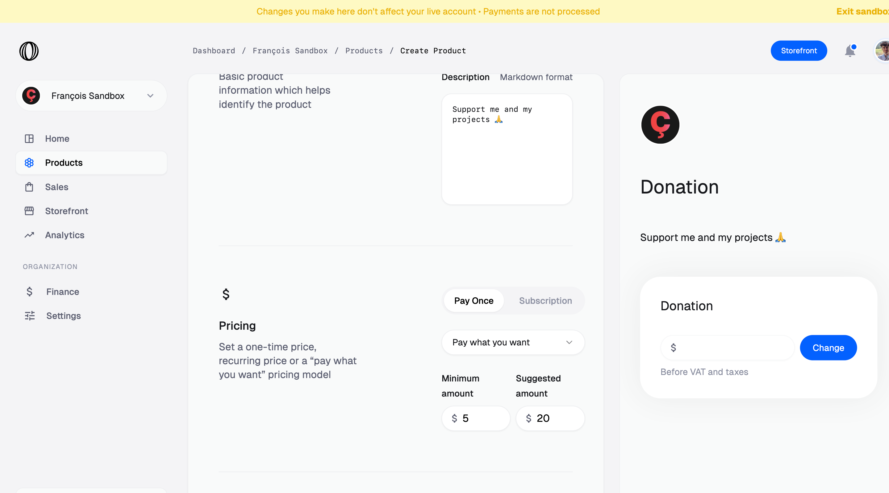
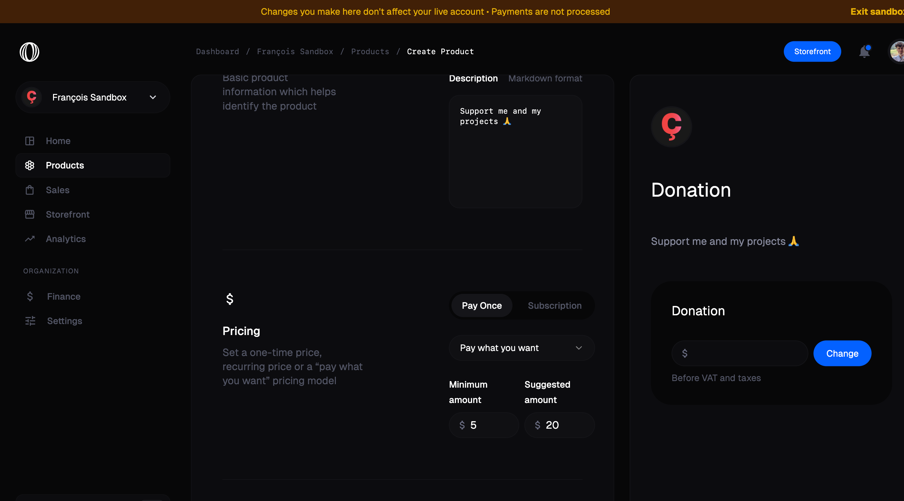
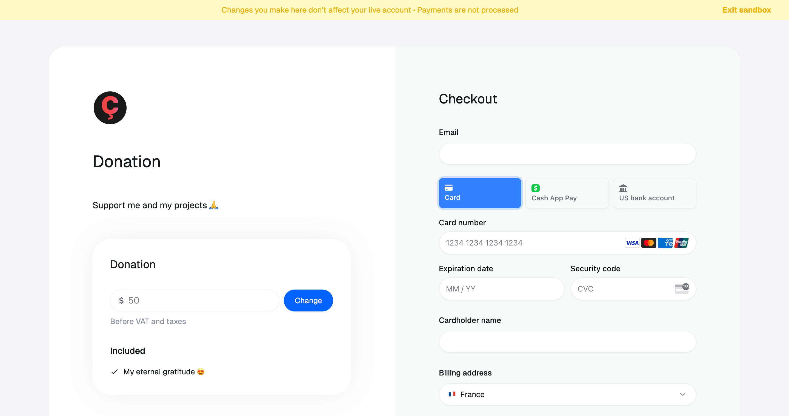
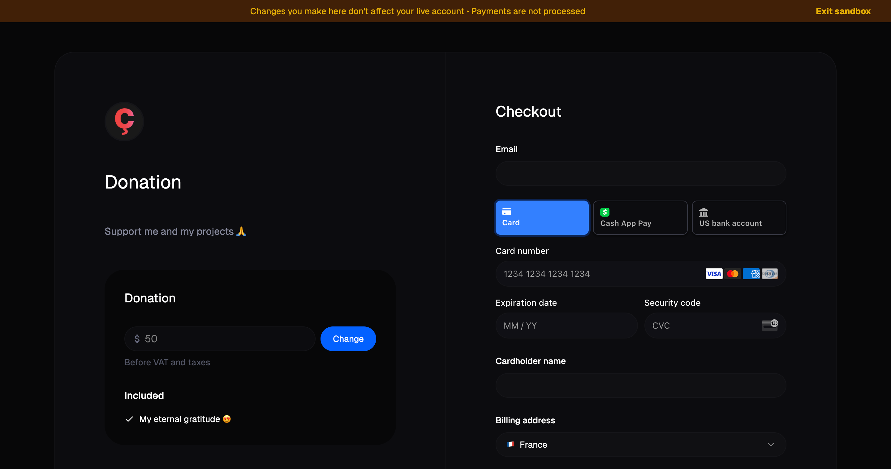
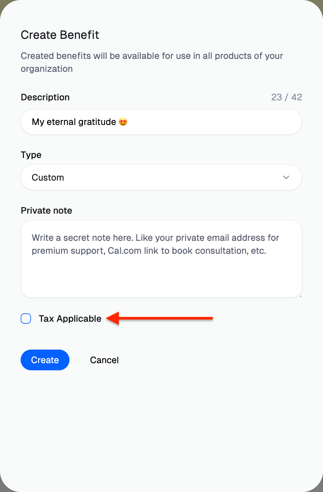
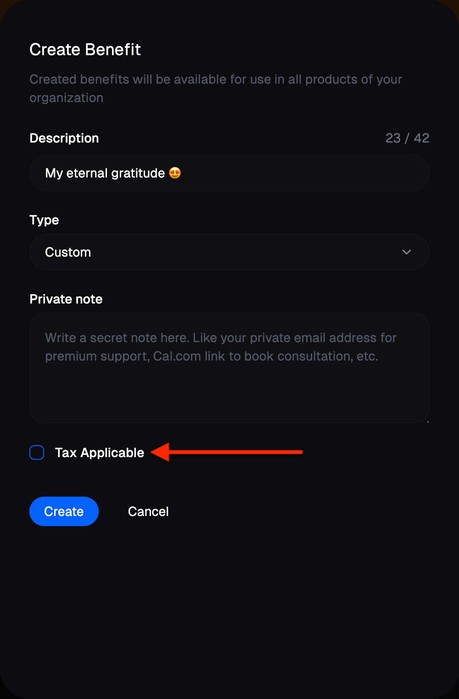
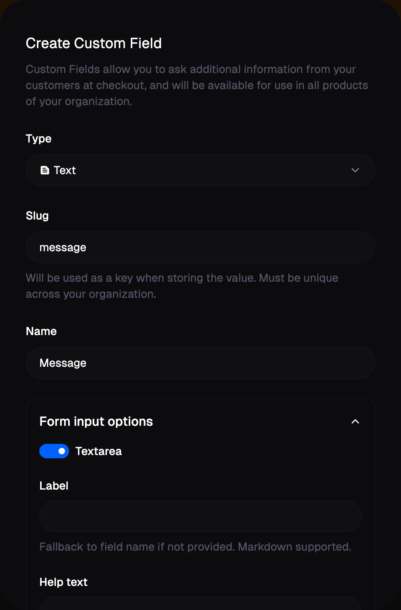
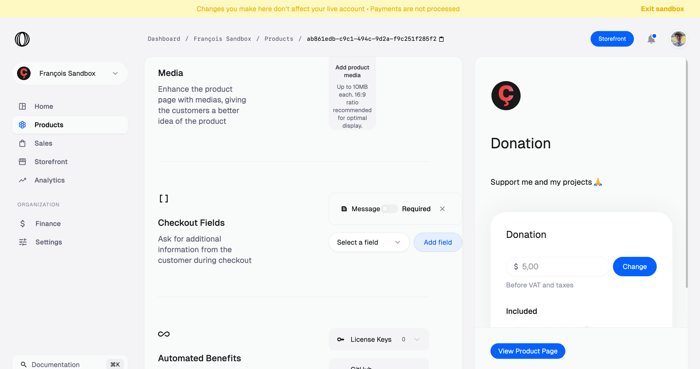

# Donations

You can accept one-off donations easily with Polar by leveraging our *pay what youwant* pricing feature. Here's how!

## Create a donation product

As described in our [Products](/docs/products/create), go to the `Products` page and click on `New Product`. Then, fill the details of your product.

The key part is to select a `Pay what you want pricing`, under `Pay once`. It'll allow your supporters to choose how much the amount they want to donate. We suggest you to a preset amount, like $20.

Once your donation product is created, you can share it using a [Checkout Link](/docs/guides/checkout) or access it from your Storefront!

### Benefits and VAT

Like any other product, you can add [Benefits](/docs/benefits), to grant rewards and perks to your supporters.

The gotcha is that most of those benefits will automatically enable VAT on your product, meaning your donator will pay the VAT corresponding to their country over their donation. As a Merchant of Record, this is a legal requirement we can't bypass.

However, if you want to add a simple *thank you message* or such, you can create a `Custom` benefit and leave the `Tax Applicable` checkbox unchecked. If you're unsure about the nature of your benefit and whether VAT should be applied, contact us.

### Optional: add a message field

Money is nice, but get some love is great 😄 You can enable your supporters to leave you a nice message when making their donations. To do so, go to `Settings` and click on the `Custom fields` tab. This is where you'll be able to manage fields you can add to your products' checkout.

Here, we'll create a simple *text* field called *Message*. Since it can be a long message, be sure to enable the `Textarea` option under `Form input options`. You can customize the label, help text or placeholder to your liking.

Then, go back to `Products` and edit your Donation product. In the `Checkout Fields` section, select your *Message* field and add it. Save your changes.

Your supporters are now able to add a message to their donation! You can read them directly from the orders table in the `Sales` section.

## Legacy Donations migration

If you were using our legacy Donations feature, we've automatically migrated your organization to the system described above. More precisely:

* We created a `Message` custom field;
* We created a `Donation` product, with a `Pay what you want` pricing and the `Message` custom field;
* We migrated your past donations to `Orders`, along with the supporter's message.

Past and new donations will now appear in your metrics in the `Analytics` section, like any other product sales.
