# Donations

You can accept one-off donations easily with Polar.
- Supporters can donate to your efforts in a few seconds
- Supporters get featured on your Polar page along with their public comment
- Closed GitHub issues with the Polar funding badge change to `Tip` - allowing supporters to reward specific efforts too

Let's start with enabling the feature.

### Enable donations

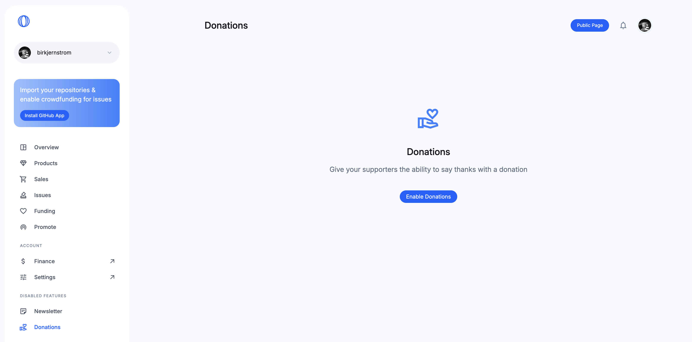
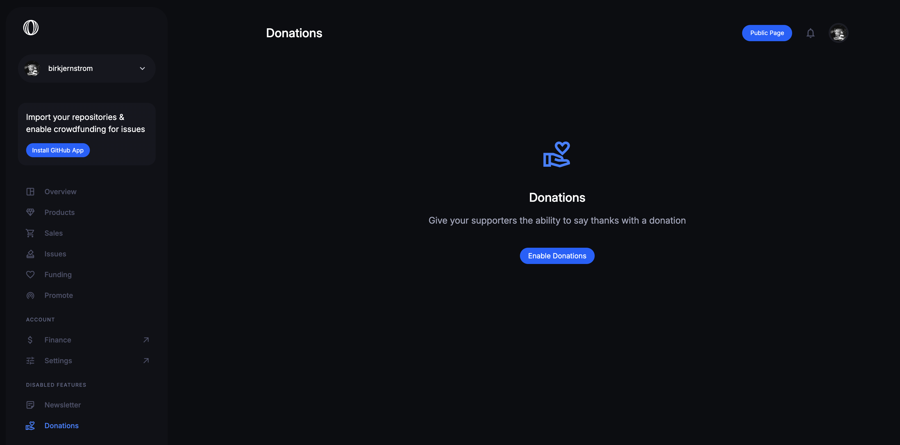

1. Go to the `Donations` page in your dashboard
2. Click `Enable Donations` and that's it.
3. New to Polar? Please goto `Finance` and start setting up Stripe too - ensuring you're in a [supported country](/docs/overview/faq/for-maintainers/#which-countries-are-supported) for payouts.

Donations is now enabled. You can click `Storefront` to see what it looks like for supporters.

### Experience for supporters

Donations is now promoted across your Polar page. Giving supporters easy access to support your work.

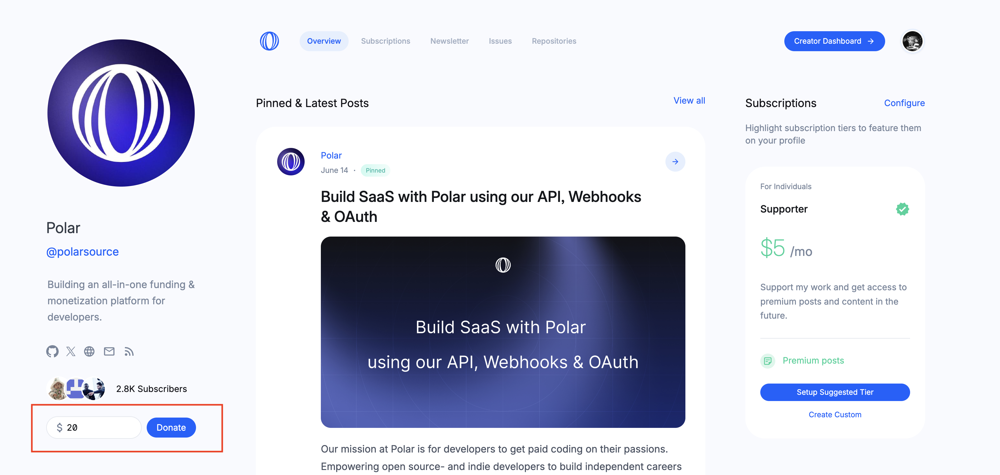
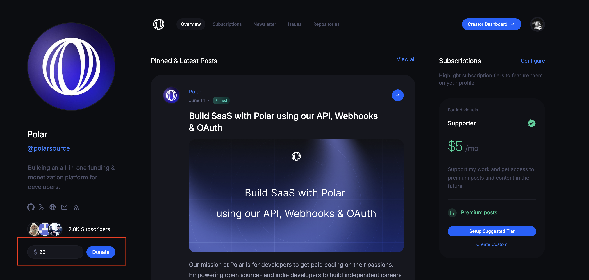

In combination with being suggested for closed GitHub issues with the Polar issue funding badge.

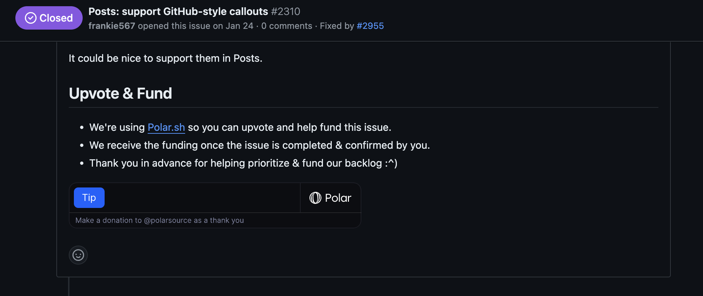

Supporters can now:
- Use Stripe Link (credit card on file)
- Specify an arbitrary amount
- Add a public message of support

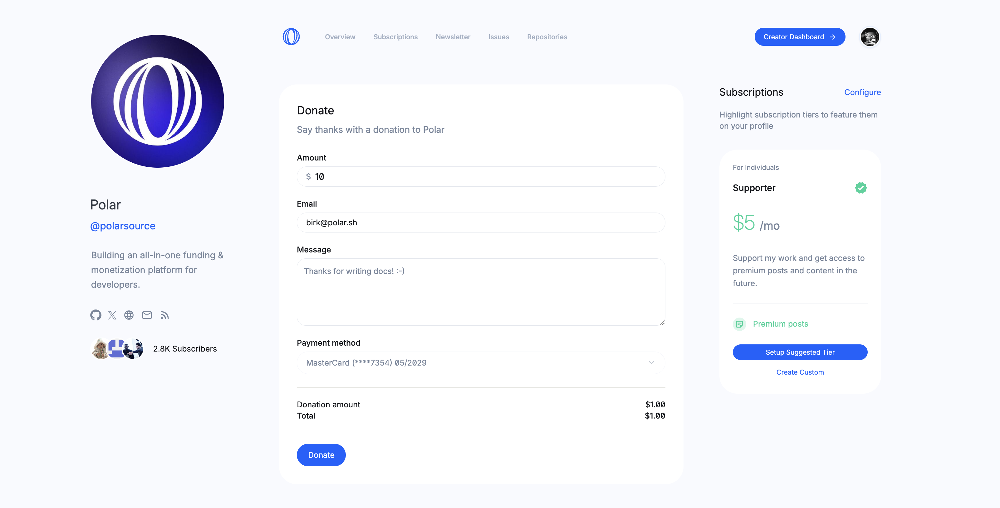
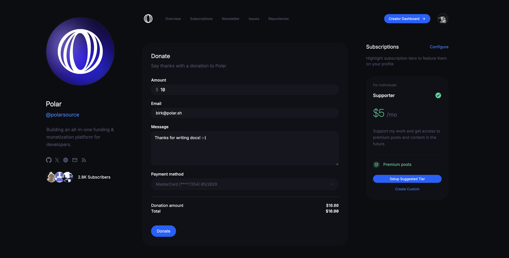

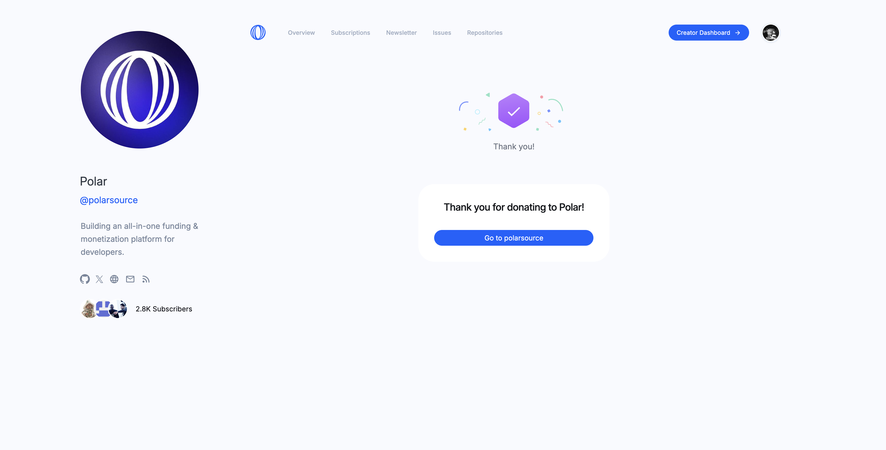
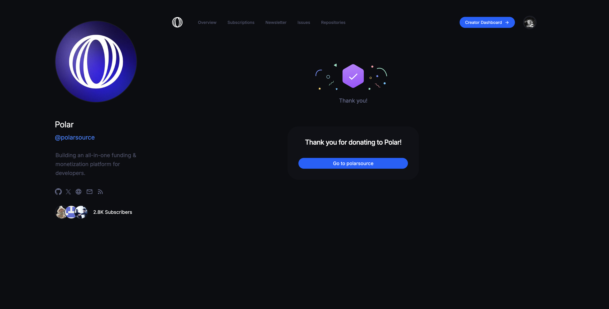

Supporters are shown publicly on your Polar page along with their message. Rewarding them with social klout and encouraging others to follow suit.

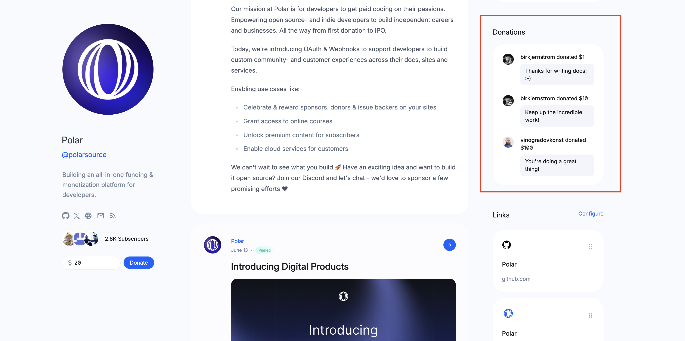
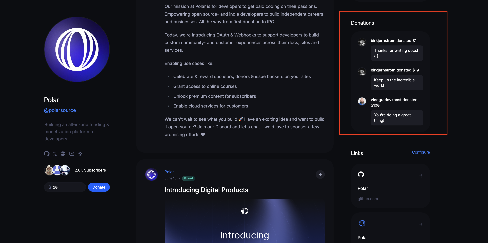

That's it. Donations are seamless with Polar.

### Donation Statistics

You now receive a notification of a new donation and can easily review them all in your dashboard.

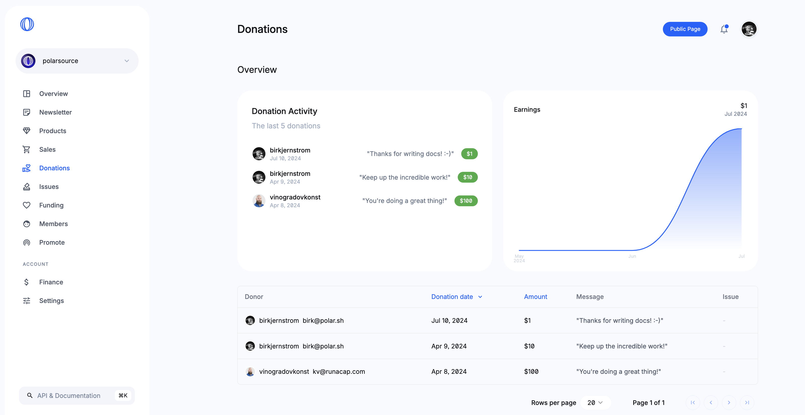
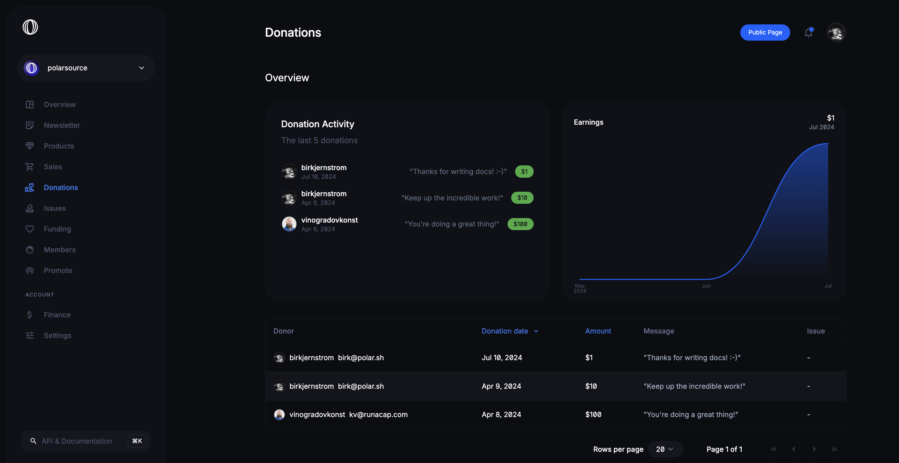

Have the Discord webhook setup with Polar for notifications? Donations will be shared there too.

### Disable donations

Currently, we do not support disabling donations once it has been enabled. We will change this in a near future. In the meantime, reach out to [Polar support](/docs/support) and we can do it for you.
