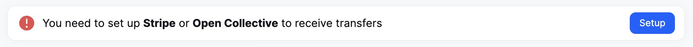
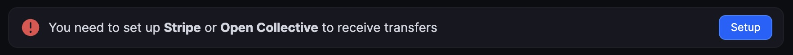
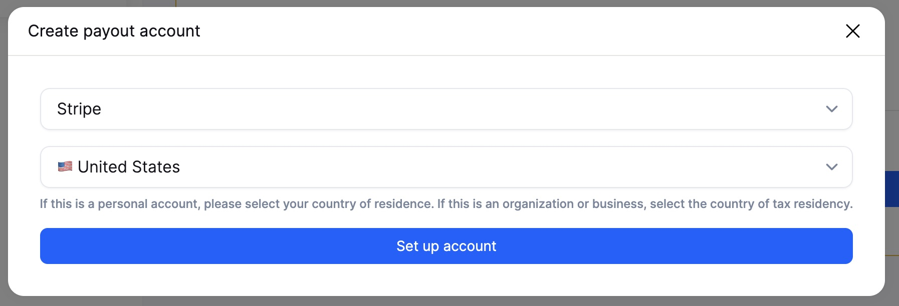
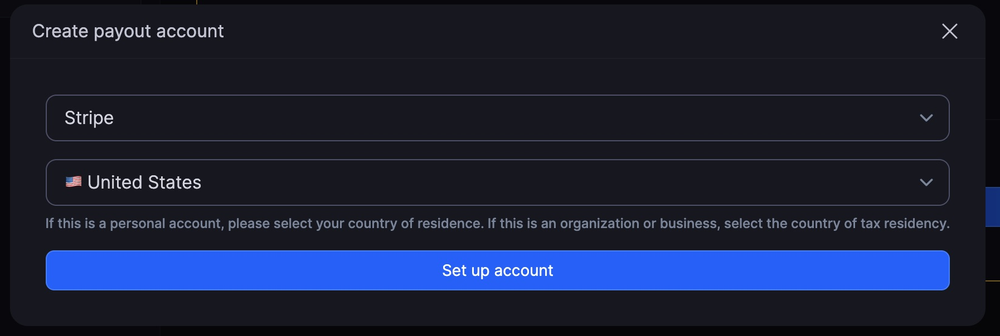
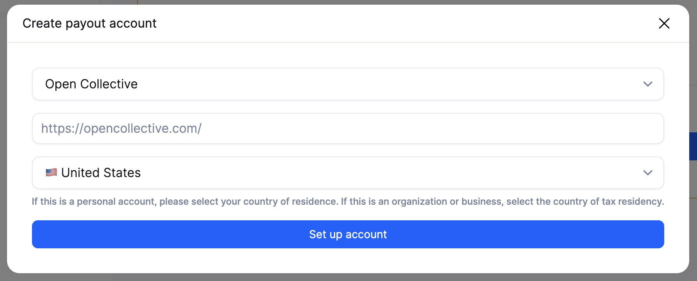
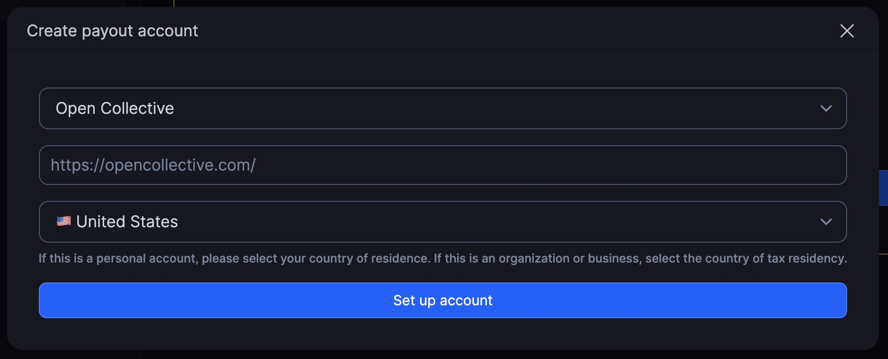

import BrowserCallout from '@/components/Feed/Markdown/Callout/BrowserCallout'

# Connect Payout Account

You need to setup an account so that we can issue
[payouts](/docs/finance/payouts).

1. Goto the `Finance` page in your Polar dashboard
2. Click `Setup` in the card shown above in your dashboard
3. Choose account type & follow their setup instructions

*This is only required the first time and you can do this proactively too in order - recommended to avoid
any additional delays.*

##### Stripe Connect Express

Stripe is the default and recommended option since it enables instant transfers.

##### Open Collective

We support the ability to easily connect a verified Open Collective account to
Polar. However, such transfers are done manually vs. automatically via an API
(such as Stripe) and therefore we only do them:

- Once per month
- For accounts reaching a $100 minimum threshold

<BrowserCallout type="NOTE">
**Open Collective fees apply in addition**

We only support Open Collective accounts using the Open Source Collective
fiscal host and their fees apply in addition to offer their services on top.
</BrowserCallout>
