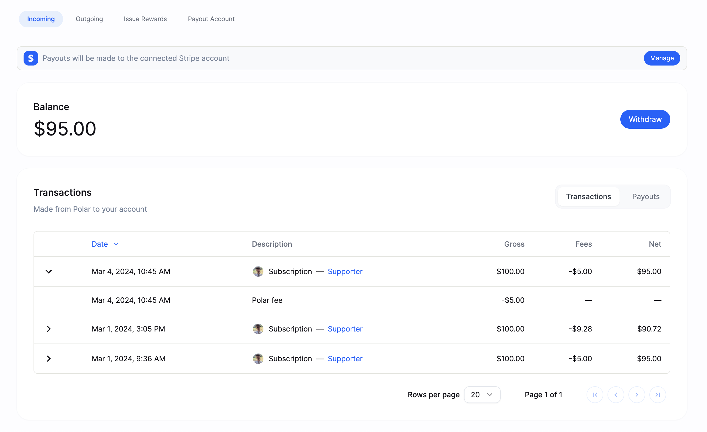
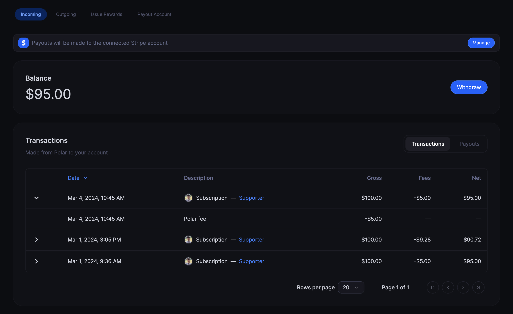

# Balance

You can see your available balance for payout at any time under your `Finance`
page.

## Polar Balance

Your balance is all the earnings minus:

1. Any VAT we've captured for remittance, i.e balance is excluding VAT
2. Our revenue share (4% + 40¢)

All historic transactions are available in chronological order along with their
associated fees that have been deducted.

Note: Upon [payout (withdrawal)](/docs/finance/payouts), Stripe incurrs additional fees that will be
deducted before the final payout of the balance.
