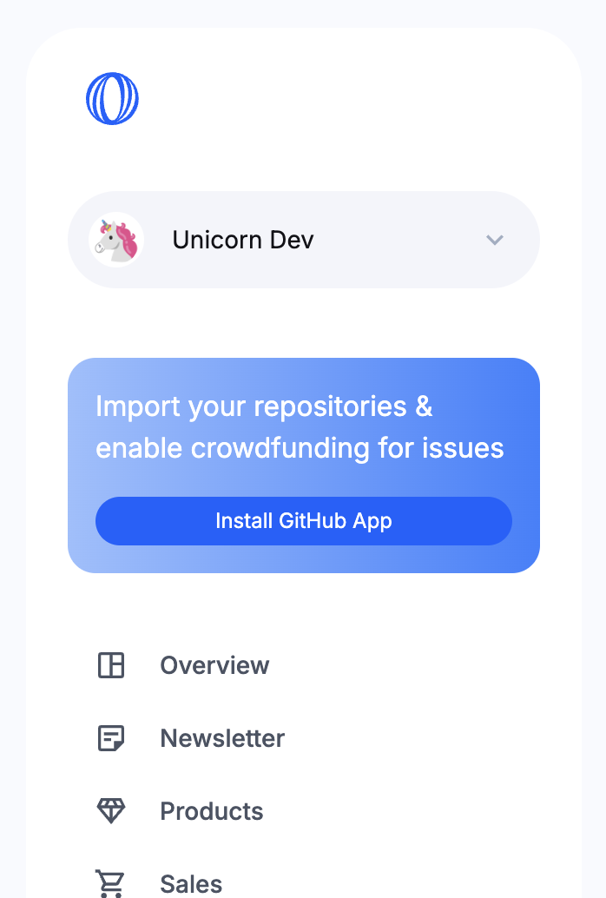
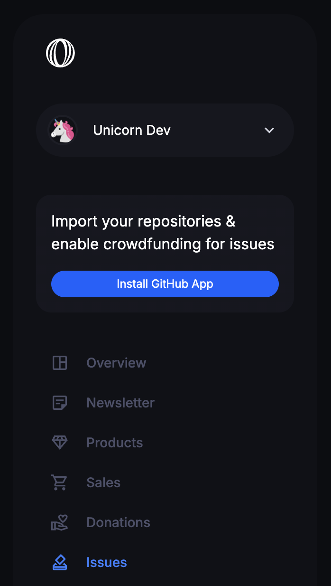
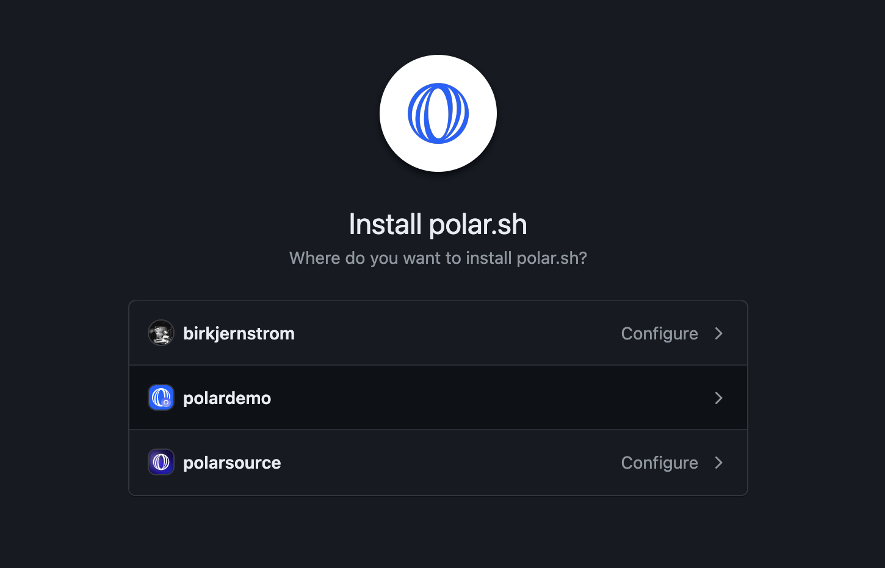
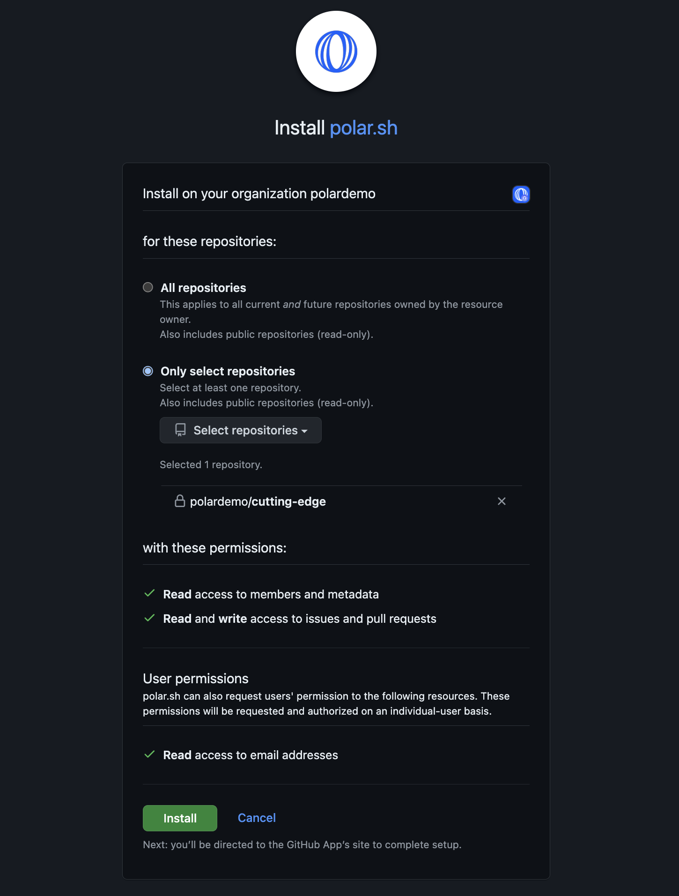
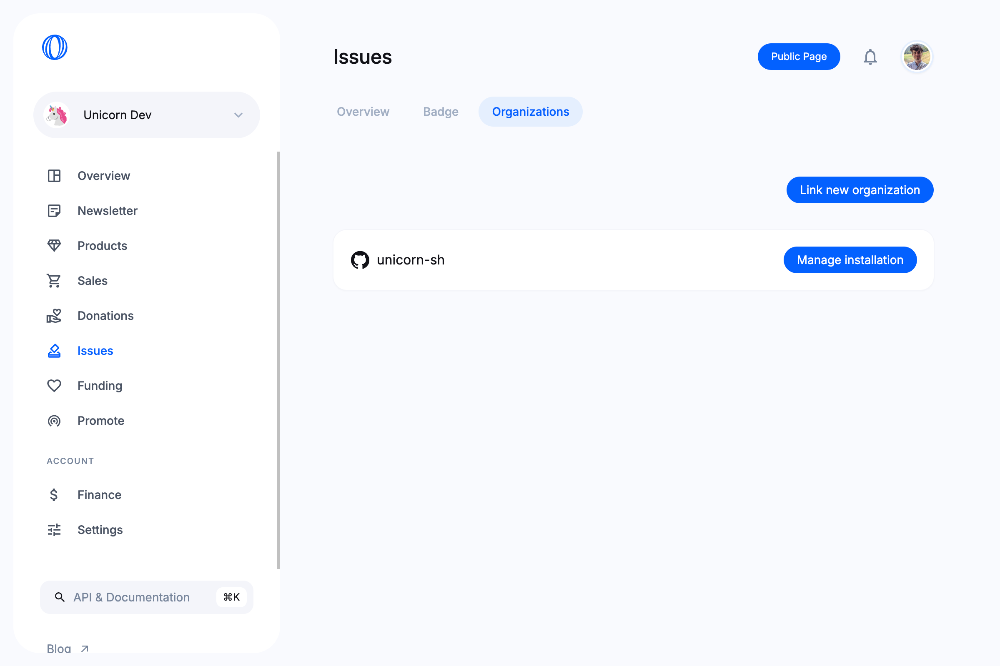
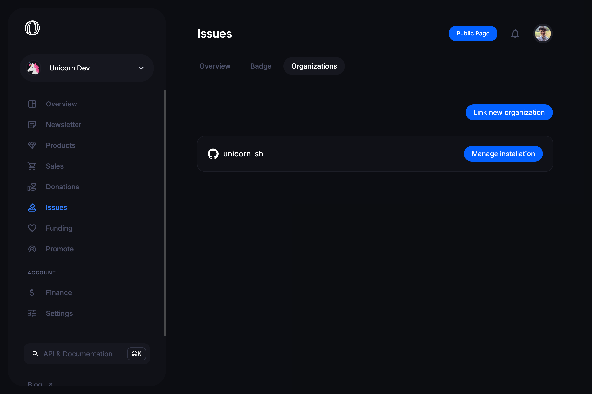

import Callout from '@/components/Markdown/Callout'

# Connect GitHub organizations

Polar is able to integrate with GitHub to sync your repositories and issues, in particular to enable [issue funding](/docs/issue-funding).

## First installation

To do so, you can click on `Install GitHub App` on the sidebar.

### Select a GitHub organization

You'll be taken to GitHub where you'll be asked to select the organization you want to install.

### Install repositories

What does Polar use repository access for?

- You want to enable crowdfunding behind issues
- You want to showcase & promote them on your Polar page
- You want to sell access to Private GitHub Repo(s). However, this feature uses a separate opt-in app installation with additional permissions.

<Callout type="NOTE">
**Do I have to install repositories?**

Yes, GitHub's App installation flow requires granting access to at least one (1) repository to work.

</Callout>

#### All Repositories

- Every, single, repository is synced with Polar - including future ones
- **Pros:** Automatically use Polar freely across your repositories now and in
  the future.
- **Cons:** You sync a lot and more than might be needed or desired.

<Callout type="NOTE">
**Private repositories & forks are synced too**

We sync all the repositories given during installation. Including private
repos & forks.

However, we don't expose private repos except to those who
can access them on GitHub too. It's supported to allow maintainers to connect
private repositories to try Polar with.

</Callout>

#### Select Repositories

- You choose _exactly_ which repositories Polar should have access to
- **Pros:** Complete control. Gradual expansion. Great starting point.
- **Cons:** You need to manually add repositories.

<Callout type="NOTE">
**You can add/remove repositories at any time**

You can change repository access in your GitHub
settings for the Polar app at any time.

</Callout>

#### Required permissions & usage

**Read access to metadata**

We store this data to create a trustworthy user experience for your audience.
Showing repository context on your Polar page and additioinal contect on the issue funding page,
e.g avatar, name, description, stars, license etc.

**Read access to issues & pull requests**

We synchronize all your issues and pull requests in order to support issue
funding in a seamless way. Keeping track of all issues, their contributions and current status -
updating it in near real-time (webhooks). Enabling funding to seamlessly work
within your existing GitHub workflow & across Polar services.

**Write access to issues & pull requests**

Polar funding is designed to be deeply integrated within the GitHub workflow &
experience. By enabling you to easily embed the beautiful and non-intrusive
Polar funding badge directly within selected issues (at the bottom of their
description). We need to be able to write to issues in order to achieve this. Of
course, we only embed the badge based on your settings and desired issues to
badge.

## Manage installation and connect more organizations

You can manage your installed GitHub organizations from `Issues` > `Organizations`.

Click on `Manage installation` to get back to GitHub and add or remove repositories enabled on Polar.

You can link **more than one** GitHub organization to your Polar organization. To add another, click on `Link new organization`. You'll be taken through the same process described above.

## GitHub Integration and Deployment

The GitHub integration plays a crucial role in the deployment process. By connecting your GitHub repositories with Polar, you can automate various aspects of your deployment workflow. This includes:

- **Continuous Integration (CI)**: Automatically trigger builds and tests whenever code is pushed to your repository.
- **Continuous Deployment (CD)**: Deploy your application to production environments seamlessly.
- **Issue Tracking**: Keep track of issues and bugs directly from your GitHub repository.
- **Collaboration**: Collaborate with your team members and contributors effectively.

To set up the GitHub integration for deployment, follow these steps:

1. **Install the GitHub App**: Follow the instructions above to install the Polar GitHub App and connect your repositories.
2. **Configure CI/CD**: Set up your CI/CD pipelines using tools like GitHub Actions, Jenkins, or CircleCI. Refer to the documentation of these tools for detailed instructions.
3. **Deploy to Production**: Use deployment scripts or tools like Docker, Kubernetes, or Heroku to deploy your application to production environments. Ensure that your deployment process is automated and reliable.

By leveraging the GitHub integration, you can streamline your deployment process and ensure that your application is always up-to-date and running smoothly in production.
