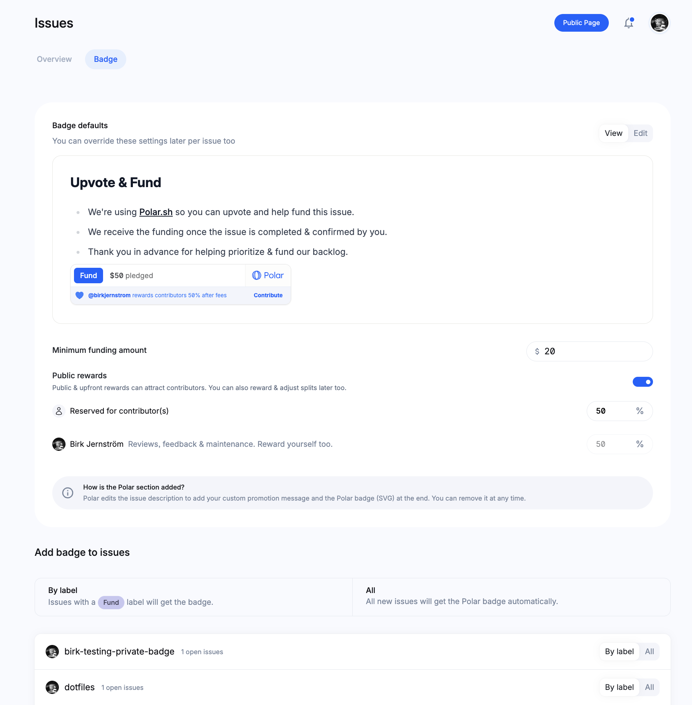
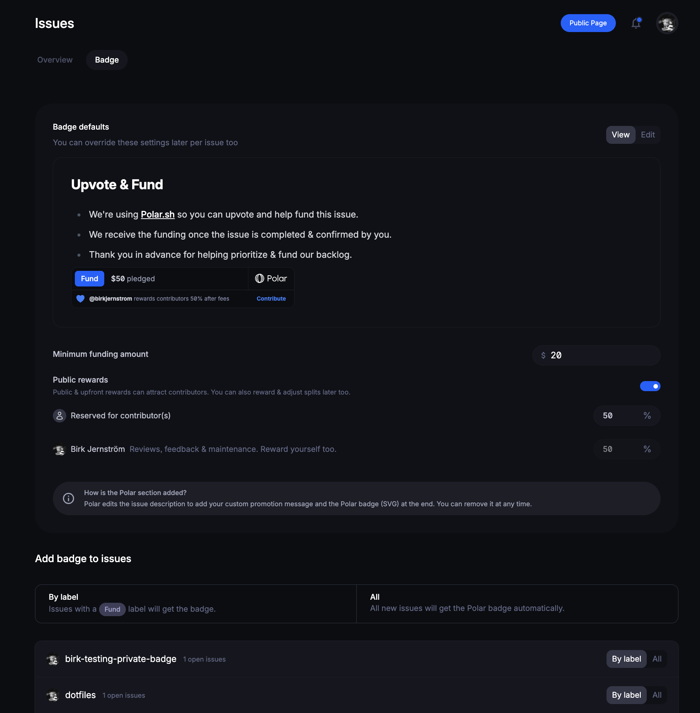

import BrowserCallout from '@/components/Feed/Markdown/Callout/BrowserCallout'

# Prerequisite

- You have a GitHub account
- You have installed the Polar GitHub App for the desired repositories ([Installation Guide](/docs/github/install))
- You are located and operate in one of our [supported countries](/docs#supported-countries)

# Repository & Badge Settings

You can now go to `Issues` > `Badge` in your Polar dashboard to customize issue funding across your repositories.

#### Markdown description

Custom markdown text to be inserted before the Polar Badge. Great way to offer
additional and personal context. We offer a default suggestion, but you can easily
edit it and even remove it entirely.

#### Minimum funding amount

The minimum amount required for funding by individual backers (default is `$20`)

#### Public rewards (Optional)

Enable & promote a default percentage split of the funding pool with potential
contributors who help squash an issue.

### Embed Settings

So we have our badge setup & ready - amazing! Let's configure how we want to
embed it for each repository.

#### Manual: Issues by Label

This is the default setting and a great way to try things out. You then have
complete control of which issues you want to embed the Polar Badge on using the
label `Fund` (case insensitive).

- You can label via GitHub directly and see the badge embedded within seconds
- You can label & badge an issue with one-click through the Polar dashboard

#### Automated: All Issues

Ok, you're loving it. Let's unleash it across all issues to promote funding to
our community and let them help vote & fund the most impactful efforts. Combined
with using rewards to distribute it across your contributors. Just like [tRPC](https://twitter.com/trpcio/status/1716747233121464346) has.

- `All` will ensure all future issues are badged automatically & directly upon
  creation

- You'll get the option to badge all existing - open - issues too. However, for
  safety, we show how many issues would be updated and require you to
  explicitly confirm & trigger this action.

<BrowserCallout type="NOTE">
#### How GitHub issue ordering is affected by multiple updates
Since we update the issues to embed the Polar Badge the issues will get an
updated `modified_at` timestamp.

By default, GitHub issues is sorted by `created_at` so it's not impacted
unless you specifically sort by `modified_at`.

However, when & if you select to badge all existing - open - issues, we do
so in a batch and in reverse chronological `modified_at` order. So that even
though we update them we do so in a way that should retain their previous order.
We cannot promise, however, that it will guaranteed.
</BrowserCallout>

## Next Step

Great, we're now setup. [Let's review how you can work with issue funding](/docs/issue-funding/workflow).
