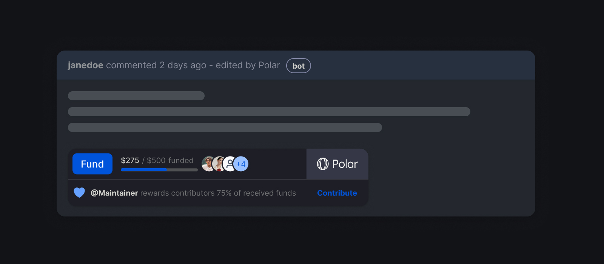
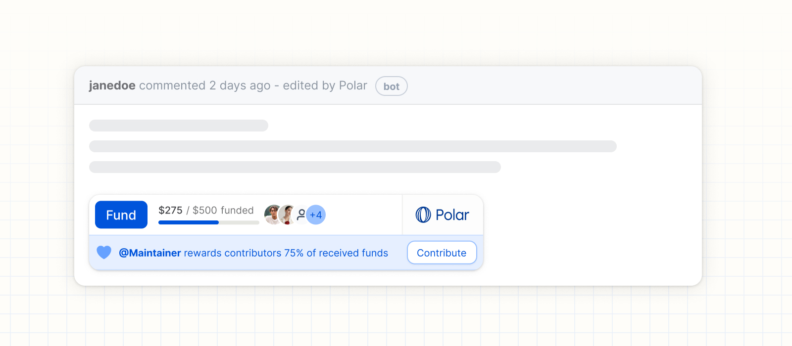

# Issue Funding

Polar offers a seamless service to enable your community to pool
funding towards issues - helping support, upvote and fund the most impactful
efforts. You can also easily reward contributors a share of the funding once the
issue is completed.

_Checkout an example on a GitHub issue: [SerenityOS/serenity#22179](https://github.com/SerenityOS/serenity/issues/22179)_

## Funded Backlog

Get a stack ranked & funded backlog based on what drives the most impact across your community.

- Enable users to easily fund any issues (feature requests, roadmap items, bugs
  etc)
- Seamless embedding of the Polar badge on GitHub issues to promote funding for
  select issues
- Set individual funding goals per issue (or leave it open)
- Funding is pooled from community members & users
- Better backlog of issues stack ranked based on reactions & funding
- Reward contributors once issues are completed a percentage of received funding
  (more below)

**Polar by example:** [tRPC](https://polar.sh/trpc/issues), [SerenityOS](https://polar.sh/serenityos/issues), [Sindre Sorhus](https://polar.sh/sindresorhus/issues), [Encode](https://polar.sh/encode/issues) and hundreds more.

## Reward Contributors

Issue funding can seamlessly be shared with your contributors. You can think of
rewards as open source bounties, but don't worry - it's designed for
maintainers and your communities for a change.

- You are in full control
- Your community pools funding towards an issue
- You can [promote funding towards specific
  issues](/docs/issue-funding/workflow)
- You can split the funding with contributor(s), i.e reward them
- You can promote rewards publicly (Optional - more details below)
- You can adjust rewards & add custom recipients when marking an issue as
  completed
- Your GitHub issue thread stays focused on making progress vs. funding chatter

You can read more about our philosophy of empowering maintainers & their
communities with Polar Rewards in our original [blog post from the Rewards launch](https://blog.polar.sh/introducing-rewards/).

## Get started in minutes

[Let's setup issue funding](/docs/issue-funding/getting-started) for your desired GitHub repositories.

## Configuring and Deploying Issue Funding in Production

To configure and deploy issue funding in production, follow these steps:

1. **Environment Setup**: Ensure that your production environment is properly configured with the necessary environment variables, such as `POLAR_ACCESS_TOKEN` and `POLAR_ORGANIZATION_ID`.

2. **GitHub Integration**: Connect your GitHub repositories with Polar as described in the [GitHub Install Guide](/docs/github/install). This will enable Polar to sync your issues and pull requests in real-time.

3. **Badge Issues**: Use the Polar dashboard to badge issues that you want to promote for funding. You can also set individual funding goals and customize the badge description for each issue.

4. **Promote Funding**: Share the direct link to the issue's funding page with your community. You can also embed the Polar badge in other places, such as your project documentation or website.

5. **Reward Contributors**: Once an issue is completed, use the Polar dashboard to mark it as completed and reward contributors. You can adjust the reward split and add custom recipients as needed.

6. **Monitoring**: Set up monitoring and logging for the issue funding process in your production environment. This will help you identify and resolve any issues that may arise during the funding process.

By following these steps, you can successfully configure and deploy issue funding in production, enabling your community to support and fund the most impactful efforts.
