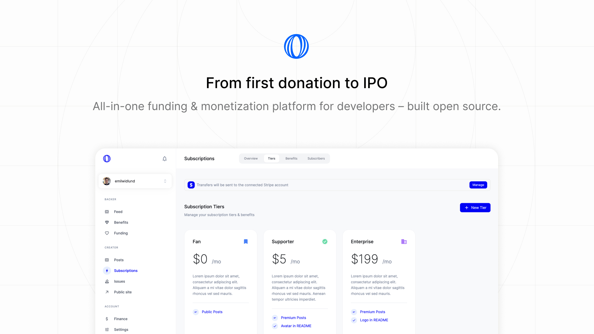
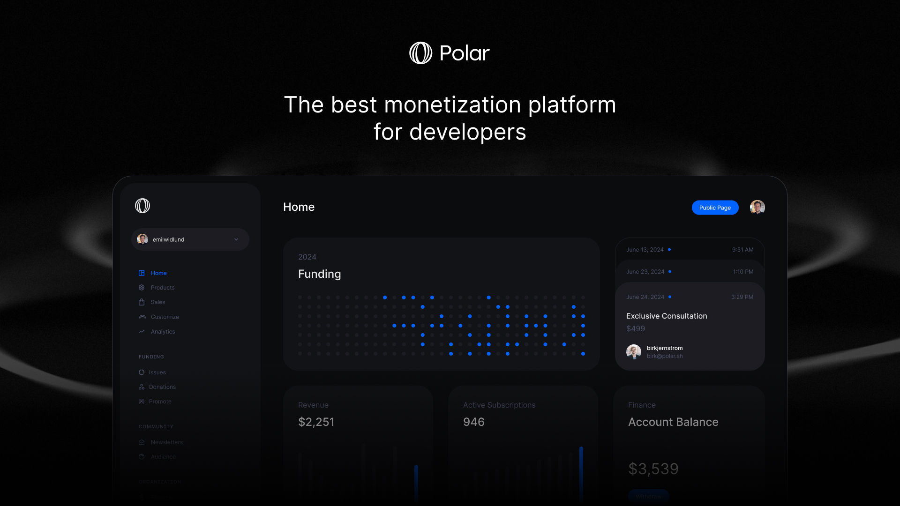

import {GuideCard} from '../GuideCard'

# Welcome to Polar

Focus on shipping. We'll focus on the infrastructure to get you paid - from first donation to IPO.

### Features

- GitHub Login & Official funding partner (`FUNDING.yaml`)
- Funding
  - Accept one-off donations
  - Crowdfunding behind GitHub issues - beautifully embedded
  - Reward contributors to funded issues
- Commercialization (Sponsorware to SaaS)
  - Pay once digital products, or...
  - Recurring subscriptions (monthly/annual)
  - Built-in & powerfully automated product & subscription benefits, e.g License Keys, File Downloads, GitHub Repo(s) access, Discord access and more.
- Polar is the Merchant of Record (MOR) handling billing, sales tax & EU VAT.
- Beautiful Polar page out of the box (official GitHub funding link) or...
- API & SDK for seamless integrations across docs, sites & services

You'll be up and running in 5 minutes. [Let's get started](/docs/onboarding).

### Integrate Polar in minutes

    <GuideCard
        icon='nextjs'
        title='Integrating Polar with Next.js'
        description='Learn how to integrate Polar with Next.js'
        href='/docs/guides/nextjs'
    />
    <GuideCard
        icon='node'
        title='Integrating Polar with Node.js'
        description='Integrate Polar with ease using Node.js'
        href='/docs/guides/node'
    />

### Built Open Source (Apache 2.0)

- 100% of our product, code and docs available on [GitHub](https://github.com/polarsource/polar)
- 19 contributors and growing ([Contributions welcome](/docs/contribute))
- Feature requests, feedback and issues - all in public
- Self-hosting while possible is not supported or encouraged (no MOR benefits)

### Pricing

- No fixed, monthly, costs
- 4% + 40¢ on transactions - we earn when you do
- Some payments may be subject to additional fees
- Large or fast-growing business? Reach out to us for volume discounts

## Why Polar vs. X?

There are a lot of options out there. So why use Polar?

- We're the [Merchant of Record](/docs/merchant-of-record/tax) and handle Sales tax & EU VAT so you don't have
  to
- Built-in benefits to upsell designed for the developer ecosystem, e.g Discord
  invites, GitHub repository access, file downloads and
  more.
- [Official GitHub funding.yaml option](/docs/github/funding-yaml)
- [Powerful API](/docs/api) & built 100% open source for the developer ecosystem
- [Competitive pricing](/docs/fees). Our fees are 20% lower than other popular merchant of record solutions.

## Supported countries

Polar is built on Stripe Connect and currently supports the following list of
countries for payouts:

- Austria
- Belgium
- Bulgaria
- Canada
- Croatia
- Cyprus
- Czech Republic
- Denmark
- Estonia
- Finland
- France
- Germany
- Greece
- Hungary
- Ireland
- Italy
- Latvia
- Lithuania
- Luxembourg
- Malta
- Netherlands
- Norway
- Poland
- Portugal
- Romania
- Slovakia
- Slovenia
- Spain
- Sweden
- United Kingdom
- United States
