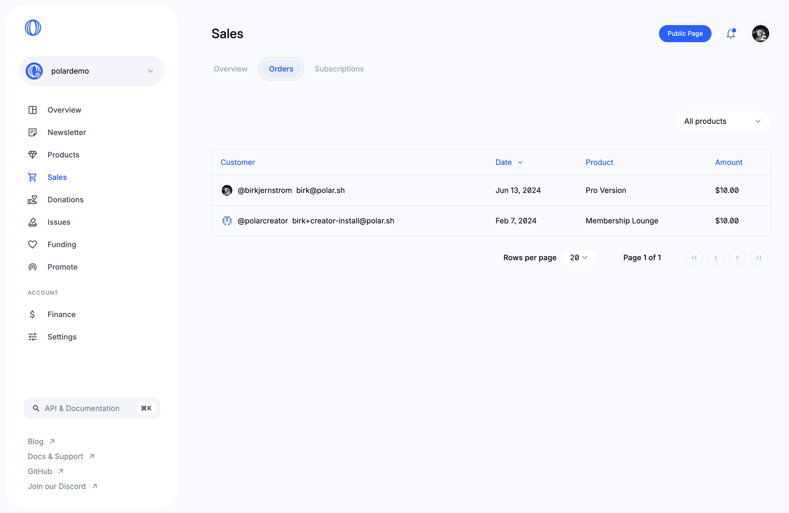
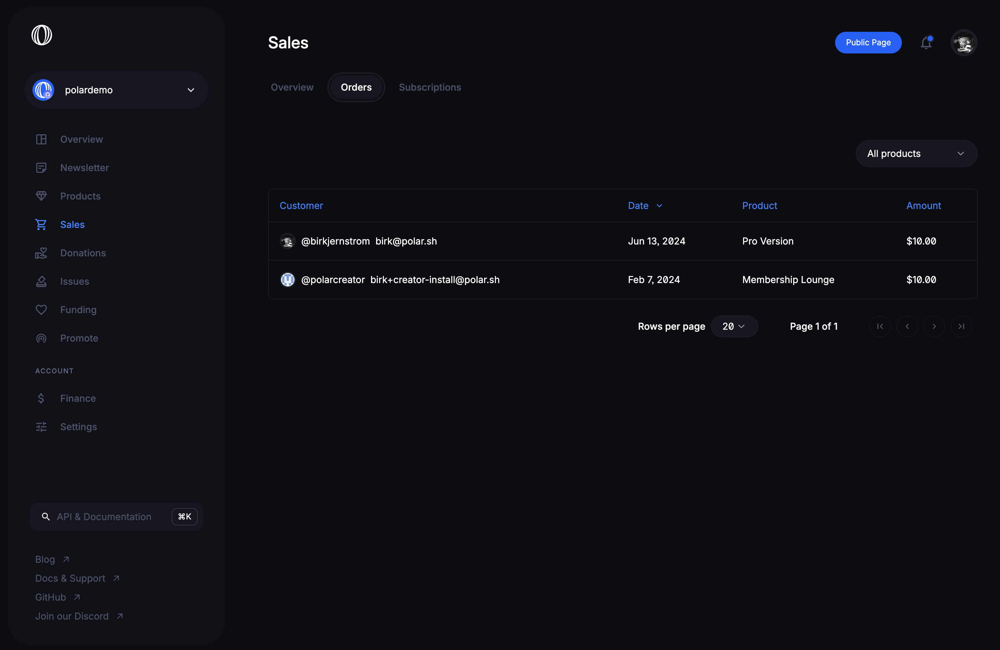

# Transaction History (Orders)

You can easily review all transactions (orders) that drive revenue. From
one-time purchases to subscription payments.

## Available data

- **Customer**. Email and GitHub handle (if available)
- **Date**. When was the transaction (order) made?
- **Product**. Which product or subscription tier was it for?
- **Amount**. How much revenue was earned from it?

## Filter by Product

By default all orders are shown in a paginated table. You can also filter it by
any specific product or subscription tier.

