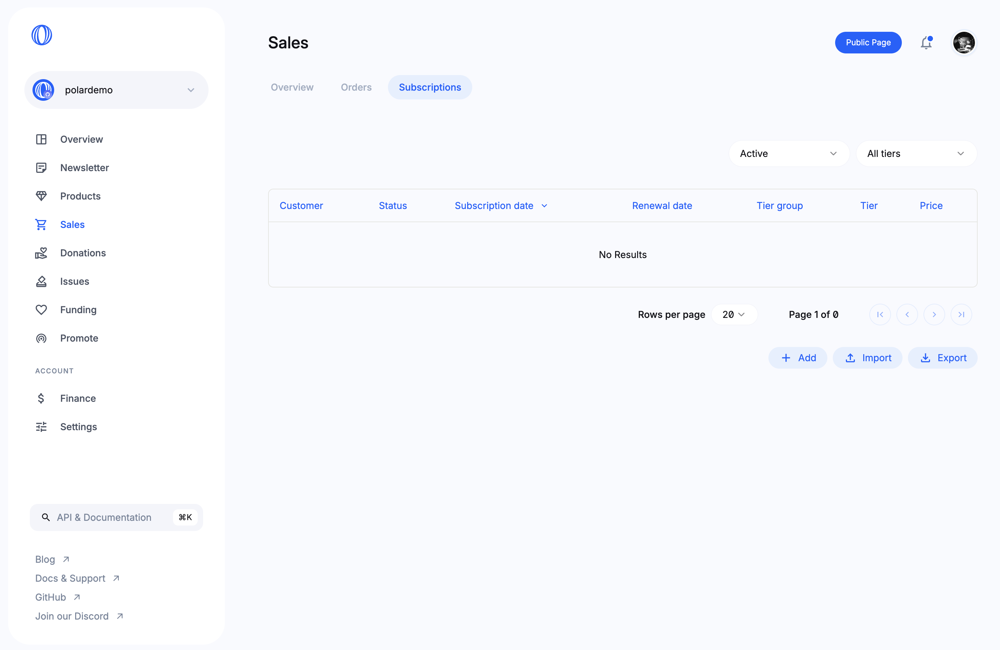
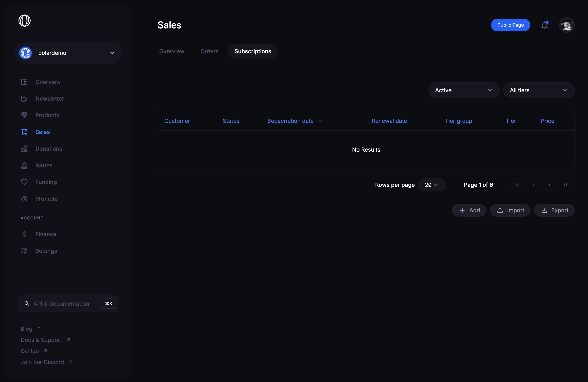

# Subscriptions Overview

## Available data

Paginated table of subscriptions showing:

- **Customer**. Email and GitHub handle (if available)
- **Status**. Active or cancelled.
- **Subscription date**. When customer subscribed (you can sort by this too)
- **Renewal date**. When the recurring subscription is due renewal, i.e next
  payment.
- **Tier**. The specific tier the customer is subscribed to.
- **Price**. The recurring price point.

## Filters

### Subscription Status

You can filter to show `Active` or `Cancelled` subscriptions.

### Tiers

You can also filter based on a specific subscription tier.
