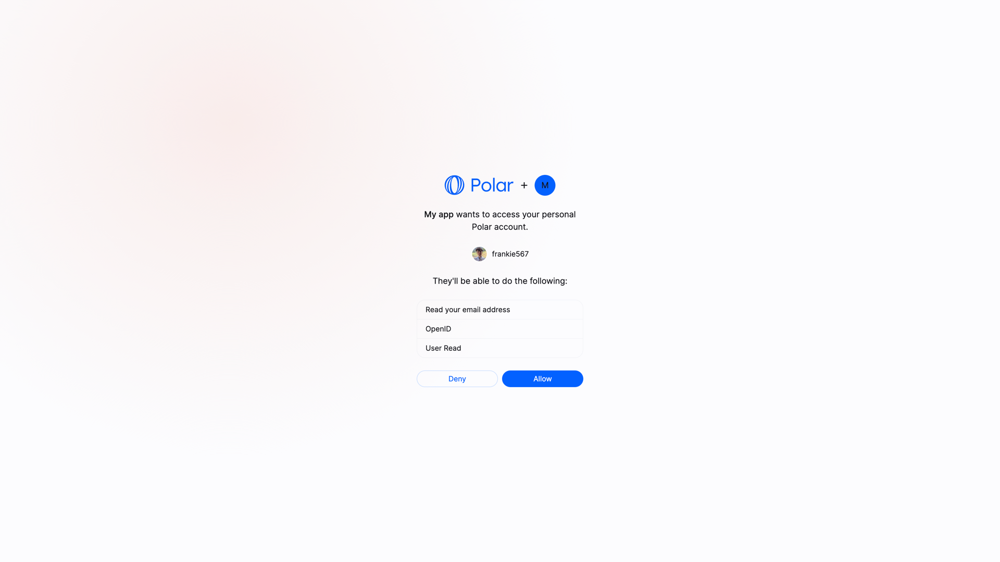
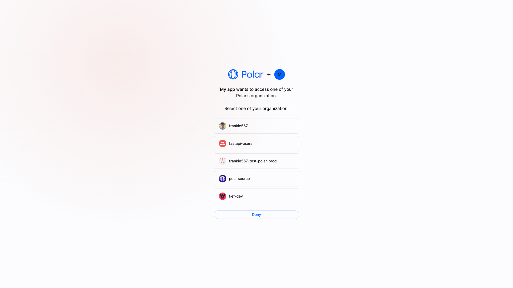
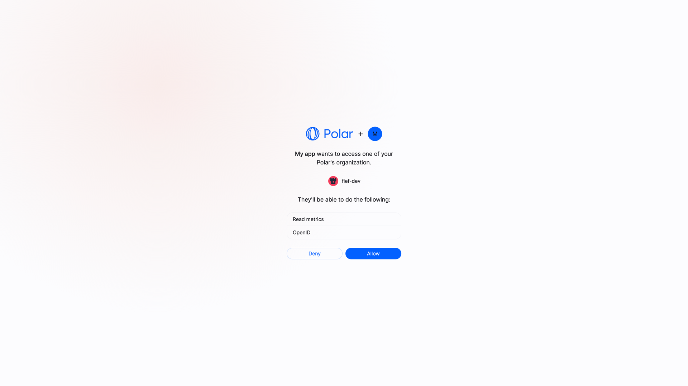

import BrowserCallout from '@/components/Feed/Markdown/Callout/BrowserCallout';
import OAuthSettings from '@/components/Documentation/OAuthSettings';

# Authentication

To authenticate requests, Polar API has two mechanisms:

1. Personal Access Tokens: those are long-lived tokens generated from your [user settings](https://polar.sh/settings#pat).
2. [OpenID Connect](#openid-connect): a standardized OAuth2 specification.

## Which one should I use?

If you want to make simple scripts to read or write your own data, use **Personal Access Tokens**. They are simple to use and don't require any additional setup.

If you want to build an application that interacts with Polar API on behalf of other users, use **OpenID Connect**. This way, you can authenticate users and make requests on their behalf.

## OpenID Connect (OAuth2)

Polar implements the [OpenID Connect specification](https://openid.net/developers/how-connect-works/) to enable third-party authentication. It's a layer on top of the OAuth2 framework aiming at making integration more standard and predictable.

In particular, it comes with a **discovery endpoint** allowing compatible clients to automatically work with the OpenID Connect server. Here is Polar's one:

<div className="text-xl text-center">
[https://api.polar.sh/.well-known/openid-configuration](https://api.polar.sh/.well-known/openid-configuration)
</div>

### Create an OAuth2 client

Before being able to make authentication requests, you'll need an **OAuth2 Client**. It's the entity that'll identify you, as a third-party developer, between Polar and the final user.

You can create and manage your clients below.

<div className="not-prose mb-6">
  <OAuthSettings />
</div>

<BrowserCallout type="TIP">
You can also manage them from your [user settings](https://polar.sh/settings#oauth).
</BrowserCallout>

Here are the required fields:

* *Application Name*: the name of the application that'll be shown to the final users.
* *Client Type*: the type of client you are creating. [Read more](#public-clients).
* *Redirect URIs*: for security reasons, you need to declare your application URL where the users will be redirected after granting access to their data. **HTTPS URL are required unless the hostname is `localhost`**.
* *Scopes*: the list of scopes your app will be able to ask for. To improve privacy and security, select only the scopes you really need for your application.
* *Homepage URL*: the URL of your application. It'll be shown to the final users on the authorization page.

Optionally, you can also add a **logo**, **terms of service** and **privacy policy** URL. They'll all be shown to the final users on the authorization page.

Once your client is created, you'll get a **Client ID** and a **Client Secret**. You'll need those values to make authentication requests.

<BrowserCallout type="CAUTION">
Those values are super sensitive and should be kept secret: they allow to make authentication requests on Polar!
</BrowserCallout>

### Start the authorization flow

To start the authorization flow, you need to redirect the user to the authorization URL. It looks like this:

```
https://polar.sh/oauth2/authorize?response_type=code&client_id=CLIENT_ID&redirect_uri=https%3A%2F%2Fexample.com%2Fcallback&scope=openid%20email
```

The parameters are the one described in the [OpenID Connect specification](https://openid.net/specs/openid-connect-core-1_0.html#AuthRequest). The most important ones are:

* `response_type=code`: indicates that you want to use the authorization code flow. This is the most common, and the only one supported by Polar
* `client_id`: the Client ID you got when creating the OAuth2 client.
* `redirect_uri`: the URL where the user will be redirected after granting access to their data. Make sure you declared it when creating the OAuth2 client.
* `scope`: a space-separated list of scopes you want to ask for. Make sure they are part of the scopes you declared when creating the OAuth2 client.

If you redirect the user to this URL, they'll see a page asking them to grant access to their data, corresponding to the scopes you asked for.



If they allow it, they'll be redirected to your `redirect_uri` with a `code` parameter in the query string. This code is a one-time code that you can exchange for an access token.

### Exchange the authorization code

Once you have the authorization code, you can exchange it for an access token. To do so, you'll need to make a `POST` request to the token endpoint. This call needs to be authenticated with the Client ID and Client Secret you got when creating the OAuth2 client.

Here is an example with cURL:

```bash
curl -X POST https://api.polar.sh/v1/oauth2/token \
  -H 'Content-Type: application/x-www-form-urlencoded' \
  -d 'grant_type=authorization_code&code=AUTHORIZATION_CODE&client_id=CLIENT_ID&client_secret=CLIENT_SECRET&redirect_uri=https://example.com/callback'
```

You should get the following response:

```json
{
    "token_type": "Bearer",
    "access_token": "polar_at_XXX",
    "expires_in": 864000,
    "refresh_token": "polar_rt_XXX",
    "scope": "openid email",
    "id_token": "ID_TOKEN"
}
```

The `access_token` will allow you to make authenticated API requests on behalf of the user. The `refresh_token` is a long-lived token that you can use to get new access tokens when the current one expires. The `id_token` is a signed JWT token containing information about the user, as per the [OpenID Connect specification](https://openid.net/specs/openid-connect-core-1_0.html#IDToken).

### User VS Organization access tokens

We support the concept of access tokens at **organization level**. Contrary to the standard access tokens, those tokens are not tied to a user but to an organization. They can be used to make requests operating only on a specific organization data, improving privacy and security.

To ask for a organization access token, you need to add the parameter `sub_type=organization` to the authorization URL:

```
https://polar.sh/oauth2/authorize?response_type=code&client_id=polar_ci_j3X95_MgfdSCeCd2qkFnUw&redirect_uri=https%3A%2F%2Fexample.com%2Fcallback&scope=openid%20email&sub_type=organization
```

At this point, the user will be prompted to select one of their organization before allowing access to their data.




The rest of the flow remains unchanged. The access token you'll get will be tied to the selected organization.

<BrowserCallout type="NOTE">
Bear in mind that some endpoints might not support organization access tokens. Typically, user-specific endpoints like `/v1/users/benefit` will not work with organization access tokens.
</BrowserCallout>

### Public Clients

Public clients are clients where the Client Secret can't be kept safe, as it would be accessible by the final user. This is the case for SPA, mobile applications, or any client running on the user's device.

In this case, **and only if the client is configured as a Public Client**, the request to the token endpoint won't require the `client_secret` parameter. However, the [PKCE](https://oauth.net/2/pkce/) method will be required to maximize security.

## Make authenticated requests

Once you have an access token, either from a Personal Access Token or from the OpenID Connect flow, you can make authenticated requests to the API. Here is a simple example with cURL:

```bash
curl -X GET https://api.polar.sh/v1/oauth2/userinfo \
  -H 'Authorization: Bearer polar_at_XXX'
```