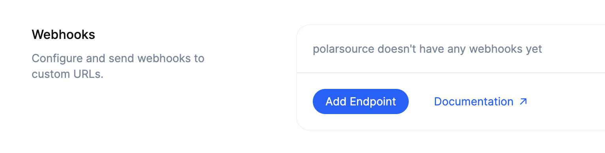
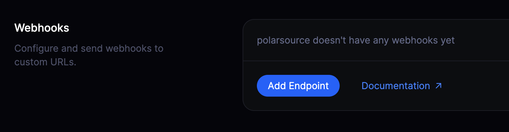
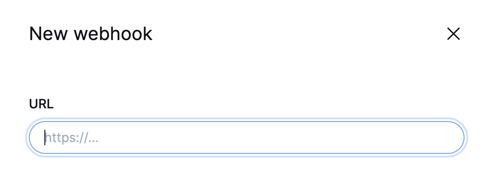
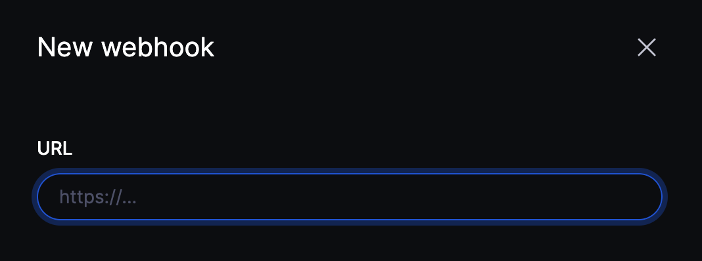
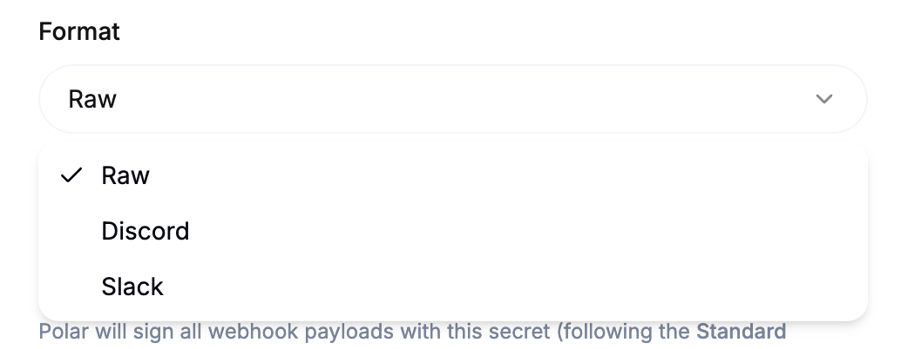
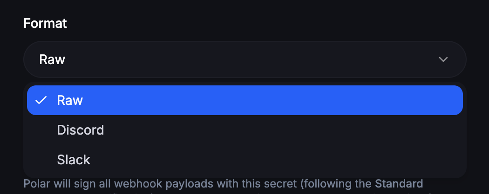
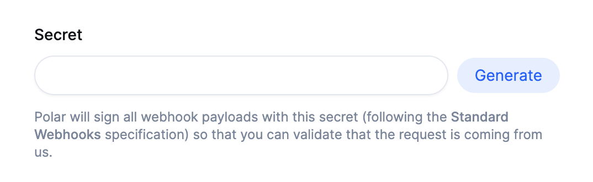
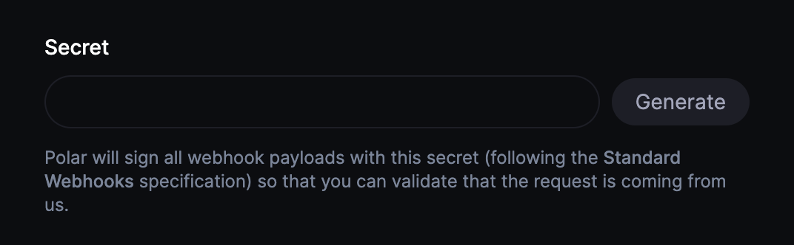
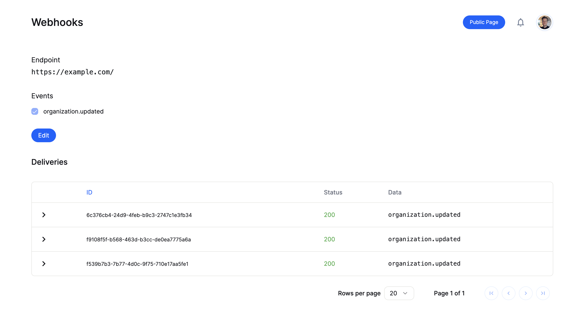
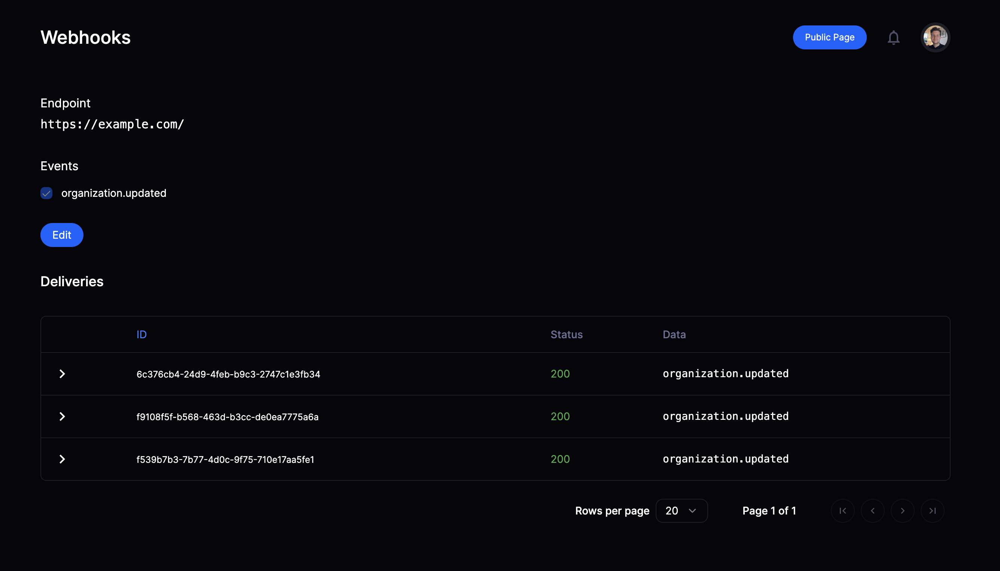

import BrowserCallout from '@/components/Feed/Markdown/Callout/BrowserCallout'

# Webhooks

Webhooks allow you to build or set up integrations that subscribe to certain Polar events. When one of those events is triggered, we'll send an HTTP POST payload to the webhook's configured URL.

Our implementation follow the [Standard Webhooks](https://www.standardwebhooks.com/) specification.

Out-of-the-box, we also support to send notifications suitable for [Discord](https://support.discord.com/hc/en-us/articles/228383668-Intro-to-Webhooks) or [Slack](https://api.slack.com/messaging/webhooks). This is the purpose of the [Format](#format) parameter.

## Configuring a Webhook

Head over to your organization's settings page and click on the "Add Endpoint" button to create a new webhook.




### URL

In the dialog that appears, enter the URL to which the webhook events should be sent.




### Format

For standard, custom integrations, leave this parameter on **Raw**. This will send a payload in a JSON format as described in the [Events](/docs/api/webhooks/events) section.

If you wish to send notifications to a Discord or Slack channel, you can select the corresponding format here. Polar will then adapt the payload so properly formatted messages are sent to your channel.




<BrowserCallout type="TIP">
  If you paste a Discord or Slack webhook URL, the format will be automatically
  selected.
</BrowserCallout>

### Secret

In order to verify that requests are legitimate webhook payload coming from Polar, we cryptographically sign the requests using a secret key. You can set your own or generate a random one.




### Events

Finally, select the events you want to be notified about. You can read more about the available events in the [Events](/docs/api/webhooks/events) section.

## Webhook Delivery

Once a webhook is configured, you will have access to a delivery overview page. This page shows you all the webhook events that have been sent to the configured URL. You can easily see the status of each delivery and the data which was sent.




<BrowserCallout type="NOTE">
  If we hit an error while trying to reach your endpoint, whether it is a
  temporary network error or a bug, we'll retry to send the event up to **10
  times** with an exponential backoff.
</BrowserCallout>

## Verify signature

Requests sent to your webhook endpoint will include a signature so you can verify that the request is truly coming from Polar.

As it follows the [Standard Webhooks](https://www.standardwebhooks.com/) specification, you can use one of their libraries to verify the signature: https://github.com/standard-webhooks/standard-webhooks/tree/main/libraries

If you use the `standard-webhooks` library, you can verify the signature like this using Node.js:

```javascript
import { Webhook } from "standardwebhooks"

const webhookSecret = Buffer.from(env.POLAR_WEBHOOK_SECRET).toString('base64');
const wh = new Webhook(webhookSecret);
const payload = wh.verify(requestBody, webhookHeaders)
```

For a more in-depth implementation example - look at the [Polar NextJS Webhooks example](/docs/guides/nextjs#handling-polar-webhooks).

## Webhook Events

Events are detailed in the dedicated [Events](/docs/api/webhooks/events) section.