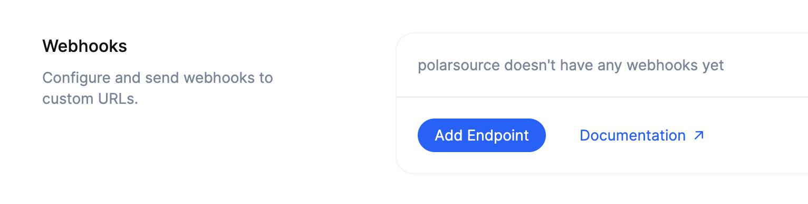
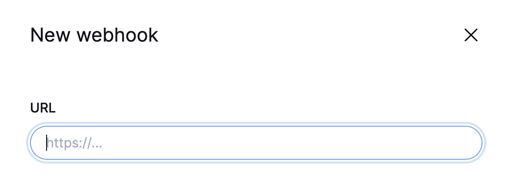
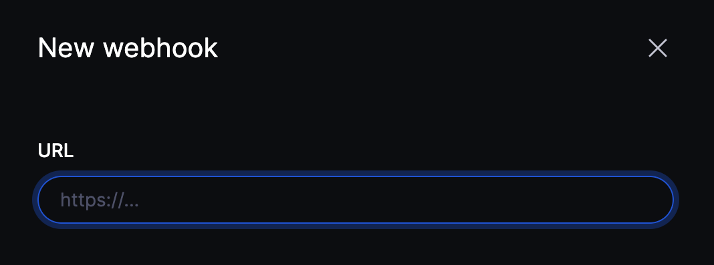
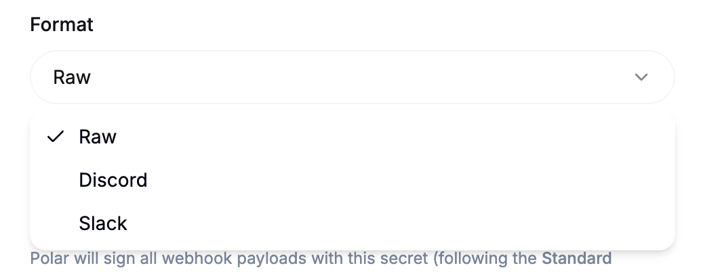
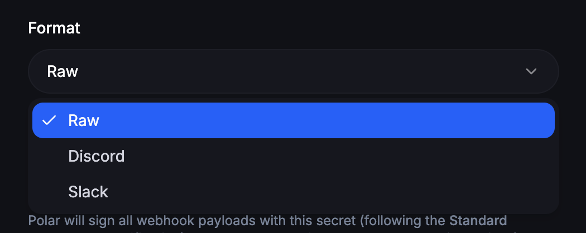
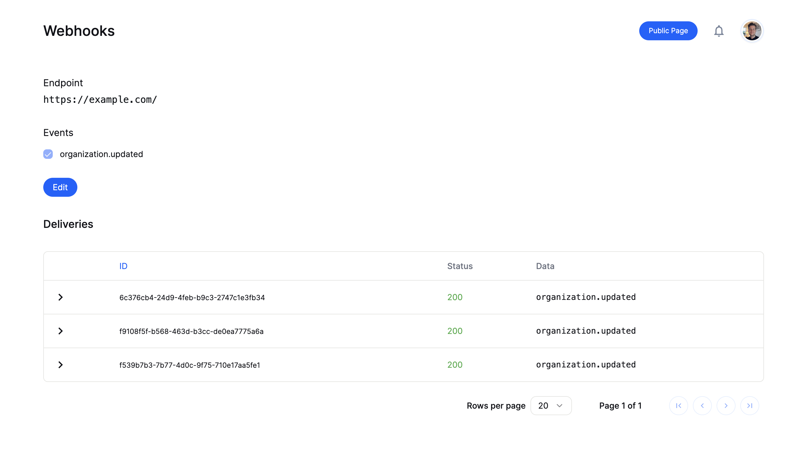
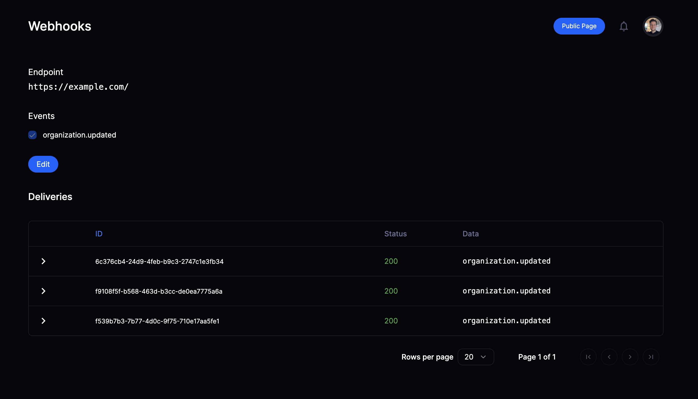

import BrowserCallout from '@/components/Feed/Markdown/Callout/BrowserCallout'

# Webhooks

Webhooks allow you to build or set up integrations that subscribe to certain Polar events. When one of those events is triggered, we'll send an HTTP POST payload to the webhook's configured URL.

Our implementation follow the [Standard Webhooks](https://www.standardwebhooks.com/) specification.

Out-of-the-box, we also support to send notifications suitable for [Discord](https://support.discord.com/hc/en-us/articles/228383668-Intro-to-Webhooks) or [Slack](https://api.slack.com/messaging/webhooks). This is the purpose of the [Format](#format) parameter.

## Configuring a Webhook

Head over to your organization's settings page and click on the "Add Endpoint" button to create a new webhook.




### URL

In the dialog that appears, enter the URL to which the webhook events should be sent.




### Format

For standard, custom integrations, leave this parameter on **Raw**. This will send a payload in a JSON format as described in the [Events](/docs/developers/webhooks/events) section.

If you wish to send notifications to a Discord or Slack channel, you can select the corresponding format here. Polar will then adapt the payload so properly formatted messages are sent to your channel.




<BrowserCallout type="TIP">
  If you paste a Discord or Slack webhook URL, the format will be automatically
  selected.
</BrowserCallout>

### Secret

In order to verify that requests are legitimate webhook payload coming from Polar, we cryptographically sign the requests using a secret key. You can set your own or generate a random one.


### Events

Finally, select the events you want to be notified about. You can read more about the available events in the [Events](/docs/developers/webhooks/events) section.

## Webhook Delivery

Once a webhook is configured, you will have access to a delivery overview page. This page shows you all the webhook events that have been sent to the configured URL. You can easily see the status of each delivery and the data which was sent.




### Retries

If we hit an error while trying to reach your endpoint, whether it is a temporary network error or a bug, we'll retry to send the event up to **10 times** with an exponential backoff.

### Timeouts

We expect your endpoint to answer under **20 seconds**. Past this delay, the delivery will error and we'll enter the retry cycle described above. We recommend you to avoid too long processing while receiving the webhook. The good practice if you have long logic to run is to queue the event and respond to the webhook immediately. Your logic is then run in a background by a worker.

## Verify signature

Requests sent to your webhook endpoint will include a signature so you can verify that the request is truly coming from Polar.

Our Python and JavaScript SDK provide a function to validate and parse the webhook event.

**Python example**

```py
from flask import Flask, request
from polar_sdk.webhooks import validate_event, WebhookVerificationError

app = Flask(__name__)

@app.route('/webhook', methods=['POST'])
def webhook():
    try:
        event = validate_event(
            payload=request.data,
            headers=request.headers,
            secret='<YOUR_WEBHOOK_SECRET>',
        )

        # Process the event

        return "", 202
    except WebhookVerificationError as e:
        return "", 403
```

**Node.js example**

```ts
import express, { Request, Response } from "express";
import { validateEvent, WebhookVerificationError } from "@polar-sh/sdk/webhooks";

const app = express();

app.post("/webhook", express.raw({ type: "application/json" }), (req: Request, res: Response) => {
  try {
    const event = validateEvent(req.body, req.headers, process.env["POLAR_WEBHOOK_SECRET"] ?? "");

    // Process the event

    res.status(202).send('')
  } catch (error) {
    if (error instanceof WebhookVerificationError) {
      res.status(403).send('')
    }
    throw error
  }
});
```

For other languages, as we follow the [Standard Webhooks](https://www.standardwebhooks.com/) specification, you can use one of their libraries to verify the signature: https://github.com/standard-webhooks/standard-webhooks/tree/main/libraries

<BrowserCallout type="WARNING">
  When using the Standard Webhooks libraries, they expect your secret to be **encoded in Base64 first**.
</BrowserCallout>

For a more in-depth implementation example, look at the [Polar NextJS Webhooks example](/docs/developers/guides/nextjs#handling-polar-webhooks).
