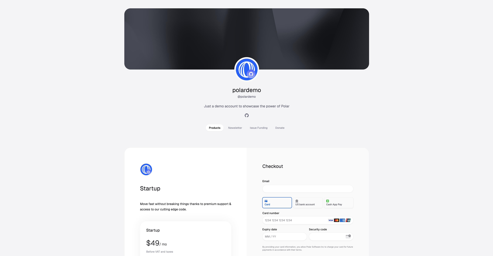
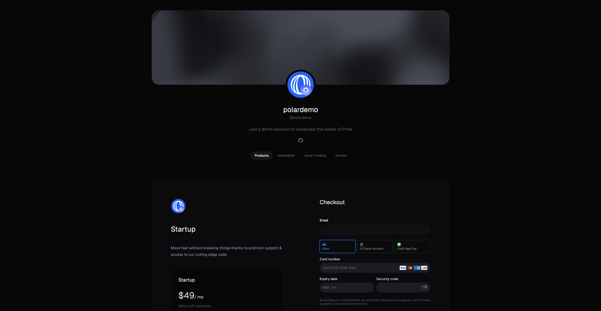
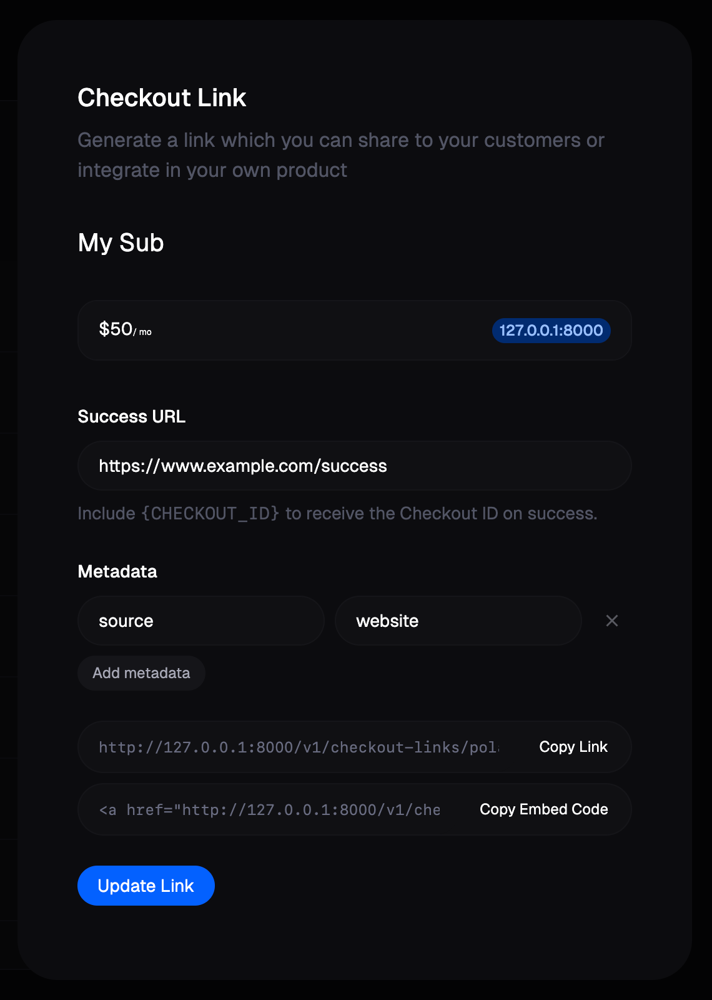

import BrowserCallout from '@/components/Feed/Markdown/Callout/BrowserCallout'
import CheckoutEmbedExample from './CheckoutEmbedExample'

export const metadata = {
  title: 'Checkout',
  description: 'Learn how to sell products with Polar',
  openGraph: {
    title: 'Checkout',
    description: 'Learn how to sell products with Polar',
    siteName: 'Polar',
  },
  twitter: {
    images: [
      {
        url: `https://polar.sh/assets/brand/polar_og.jpg`,
        width: 1200,
        height: 630,
        alt: `Polar`,
      },
    ],
    card: 'summary_large_image',
    title: 'Checkout',
    description: 'Learn how to sell products with Polar',
  },
}

# Checkout

Polar offers a few different ways to sell digital products. In this guide, we'll go through & cover the most basic approaches using the Storefront, Checkout Links, Embedded Checkout and API.

## Storefont




A Polar Storefont is a hosted store for your organization. It's an easy way for you to drive traffic and sell your products without the hassle of dealing with your own store implementation.

Storefronts are disabled by default. Head to the Organization Dashboard and click "Storefront" in the Navigation. In there, you'll find the option to enable it. Once done, your storefront is available at `https://polar.sh/<organization-slug>`

Every product-page has a checkout form inline where users can purchase your product directly.

## Checkout Links

Checkouts Links are an easy way to sell your products: you just need to share this URL on your website or social media for customers to start a checkout.

Checkout Links can be created by pressing the "context-menu" button on the Products Overview Page. This will open a modal where you can select price and optionally set a success URL.

You can also optionally set `Metadata`: this is a key-value object allowing you to store additional information which may be useful for you when handling the order. This metadata will be copied to the generated Checkout object and, if the checkout succeeds, to the resulting Order and/or Subscription.




<BrowserCallout type="TIP">
  Previously generated links will be displayed in this modal as well. Click on
  it to edit the success URL or metadata.
</BrowserCallout>

## Embedded Checkout


Embedded Checkout allows you to include Polar's Checkout and sell your product directly on your website.

You can either copy and paste or code snippet to get up and running in a second or use our JavaScript library for more advanced integrations.

### Code snippet

The code snippet can be used on any website or CMS that allows you to insert HTML.

First, create a [Checkout Link](#checkout-links) as described in the previous section. The code snippet can directly be copied from there by clicking on `Copy Embed Code`.

The snippet looks like this:

```html
<a
  href="__CHECKOUT_LINK__"
  data-polar-checkout
  data-polar-checkout-theme="light"
>
  Purchase
</a>
<script
  src="https://cdn.jsdelivr.net/npm/@polar-sh/checkout@0.1/dist/embed.global.js"
  defer
  data-auto-init
></script>
```

This will display a `Purchase` link which will open an inline checkout when clicked, like the following: <CheckoutEmbedExample />

<BrowserCallout type="TIP">
  You can style the trigger element any way you want, as long as you keep the
  `data-polar-checkout` attribute.
</BrowserCallout>

### Import library

If you have a more advanced project in JavaScript, like a React app, adding the `<script>` tag may not be an option. In this case, you can install our dedicated library.

```bash
npm install @polar-sh/checkout
```

Then, you should import the `PolarEmbedCheckout` helper class and manually call `PolarEmbedCheckout.init()`. This will add the required handlers on elements having the `data-polar-checkout` attribute.

Here is an example in React:

```tsx
import { PolarEmbedCheckout } from '@polar-sh/checkout/embed'
import { useEffect } from 'react'

const PurchaseLink = () => {
  useEffect(() => {
    PolarEmbedCheckout.init()
  }, [])

  return (
    <a
      href="__CHECKOUT_LINK__"
      data-polar-checkout
      data-polar-checkout-theme="light"
    >
      Purchase
    </a>
  )
}

export default PurchaseLink
```

## API

If you want to integrate more deeply the checkout process with your website or application, you can use our dedicated API.

The first step is to [create a Checkout session](/docs/api/v1/checkouts/custom/post). For this you'll need at least your **Product Price ID**.

<BrowserCallout type="TIP">
  You can retrieve your Product Price ID from `Products` in your dashboard,
  click on "context-menu" button in front of your product and click on `Copy
  Price ID`.
</BrowserCallout>

The API will return you an object containing all the information about the session, including **an URL where you should redirect your customer** so they can complete their order.

You can read more about this approach in our dedicated [framework guides](/docs/guides).
