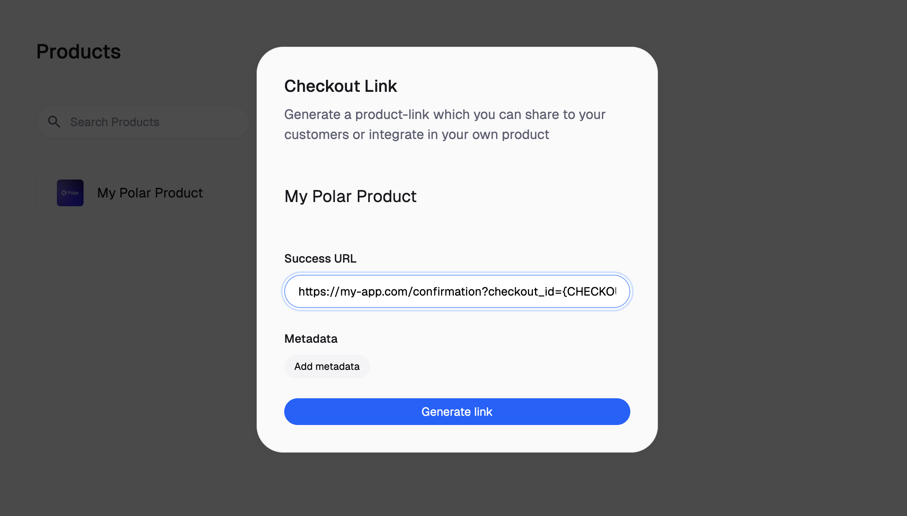
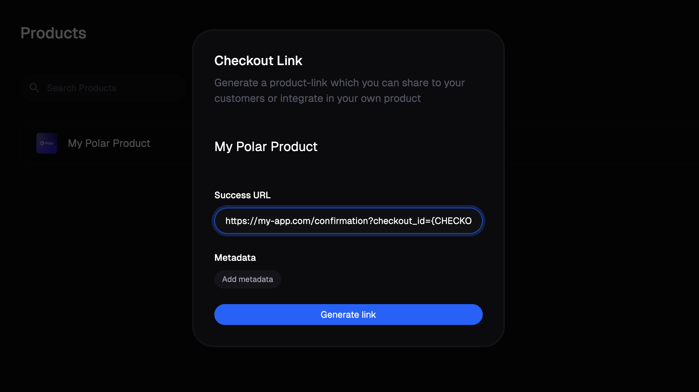
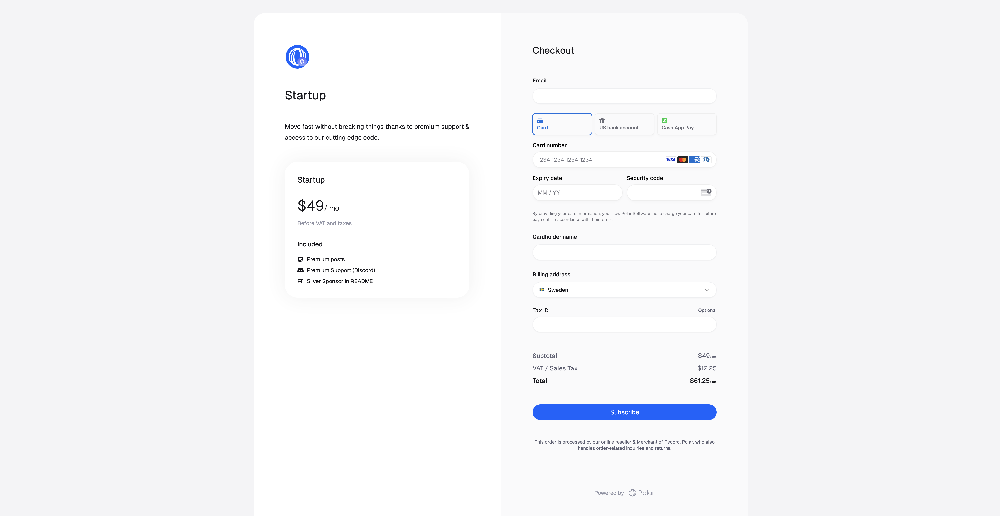
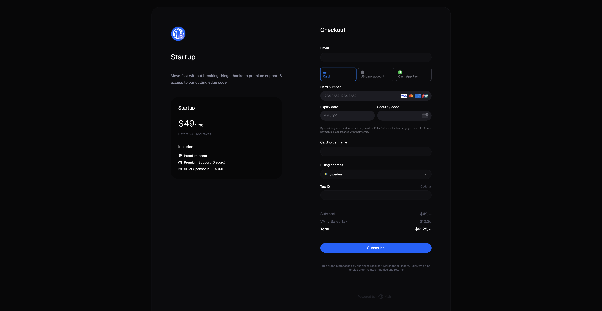

# Checkouts & Payment Links

Polar offers a few different ways to sell digital products. In this guide, we'll go through & cover the most basic approaches using the Storefront, Checkout Sessions, and Payment Links.

### Storefont Checkouts


A Polar Storefont is a hosted store for your organization. It's an easy way for you to drive traffic and sell your products without the hassle of dealing with your own store implementation.

Storefronts are disabled by default. Head to the Organization Dashboard and click "Storefront" in the Navigation. In there, you'll find the option to enable it. Once done, your storefront is available at `https://polar.sh/<organization-slug>`

Every product-page has a checkout-form inline where users can purchase your product directly.

### Payment Links




In case you don't want a public-facing storefront, and instead do all store-related integrations on your own platform, you can use Payment Links.

Payment Links are URL's which points to a product with a specific price. As you can offer a monthly and yearly price for a product, Payment Links are generated with a specific price ID in mind. These Payment URLs takes the user to a Product Checkout page on Polar.

You can also pass an optional `successUrl` when creating a payment link. This is where we redirect to when the checkout has been confirmed, otherwise they will be redirected to the Order Page on Polar.

#### Creating a new Payment Link

Payment Links can be created by pressing the "context-menu" button on the Products Overview Page. This will open a modal where you can select price and optionally set a success URL.

#### Including the Checkout ID

In order to receive the Checkout ID on your success page, you can pass a `...?checkout_id={CHECKOUT_ID}` parameter to your success URL. Polar will automatically replace it with the actual Checkout session ID. This allows you to retrieve the Checkout object easily on your confirmation page.

### Checkout Sessions




You can programmatically create checkout URL redirections via the Polar SDK. A simple NextJS example would look something like:

```typescript
// src/app/checkout/route.ts
import { api } from "@/polar";
import { type NextRequest, NextResponse } from "next/server";

export async function GET(req: NextRequest) {
	const url = new URL(req.url);
	const productPriceId = url.searchParams.get("priceId") ?? "";
    // Polar will replace {CHECKOUT_ID} with the actual checkout ID upon a confirmed checkout
	const confirmationUrl = `${req.nextUrl.protocol}//${req.nextUrl.host}/confirmation?checkout_id={CHECKOUT_ID}`;

	try {
		const result = await api.checkouts.custom.create({
			productPriceId,
			successUrl: confirmationUrl,
		});

		return NextResponse.redirect(result.url);
	} catch (error) {
		console.error(error);
		return NextResponse.error();
	}
}
```

export const metadata = {
    title: 'Checkouts & Payment Links',
    description: 'Learn how to create and manage Checkout Sessions and Payment Links',
    openGraph: {
        title: 'Checkouts & Payment Links',
        description: 'Learn how to create and manage Checkout Sessions and Payment Links',
        siteName: 'Polar',
    },
    twitter: {
        images: [
            {
                url: `https://polar.sh/assets/brand/polar_og.jpg`,
                width: 1200,
                height: 630,
                alt: `Polar`,
            },
        ],
        card: 'summary_large_image',
        title: 'Checkouts & Payment Links',
        description: 'Learn how to create and manage Checkout Sessions and Payment Links',
    },
}