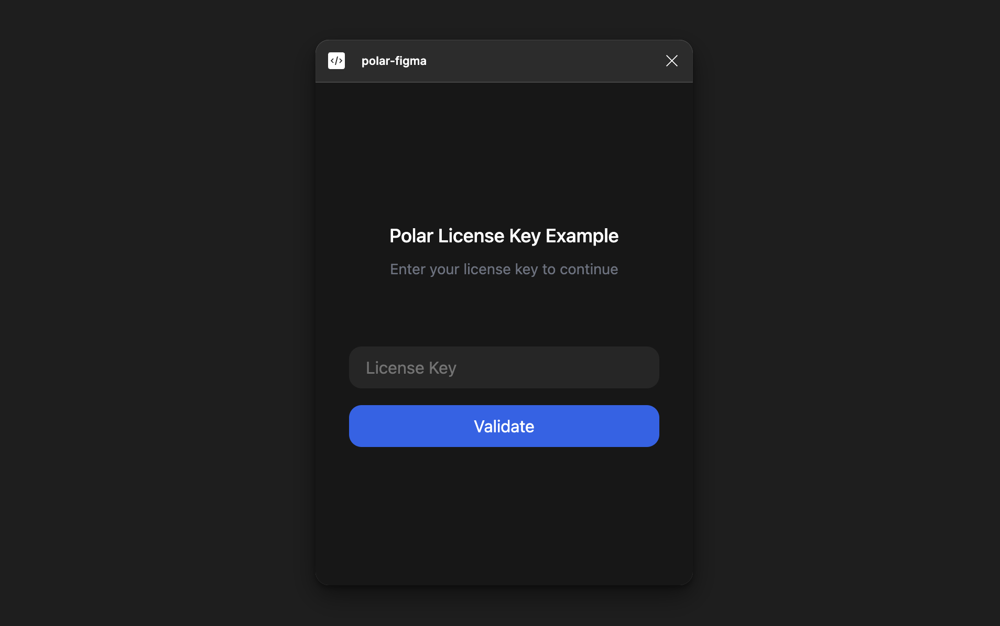

import BrowserCallout from '@/components/Feed/Markdown/Callout/BrowserCallout';
import ShadowBox from 'polarkit/components/ui/atoms/shadowbox'
import Button from 'polarkit/components/ui/atoms/button'
import GithubIcon from '@/components/Icons/GithubIcon'

# Figma Plugins with License Keys

Want to earn a few bucks on your Figma plugin? Sell access to your plugin using Polar, with the License Key benefit.

### Prerequisites

- A Figma account
- A Polar account
- A Figma plugin with React & Typescript configured

<ShadowBox className="mt-12">
<GithubIcon width={40} />
<h3>Polar Figma Plugin Example</h3>
<p>We've created a simple example Figma plugin that you can use as a reference</p>
<a href="https://github.com/polarsource/polar-figma" target="_blank"><Button>View Code on GitHub</Button></a>
</ShadowBox>

## Creating a product with License Key Benefit

The best way to monetize your Figma plugin is to use a License Key Benefit. This benefit type allows you to sell access to your plugin to users.

The flow would look something like this:

1. User installs your plugin
2. User gets a prompt to enter a license key
3. User buys a license key from your Polar product page
4. User adds the license key to your plugin
5. User can now use your plugin & you've made a few bucks!

### Creating a product

Head over to your Polar dashboard and click on **Products** in the sidebar. Then click on **New Product**. Fill in the details for your product.

### Adding the License Key Benefit

Once you've entered product details and pricing information, you'll see a section for **Benefits**. Expand the License Key tab & press **Create New**.

This will expand the License Key modal, where you can configure the license key settings. Configure how the license key should be used in your plugin.

Perfect! You've now created a product, which grants an associated license key to the customer.

If you need help configuring the license key settings, you can read more about it in the [License Key Settings Guide](/docs/benefits/license-keys).

### Configuring the Figma Plugin Manifest

In order to communicate with the Polar API, you'll need to configure the Figma plugin manifest & add the polar domain to the allowed domains list.

```json
{
  "name": "...",
  "id": "...",
  "api": "1.0.0",
  "main": "code.js",
  "capabilities": [],
  "enableProposedApi": false,
  "documentAccess": "dynamic-page",
  "editorType": [
    "figma"
  ],
  "ui": "ui.html",
  "networkAccess": {
    "allowedDomains": [
      "https://*.polar.sh"
    ],
    "reasoning": "This plugin needs to access the Polar API to validate license keys."
  }
}
```

## Installing the Polar SDK

Go to your Figma plugin code and install the Polar SDK.

```bash
npm install @polar-sh/sdk
```

### Configuring the Polar SDK Client

You instantiate the Polar SDK client by creating a new instance of the `Polar` class. You do not need to provide a personal access token to validate license keys.

```typescript
// src/main/polar.ts
import { Polar } from '@polar-sh/sdk'

export const polar = new Polar()
```

## UI



Go ahead and add an input field to your Figma plugin UI where users can enter their license key. 

This example uses TailwindCSS for styling and React hooks for state management.

```tsx
// src/ui/components/LicenseKeyInput.tsx
import type { Polar } from "@polar-sh/sdk";
import type {
	LicenseKeyActivationRead,
	ValidatedLicenseKey,
} from "@polar-sh/sdk/models/components";
import React, { useState, useCallback } from "react";
import { twMerge } from "tailwind-merge";
import { polar } from "../polar";

export interface LicenseKeyInputProps {
	organizationId: string;
	needsActivation?: boolean;
	onValidation?: (validation: ValidatedLicenseKey) => void;
	onActivation?: (activation: LicenseKeyActivationRead) => void;
}

export const LicenseKeyInput = ({
	organizationId,
	needsActivation,
	onActivation,
	onValidation,
}: LicenseKeyInputProps) => {
	const [licenseKey, setLicenseKey] = useState("");
	const [error, setError] = useState<string | null>(null);
	const [loading, setLoading] = useState(false);

	const handleError = useCallback((error: string) => {
		setError(error);
	}, []);

	const handleActivation = useCallback(async () => {
		setError(null);
		setLoading(true);
		try {
			const activation = await polar.users.licenseKeys.activate({
				key: licenseKey,
				organizationId: organizationId,
				label: "Figma Plugin",
			});

			onActivation?.(activation);
		} catch (error) {
			if (error instanceof Error) {
				handleError(error.message);
			}
		} finally {
			setLoading(false);
		}
	}, [licenseKey, organizationId, onActivation, handleError]);

	const handleValidation = useCallback(async () => {
		setError(null);
		setLoading(true);
		try {
			const validation = await polar.users.licenseKeys.validate({
				key: licenseKey,
				organizationId: organizationId,
			});

			onValidation?.(validation);
		} catch (error) {
			if (error instanceof Error) {
				handleError(error.message);
			}
		} finally {
			setLoading(false);
		}
	}, [onValidation, licenseKey, organizationId, handleError]);

	return (
		<div className="flex flex-col gap-y-4 w-full">
			<input
				className="bg-gray-100 py-2 px-4 rounded-xl w-full"
				placeholder="License Key"
				value={licenseKey}
				onChange={(e) => setLicenseKey(e.target.value)}
			/>
			{error && (
				<div className="flex rounded-lg px-4 py-2 bg-red-50">
					<p className="text-red-500 text-xs">License key is invalid</p>
				</div>
			)}
			<button
				className={twMerge(
					"text-white py-2 px-4 rounded-xl",
					loading ? "bg-gray-300" : "bg-blue-500",
				)}
				onClick={needsActivation ? handleActivation : handleValidation}
				type="button"
				disabled={loading}
			>
				{loading ? "Validating..." : "Validate"}
			</button>
		</div>
	);
};
```

### Activate License Key

In case you've setup license keys to have a maximum amount of activation
instances, e.g associated Figma Accounts. You'll then need to create an activation
instance prior to validating license keys.

This is why we've added the `needsActivation` prop to the `LicenseKeyInput` component.

**No activation limit?** You can pass `false` to the `needsActivation` prop.

Acticating a license key will automatically validate it, so it doesn't need to be validated separately.

### Authenticated and Unauthenticated UI

Let's create two different UI components, one for when the user has a validated License Key and is considered `Authenticated`, and one for when the user is not.

```tsx
// src/ui/components/Authenticated.tsx
import * as React from "react";

// This is where you can add what you want the authenticated user to see
export const Authenticated = () => {
	return (
		<div className="flex flex-col items-center h-full w-full">
			<h1 className="text-lg font-medium">Thanks for supporting this plugin</h1>
		</div>
	);
};
```

```tsx
// src/ui/components/Unauthenticated.tsx
import type {
	LicenseKeyActivationRead,
	ValidatedLicenseKey,
} from "@polar-sh/sdk/models/components";
import { polar } from "../polar";
import { LicenseKeyInput } from "./LicenseKeyInput";

export interface UnauthenticatedProps {
	organizationId: string;
	onValidation: (
		validation: ValidatedLicenseKey | LicenseKeyActivationRead,
	) => void;
}

export const Unauthenticated = ({
	organizationId,
	onValidation,
}: UnauthenticatedProps) => {
	return (
		<div className="flex flex-col items-center justify-center h-full gap-y-16">
			<div className="flex flex-col gap-y-2 items-center">
				<h3 className="text-lg font-medium">Polar License Key Example</h3>
				<p className="text-sm text-gray-500">
					Enter your license key to continue
				</p>
			</div>
			<LicenseKeyInput
				organizationId={organizationId}
				onValidation={onValidation}
				onActivation={onValidation}
				// Set to true if your configured Polar License Key has a limit of activations
				needsActivation={false}
			/>
		</div>
	);
};
```

## Gatekeeping the UI

In order to gatekeep the UI, between the authenticated and unauthenticated UI, we need some logic to check if the user has a valid license key.

We can create an entry point in a file called `main.tsx` for this example.

```tsx
// src/ui/main.tsx
import React, { useState } from "react";
import type {
	LicenseKeyActivationRead,
	ValidatedLicenseKey,
} from "@polar-sh/sdk/models/components";
import { Authenticated } from "./components/Authenticated";
import { Unauthenticated } from "./components/Unauthenticated";
import { createRoot } from "react-dom/client";
import "./input.css";

// Replace this with your actual organization ID
// It can be found in your Polar Organization Settings page
const ORGANIZATION_ID = "<YOUR_ORGANIZATION_ID>";

function Plugin() {
	const [validation, setValidation] = useState<ValidatedLicenseKey | LicenseKeyActivationRead>();

	return (
		<div className="flex flex-col h-full w-full bg-white p-8">
			{validation ? (
				<Authenticated />
			) : (
				<Unauthenticated
					organizationId={ORGANIZATION_ID}
					onValidation={setValidation}
				/>
			)}
		</div>
	);
}

const container = document.getElementById("root") ?? document.createElement("div");
const root = createRoot(container);
root.render(<Plugin />);
```

## Persisting License keys

We recommend persisting the license key in the Figma's client storage. This way, the user doesn't have to re-enter the license key on every Figma session. This can be done in the "plugin"-code, which runs sandboxed and has access to the Figma API.

The Figma API has a `clientStorage` API, which allows you to persist data in the Figma client. This data is unique to the Figma client, and isn't shared between different Figma clients. This is useful if you want to sell license keys that has a limit of activations per user. The user will then only be able to activate the license key once per Figma client.

### Communicating with the Figma Plugin from the UI

As mentioned earlier, the Figma plugin code runs in a sandboxed environment and has access to the Figma API. This means that you need to communicate with the Figma plugin via the postMessage API to access the clientStorage API from the UI.

Let's implement a simple example where the UI code posts a message to the plugin code to save the license key to the clientStorage API.

```typescript
// src/main/main.ts
figma.showUI(__html__, { themeColors: true, height: 480, width: 360 });

interface GetLicenseKey {
	type: "getLicenseKey";
	data: null;
}

interface SetLicenseKey {
	type: "setLicenseKey";
	data: string;
}

figma.ui.onmessage = async (message: GetLicenseKey | SetLicenseKey) => {
	switch (message.type) {
		case "getLicenseKey":
			const licenseKey = await figma.clientStorage.getAsync("license_key");

			figma.ui.postMessage({
				type: "getLicenseKey",
				data: licenseKey,
			});
			break;
		case "setLicenseKey":
			await figma.clientStorage.setAsync("license_key", message.data);

			figma.ui.postMessage({
				type: "setLicenseKey",
				data: message.data,
			});
			break;
	}
};
```

Now, let's update the UI code to listen for messages from the plugin code and persist the license key in the clientStorage API.

```tsx
// src/ui/main.tsx
import { polar } from "./polar";
import React, { useCallback, useEffect, useState } from "react";
import type {
	LicenseKeyActivationRead,
	ValidatedLicenseKey,
} from "@polar-sh/sdk/models/components";
import { Authenticated } from "./components/Authenticated";
import { Unauthenticated } from "./components/Unauthenticated";
import { createRoot } from "react-dom/client";
import "./input.css";

// Replace this with your actual organization ID
// It can be found in your Polar Organization Settings page
const ORGANIZATION_ID = "<YOUR_ORGANIZATION_ID>";

function Plugin() {
	const [validation, setValidation] = useState<ValidatedLicenseKey | LicenseKeyActivationRead>();

	const onValidation = useCallback(
		(licenseKeyValidation: ValidatedLicenseKey | LicenseKeyActivationRead) => {
			const key = "key" in licenseKeyValidation ? licenseKeyValidation.key : licenseKeyValidation.licenseKey;

			parent.postMessage({ pluginMessage: { type: "setLicenseKey", data: key } }, "*");

			setValidation(licenseKeyValidation);
		},
		[],
	);

	const initialize = useCallback(async () => {
		window.onmessage = async (e) => {
			const persistedLicenseKey = e.data.pluginMessage.data;

			switch (e.data.pluginMessage.type) {
				case "getLicenseKey":
					if (persistedLicenseKey) {
						const validation = await polar.users.licenseKeys.validate({
							organizationId: ORGANIZATION_ID,
							key: persistedLicenseKey,
						});

						setValidation(validation);
					}
					break;
			}
		};

		parent.postMessage({ pluginMessage: { type: "getLicenseKey", data: null } }, "*");
	}, []);

	useEffect(() => {
		initialize();
	}, [initialize]);

	return (
		<div className="flex flex-col h-full w-full bg-white p-8">
			{validation ? (
				<Authenticated />
			) : (
				<Unauthenticated
					organizationId={ORGANIZATION_ID}
					onValidation={onValidation}
				/>
			)}
		</div>
	);
}

const container = document.getElementById("root") ?? document.createElement("div");
const root = createRoot(container);
root.render(<Plugin />);
```

## Conclusion

You've now created a Figma plugin that can validate license keys using the Polar SDK. You can now go forth and monetize your plugin! 🎉

<ShadowBox className="mt-12">
<GithubIcon width={40} />
<h3>Polar Figma Plugin Example</h3>
<p>We've created a simple example Figma plugin that you can use as a reference</p>
<a href="https://github.com/polarsource/polar-figma" target="_blank"><Button>View Code on GitHub</Button></a>
</ShadowBox>


export const metadata = {
    title: 'Figma Plugins with License Keys',
    description: 'Learn how to sell access to your Figma plugin using License Keys & the Polar SDK',
    openGraph: {
        title: 'Figma Plugins with License Keys',
        description: 'Learn how to sell access to your Figma plugin using License Keys & the Polar SDK',
        siteName: 'Polar',
    },
    twitter: {
        images: [
            {
                url: `https://polar.sh/assets/brand/polar_og.jpg`,
                width: 1200,
                height: 630,
                alt: `Polar`,
            },
        ],
        card: 'summary_large_image',
        title: 'Figma Plugins with License Keys',
        description: 'Learn how to sell access to your Figma plugin using License Keys & the Polar SDK',
    },
}