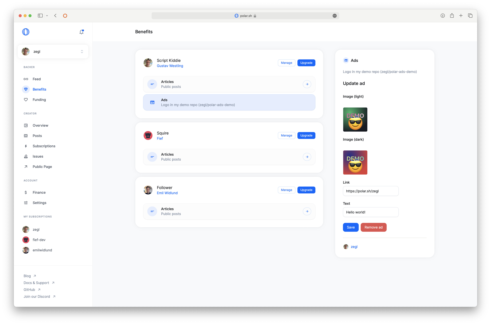

import BrowserCallout from '@/components/Feed/Markdown/Callout/BrowserCallout'

# Sponsorship Placement (Ads)

Want to offer sponsors a logotype placement in your newsletter, README or anywhere else? You can easily with Polar.
- Set custom image dimensions per benefit
- Customers can self-manage uploading their logotypes in your dimensions
- Offering light & dark mode options

<BrowserCallout type="NOTE">
**No review/approval process of uploaded images.**

Sponsors with this benefit can upload any image. In our newsletter, you see the image before publishing, but automated elsewhere there is always the risk of bad images being uploaded.
</BrowserCallout>

## Create Ads Benefit

1. Goto `Products` > `Benefits`
2. Click `+` to create a new benefit
3. Choose `Ad` as the `Type`

You can customize the benefit description, and the image width and height of your ad space.

When you've created the benefit, go to your subscription tiers and add the benefit to the relevant tiers.

Subscribers to your ads tier can manage their own ad content from the Benefits page.

From there, the subscriber can upload their images (in light and dark mode! 😎), and configure the text and link.

## Automate README.md Placements

You can easily automate logotype placements in your GitHub README.md.

### Using our GitHub Action

You can use the Polar GitHub Action to automate this in connection with the Ads benefit.

[
Read more
](https://github.com/polarsource/actions?tab=readme-ov-file#polarsourceactionsads)

### Using Sponsorkit

Polar is officially supported in [Sponsorkit](https://github.com/antfu-collective/sponsorkit) by Anthony Fu along with GitHub, Patreon and others. Making it easy to aggregate sponsorships across platforms into an automated README.md.

## Sponsorship Placement Anywhere

You can also easily get active campaigns and their associated logotypes via our [API](/docs/api/v1/advertisements/get) to integrate anywhere.

