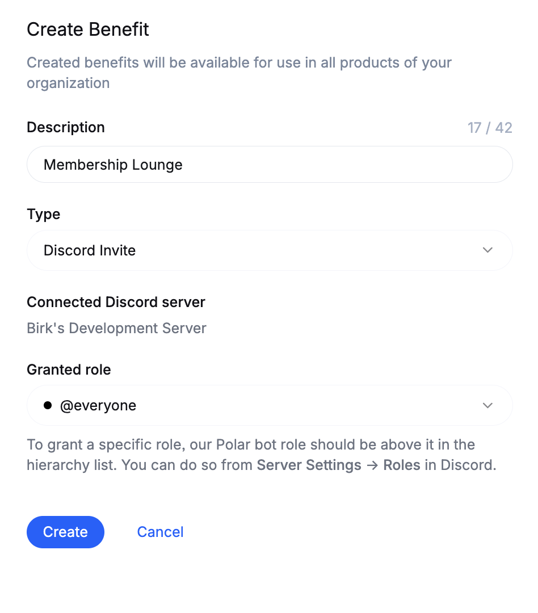
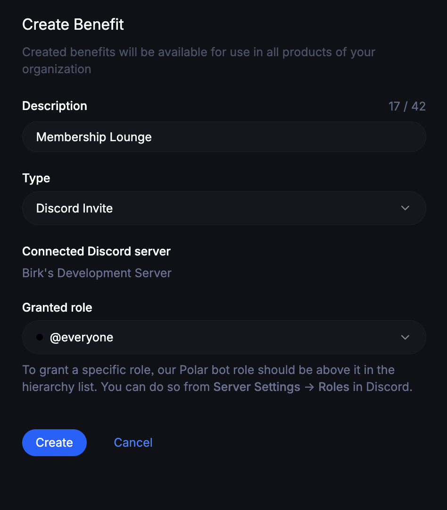

import BrowserCallout from '@/components/Feed/Markdown/Callout/BrowserCallout'

# Sell Discord Access & Roles

Automating Discord server invites and roles for customers or subscribers is
super easy and powerful with Polar.
- Fully automated Discord server invitations
- You can even setup multiple Discord servers, or...
- Offer different roles for different subscription tiers or products

## Create Discord Benefit

Click on `Connect your Discord server`. You'll be redirected to Discord where you can grant the Polar App for your desired server.

Next, you'll be promted to approve the permissions our app requires to function. It needs all of them.

**Manage Roles**

Access to your Discord roles. You'll be able to select which ones to grant to your customers later.

**Kick Members**

Ability to kick members who have this benefit and connected Discord with Polar.

**Create Invite**

Ability to invite members who purchase a product or subscribes to a tier with this benefit.

You're now redirected back to Polar and can finish setting up the Discord benefit on our end.

**Connected Discord server**

Which Discord server you connected. Cannot be changed. However, you can create multiple benefits and connect more Discord servers if you want.

**Granted role**

Which Discord role do you want to grant as part of this benefit?
