import BrowserCallout from '@/components/Feed/Markdown/Callout/BrowserCallout'

# Sell Digital Products

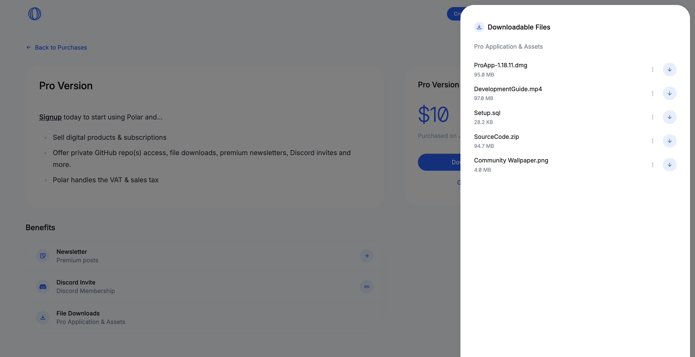
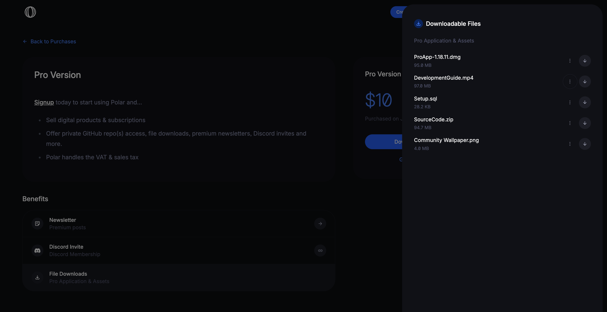

You can easily offer customers and subscribers access to downloadable files with Polar.
- Up to 10GB per file
- Upload any type of file - from ebooks to full-fledged applications
- SHA-256 checksum validation throughout for you and your customers (if desired)
- Customers get a signed & personal downloadable URL

## Create Downloadable Benefit

1. Goto `Products` > `Benefits`
2. Click `+` to create a new benefit
3. Choose `File Downloads` as the `Type`

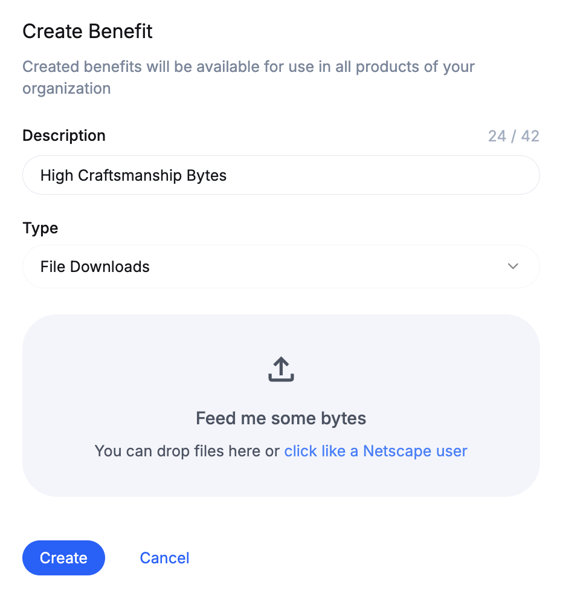
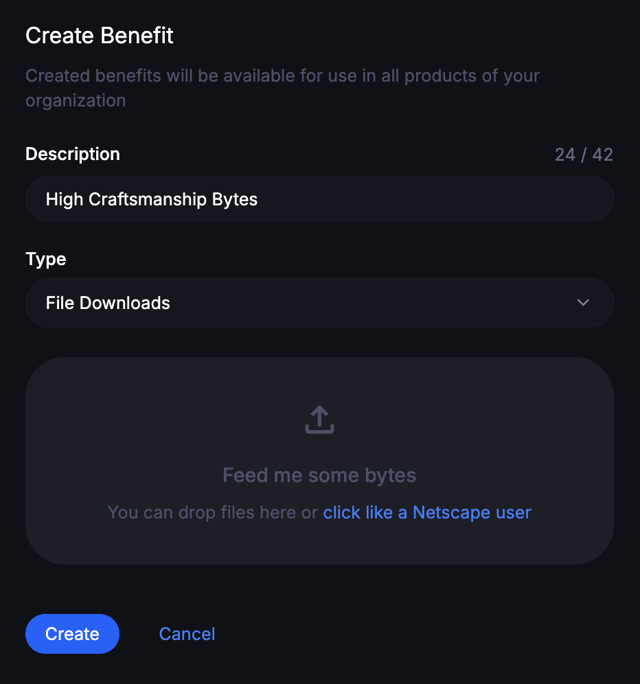

You can now upload the files you want to offer as downloadables for customers.
1. Drag & drop files to the dropzone (`Feed me some bytes`)
2. Or click on that area to open a file browser

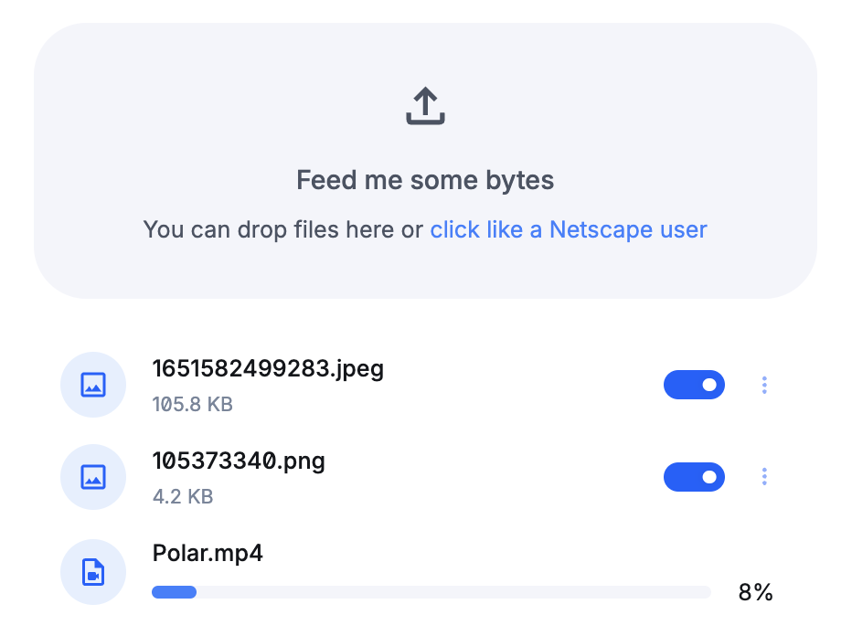
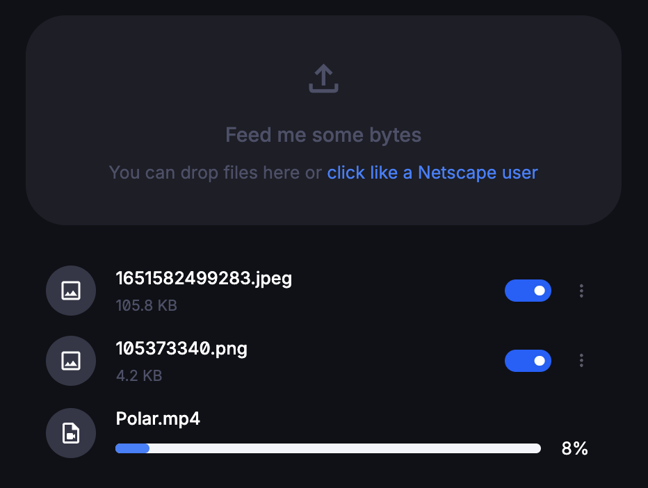

### Change filename

Click on the filename to change it inline.

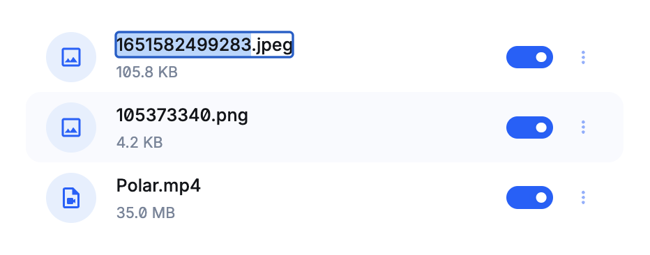
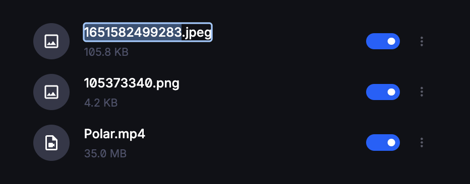

### Change order of files

You can drag and drop the files in the order you want.

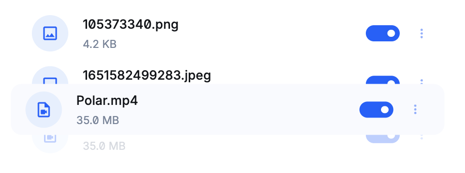
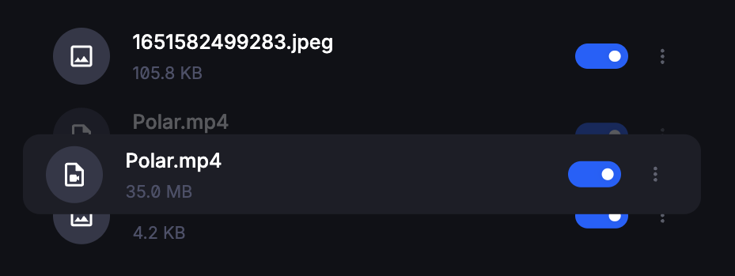

### Review SHA-256 checksum

Click on the three dots and then `Copy SHA-256 Checksum`

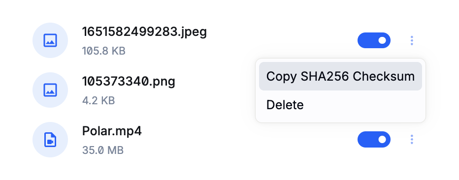
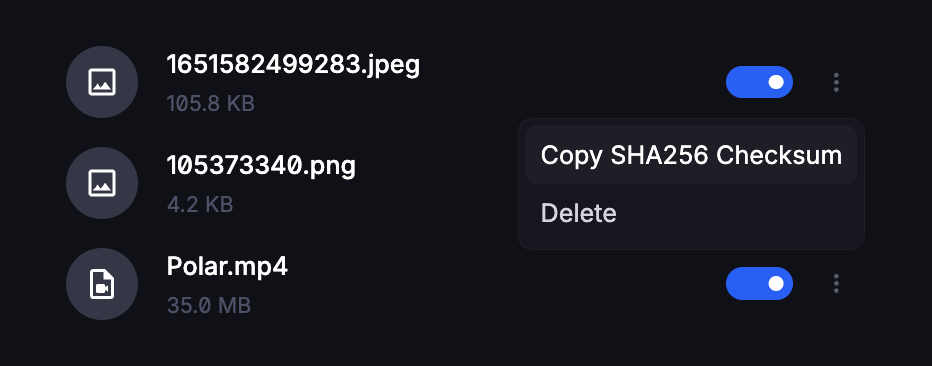

### Delete a file

Click on the three dots and then `Delete` in the menu.

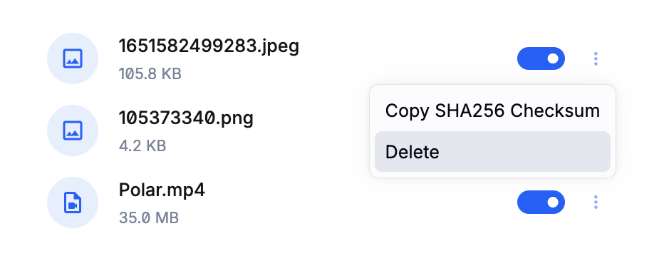

<BrowserCallout type="WARNING">
**Active subscribers & customers will lose access too!**

Deleting a file permanently deletes it from Polar and our S3 buckets except for
the metadata. Disable the file instead if you don't want it permanently deleted.
</BrowserCallout>

### Disable & enable files

You can disable files at any point to prevent new customers getting access to
it.

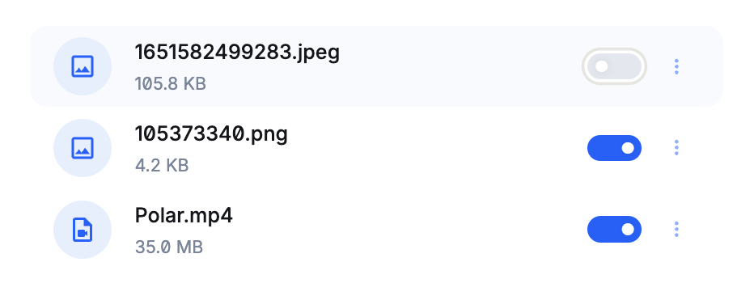
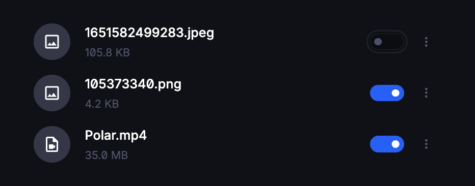

<BrowserCallout type="NOTE">
**Existing customers retain their access**

Customers who purchased once the file enabled will still have access
to legacy files. Just new customers will be impacted.
</BrowserCallout>

<BrowserCallout type="NOTE">
**Enabling or adding files grants access retroactively**

In case you add more files or re-enable existing ones, all current customers and
subscribers with the benefit will be granted access.
</BrowserCallout>
