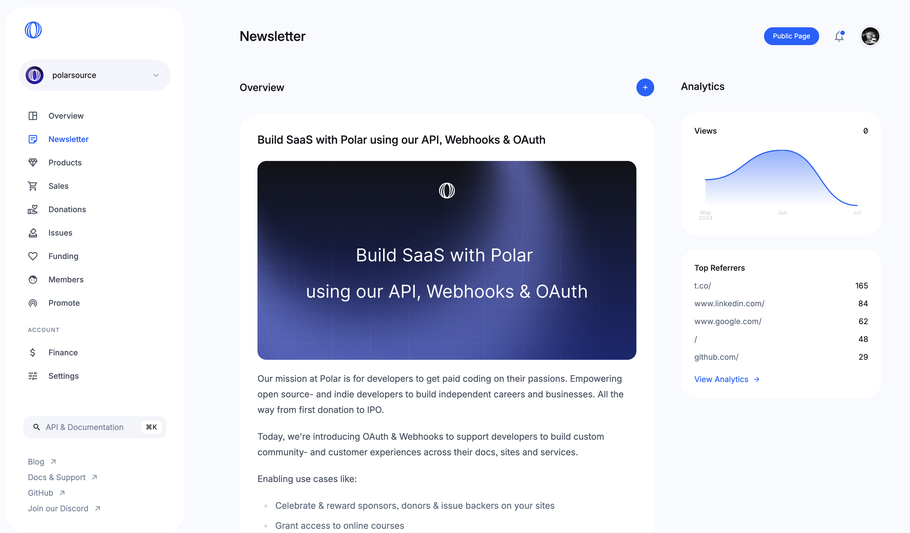
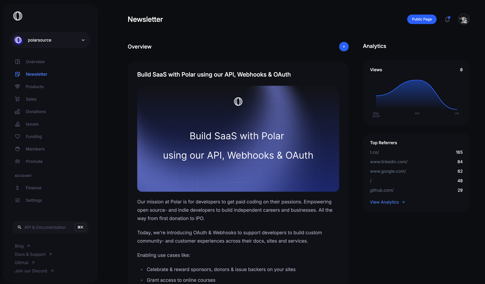
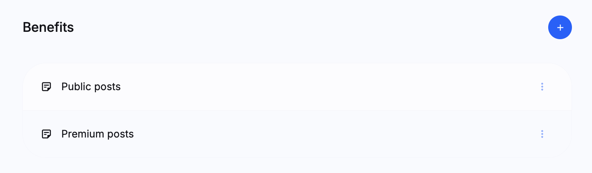
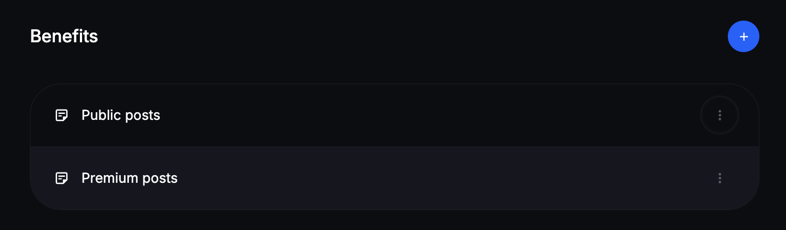
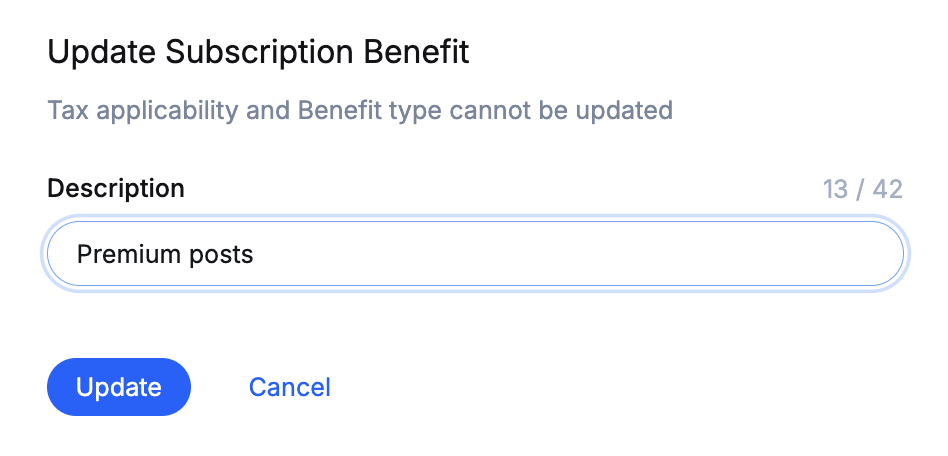
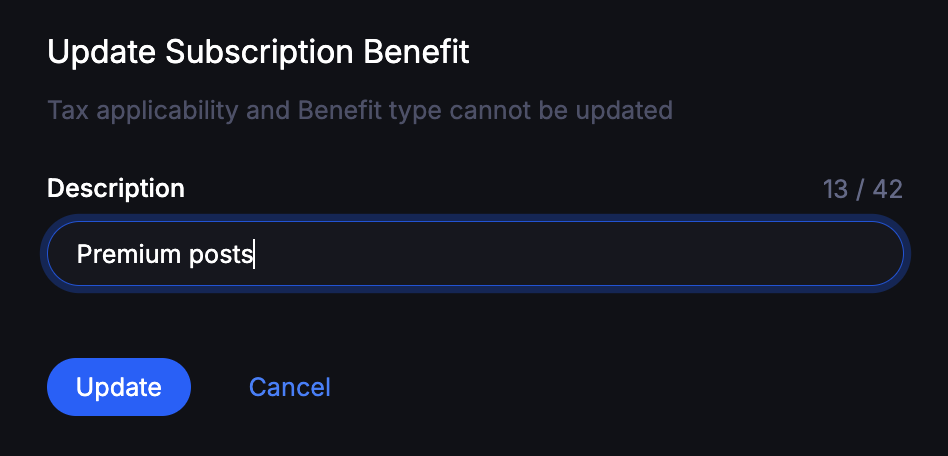

import BrowserCallout from '@/components/Feed/Markdown/Callout/BrowserCallout'

# Premium Newsletter Subscriptions

Polar offers a powerful blog and email newsletter engine built-in. You can read
more about it [here](/docs/newsletters).

All accounts therefore have two newsletter benefits automatically setup.

**Public posts**

Enabled in the free subscription tier designed for free newsletter subscriptions
and public content.

**Premium posts**

Enable across products or subscriptions to grant customers access to premium
content.

## Rename Newsletter Benefits

You can rename these benefits.
1. Goto `Products` > `Benefits`
2. Click on the three dots next to the benefits to edit them

