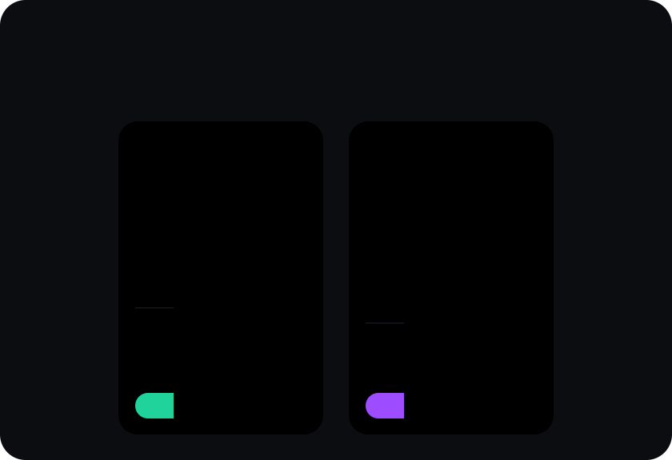
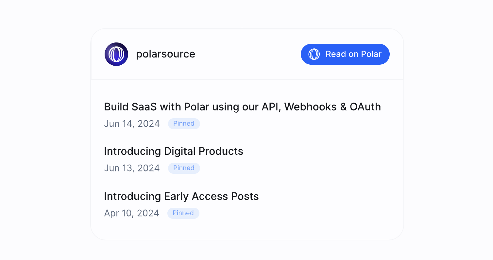
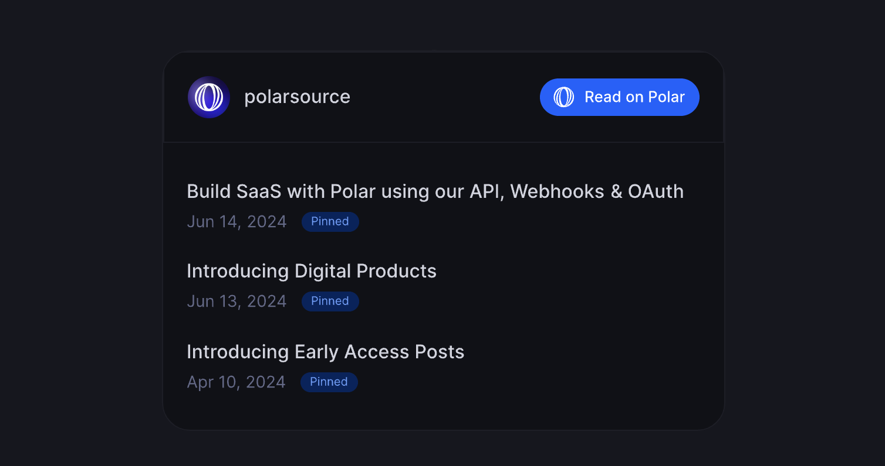
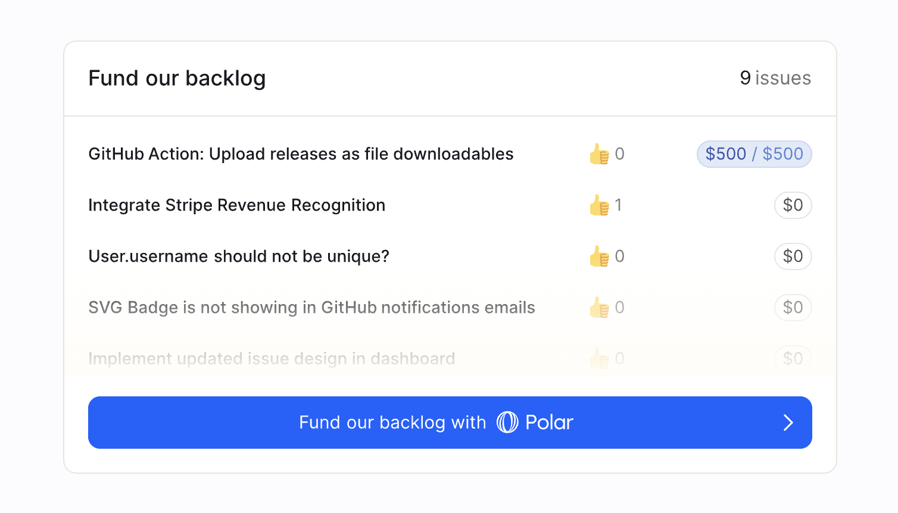
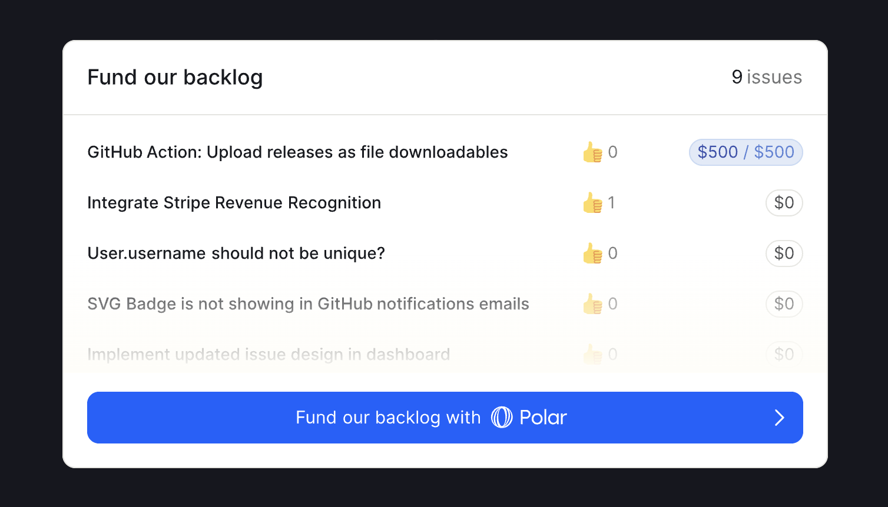

# GitHub README Embeds

Polar offers beautiful & personalized SVG embeds designed for your GitHub README.md

1. Goto your dashboard
2. Click on `Promote`
3. Choose desired embed & copy the markdown
4. Add to your desired `README.md`
5. Commit - done 🔥

## Subscription & Sponsorship Tiers

## Newsletter Feed

## Newsletter Subscribe

## Issue Funding

## Issue Funding Shield

