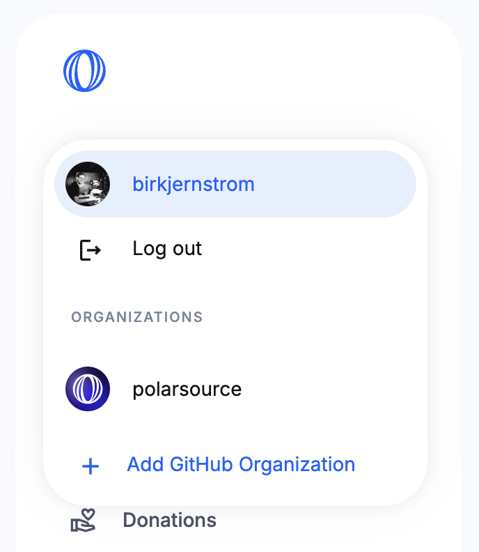
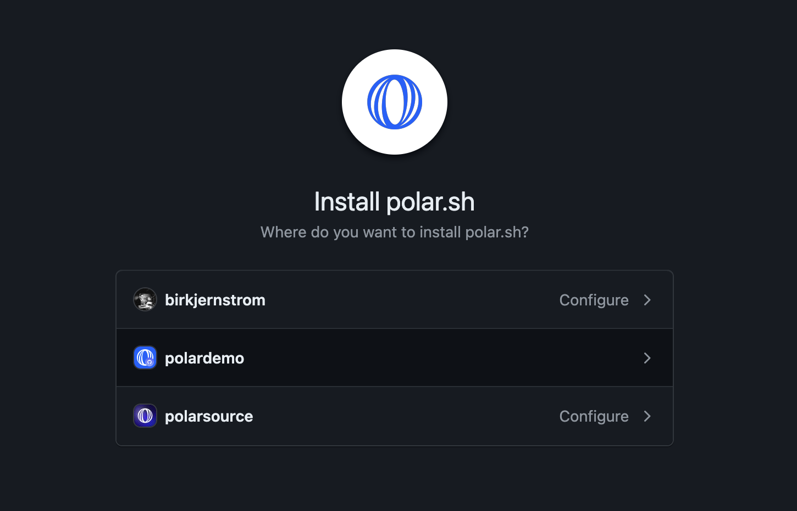
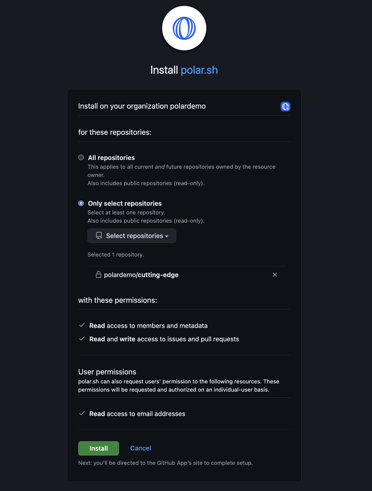

import BrowserCallout from '@/components/Feed/Markdown/Callout/BrowserCallout'

# Connect GitHub organizations

It's super easy to connect additional organizations and their repositories.

1. Click on your profile in the dashboard
2. Click `Add GitHub Organization`
3. You'll be redirected to GitHub to install the Polar GitHub app for desired organizations and repositories

### Choosing repositories

What does Polar use repository access for?
- You want to enable crowdfunding behind issues
- You want to showcase & promote them on your Polar page
- You want to sell access to Private GitHub Repo(s). However, this feature uses a separate opt-in app installation with additional permissions.

GitHub's App installation flow requires granting access to at least one (1) repository to work.

#### All Repositories

- Every, single, repository is synced with Polar - including future ones
- **Pros:** Automatically use Polar freely across your repositories now and in
  the future.
- **Cons:** You sync a lot and more than might be needed or desired.

<BrowserCallout type="NOTE">
#### Private repositories & forks are synced too

We sync all the repositories given during installation. Including private
repos & forks.

However, we don't expose private repos except to those who
can access them on GitHub too. It's supported to allow maintainers to connect
private repositories to try Polar with.

</BrowserCallout>

#### Select Repositories

- You choose *exactly* which repositories Polar should have access to
- **Pros:** Complete control. Gradual expansion. Great starting point.
- **Cons:** You need to manually add repositories.

<BrowserCallout type="NOTE">
#### Can I change repositories later?

Of course, you can always change repository access at any point in your GitHub
settings for the Polar app.
</BrowserCallout>

### Required permissions

**Read access to metadata**

We store this data to create a trustworthy user experience for your audience.
Showing repository context on your Polar page and additioinal contect on the issue funding page,
e.g avatar, name, description, stars, license etc.

**Read access to issues & pull requests**

We synchronize all your issues and pull requests in order to support issue
funding in a seamless way. Keeping track of all issues, their contributions and current status -
updating it in near real-time (webhooks). Enabling funding to seamlessly work
within your existing GitHub workflow & across Polar services.

**Write access to issues & pull requests**

Polar funding is designed to be deeply integrated within the GitHub workflow &
experience. By enabling you to easily embed the beautiful and non-intrusive
Polar funding badge directly within selected issues (at the bottom of their
description). We need to be able to write to issues in order to achieve this. Of
course, we only embed the badge based on your settings and desired issues to
badge.
