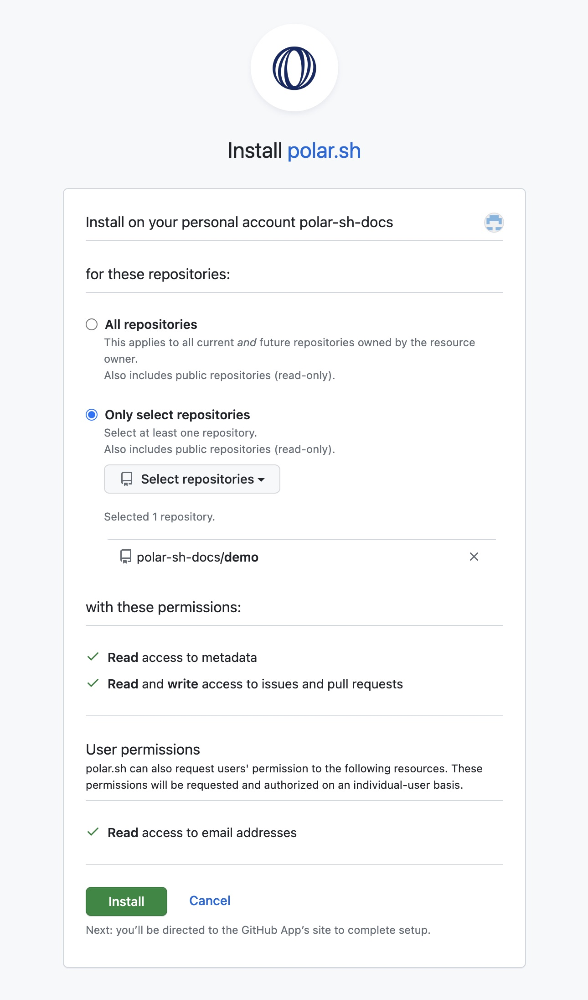
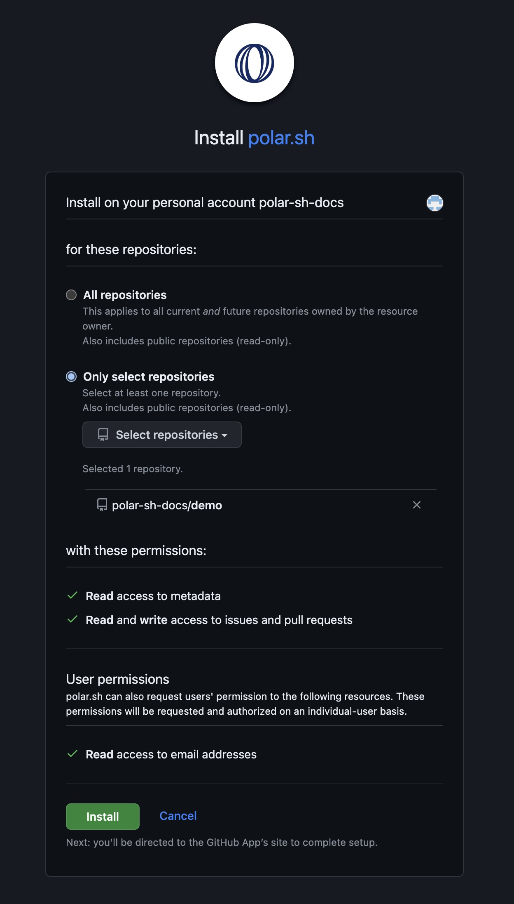
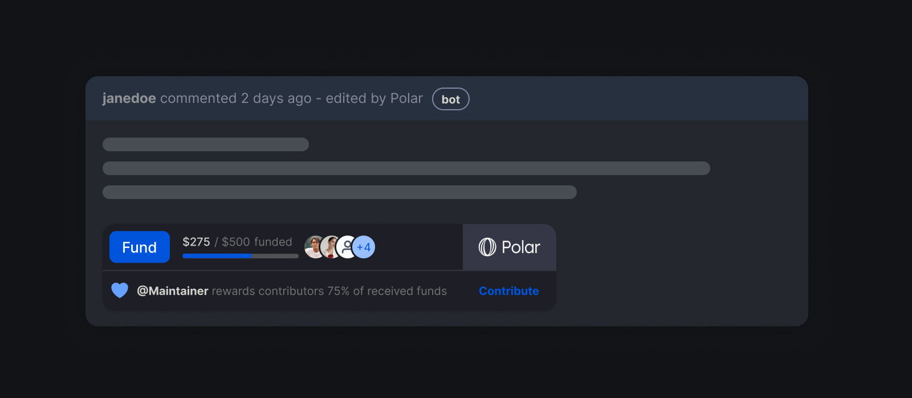
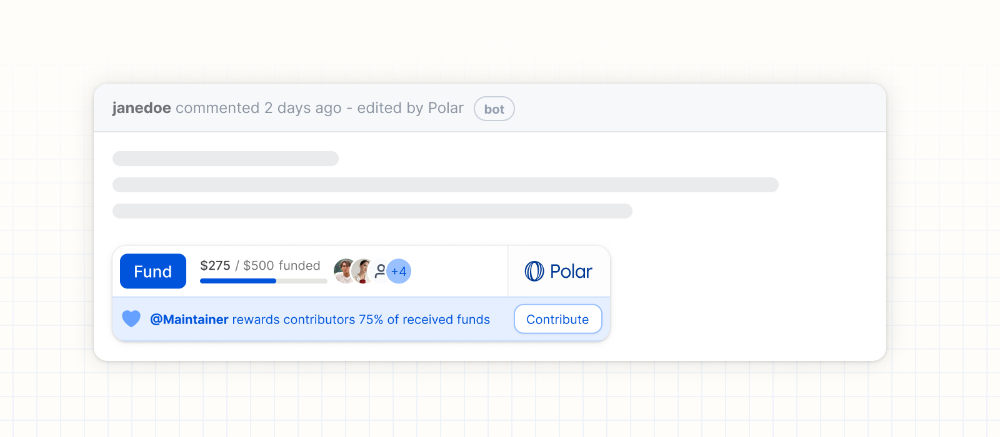

import BrowserCallout from '@/components/Feed/Markdown/Callout/BrowserCallout'

# Install the Polar GitHub App

Amazing, you now have an account setup and have been redirected to install the
Polar App on GitHub by either:

- [Signing up as a new maintainer on Polar](#creating-a-new-account)
- [Enabling maintainer mode for an existing account](#enable-personal-maintainer-account)
- Or, perhaps you're in the process of [connecting an additional GitHub
  organization](#connect-github-organization) to use with Polar

All roads lead to Rome, or in our case the GitHub App installation flow for the
Polar app.

## GitHub's Installation Flow

1. **Choose account or organization:** GitHub will ask you to choose which
   account or organization to install Polar for in case you have access to more
   than one.
2. **Review & Install Polar App:** For selected repositories under the chosen
   GitHub account or organization. *See below.*

### Choosing repositories

Choose which repositories Polar should have access to. Access is required to
easily embed the Polar funding badge on issues. However, you're always in
control of which issues to badge across the repositories you've granted access
to.

#### All Repositories

- Every, single, repository is synced with Polar - including future ones
- **Pros:** Automatically use Polar freely across your repositories now and in
  the future.
- **Cons:** You sync a lot and more than might be needed or desired.

<BrowserCallout type="NOTE">
#### Private repositories & forks are synced too

We sync all the repositories given during installation. Including private
repos & forks.

However, we don't expose issues related to private repos except to those who
can access it on GitHub. It's supported to allow maintainers to connect
private repositories to try Polar with.

We also sync forks currently. Supporting cases where forks have superseded
the original within the community.

Both of the above are likely to be deprecated features in the future.
</BrowserCallout>

#### Select Repositories

- You choose _exactly_ which repositories Polar should have access to
- **Pros:** Complete control. Gradual expansion. Great starting point.
- **Cons:** You need to manually add repositories.

<BrowserCallout type="NOTE">
#### Can I change repositories later?

Of course, you can always change repository access at any point in your GitHub
settings for the Polar app.
</BrowserCallout>

### Required permissions

**Read access to metadata**

We store this data to create a trustworthy user experience for your backers.
Showing repository context on the issue pledge page for backers as an example,
e.g avatar, name, description, stars, license etc.

**Read access to issues & pull requests**

We synchronize all your issues and pull requests in order to deliver our core
offering. Keeping track of all issues, their contributions and current status -
updating it in near real-time (webhooks). Enabling funding to seamlessly work
within your existing workflow & across Polar services.

**Write access to issues & pull requests**

Polar funding is designed to be deeply integrated within the GitHub workflow &
experience. By enabling you to easily embed the beautiful and non-intrusive
Polar funding badge directly within selected issues (at the bottom of their
description). We need to be able to write to issues in order to achieve this. Of
course, we only embed the badge based on your settings and desired issues to
badge.

### Next Step

Welcome onboard - we're excited to support you here at Polar! It's time to [customize the Polar
Badge](#badge-settings) and start
embedding & promoting it.

# Customize the Polar Badge

Epic! Polar is now installed across your chosen GitHub repositories and you've
been redirected back to Polar. We're at the last - required - step: Customize the Polar Badge
settings for your repositories.

## Goal

Users stumble upon impactful & relevant issues to them. Usually, they would
hammer the 👍 and perhaps even write a "+1" comment. But now, they also see that
they can do more; they can collectively pool funding towards it to support you
and your contributors in your efforts to complete it.

* Beautiful & non-intrusive SVG
* Promotes funding - link to Polar pledge page for given issue
* Embeddad at the end of the GitHub issue description
* Seamlessly integrated with GitHub vs. creating noise in issue threads via
  comments
* Updates automatically to show funding progress & backers
* Promote an allocated reward to potential contributors - a percentage of
  funding (optional)

*Checkout an example on a GitHub issue: [SerenityOS/serenity#22179](https://github.com/SerenityOS/serenity/issues/22179)*

Let's get this beaut setup for you.

## Setup

Once you've [installed the Polar GitHub
App](#install-the-polar-github-app) you'll be
redirected back to Polar and the screen below. Let's go through it - together.

### Badge Settings

#### Markdown description

Custom markdown text to be inserted before the Polar Badge. Great way to offer
additional and personal context. We offer a default suggestion, but you can easily
edit it and even remove it entirely.

#### Minimum funding amount

The minimum amount required for funding by individual backers (default is `$20`)

#### Public rewards

Enable & promote a default percentage split of the funding pool with potential
contributors who help squash an issue.

<BrowserCallout type="TIP">
**Missing something?** We'd love to chat and improve the product based on your
feedback!

You can submit a feature request via GitHub (we're building open source).
You're also more than welcome to join our Discord. [Relevant links](/support/)
</BrowserCallout>

### Embed Settings

So we have our badge setup & ready - amazing! Let's configure how we want to
embed it for each repository.

#### Manual: Issues by Label

This is the default setting and a great way to try things out. You then have
complete control of which issues you want to embed the Polar Badge on using the
label `Fund` (case insensitive).

- You can label via GitHub directly and see the badge embedded within seconds
- You can label & badge an issue with one-click through the Polar dashboard

#### Automated: All Issues

Ok, you're loving it. Let's unleash it across all issues to promote funding to
our community and let them help vote & fund the most impactful efforts. Combined
with using rewards to distribute it across your contributors. Just like [tRPC](https://twitter.com/trpcio/status/1716747233121464346) has.

- `All` will ensure all future issues are badged automatically & directly upon
  creation

- You'll get the option to badge all existing - open - issues too. However, for
  safety, we show how many issues would be updated and require you to
  explicitly confirm & trigger this action.

<BrowserCallout type="NOTE">
#### How GitHub issue ordering is affected by multiple updates
Since we update the issues to embed the Polar Badge the issues will get an
updated `modified_at` timestamp.

By default, GitHub issues is sorted by `created_at` so it's not impacted
unless you specifically sort by `modified_at`.

However, when & if you select to badge all existing - open - issues, we do
so in a batch and in reverse chronological `modified_at` order. So that even
though we update them we do so in a way that should retain their previous order.
We cannot promise, however, that it will guaranteed.
</BrowserCallout>

## Next Step

You're now officially done with the maintainer onboarding 🎉 Go ahead and
badge all the issues you want & checkout how you can [promote
it](/docs/issue-funding/promote) further for a
higher chance of success.

We're honored to have you onboard! Don't hesitate to reach out and share how we
can improve at any point. We have ambitious plans & a lot of exciting features in store.
