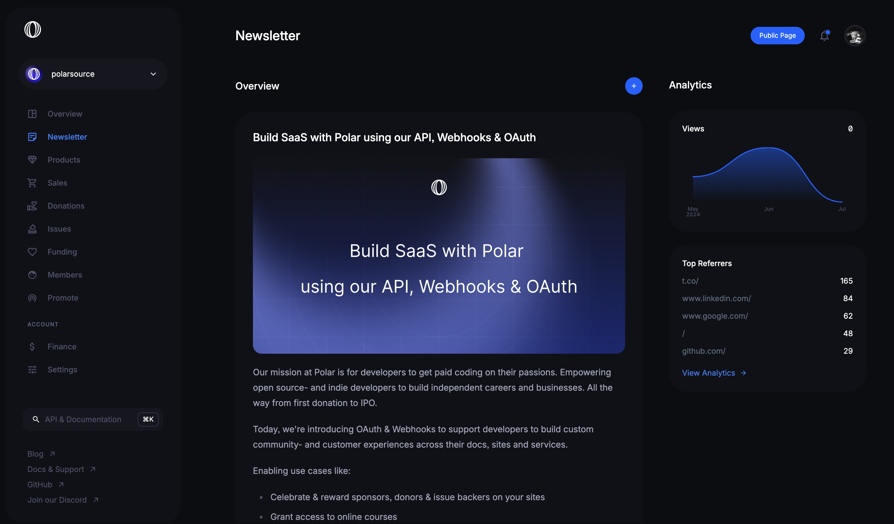
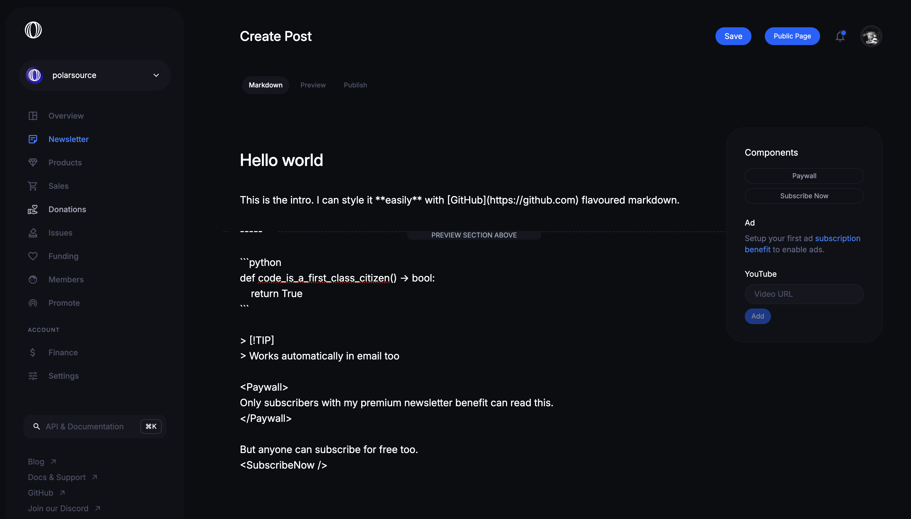
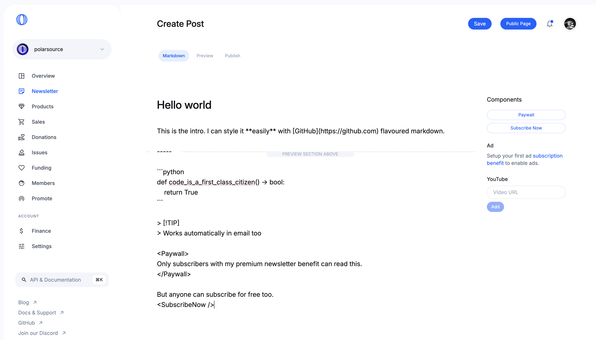

import BrowserCallout from '@/components/Feed/Markdown/Callout/BrowserCallout'

# Newsletters




Polar offers a powerful blog and email newsletter engine built-in.
- Write in GitHub flavoured markdown
- First-class code highlighting support
- Write Free, Premium or Early Access posts
- **No extra costs.** We currently offer it for free.

[Our own blog & newsletter](https://polar.sh/polarsource) is powered by it.

## Writing posts

You can easily write posts in [GitHub
Markdown](https://docs.github.com/en/get-started/writing-on-github/getting-started-with-writing-and-formatting-on-github/basic-writing-and-formatting-syntax).




... and preview them with ease. You can even share a private link for feedback.


### Basic formatting

Full markdown support with GitHub flavours. See [GitHub Markdown
Documentation](https://docs.github.com/en/get-started/writing-on-github/getting-started-with-writing-and-formatting-on-github/basic-writing-and-formatting-syntax)
for a complete guide.

### Code highlighting

Using [Shiki](https://github.com/shikijs/shiki), we support syntax highlighting for most languages out of the
box - online and over email. Combined with offering easy clipboard copying for online
readers.

```python
def add(a: int, b: int) -> int:
      return a + b
```

- Just wrap code in three backticks, e.g \`\`\`python [CODE] \`\`\`

### Admonitions

We support admonitions too.

<BrowserCallout type="NOTE">
Friendly notice
</BrowserCallout>

```
> [!NOTE]
> Friendly notice
```

<BrowserCallout type="TIP">
Tips and tricks are the foundation of engineering.
</BrowserCallout>

```
> [!TIP]
> Tips and tricks are the foundation of engineering.
```

<BrowserCallout type="IMPORTANT">
Don't miss this information!
</BrowserCallout>

```
> [!IMPORTANT]
> Don't miss this information!
```

<BrowserCallout type="WARNING">
Keep away. There be dragons here.
</BrowserCallout>

```
> [!WARNING]
> Keep away. There be dragons here.
```

<BrowserCallout type="CAUTION">
Nope, nope and absolutely nope!
</BrowserCallout>

```
> [!CAUTION]
> Nope, nope and absolutely nope!
```

#### `<Paywall>`

Write content within this tag that you want to make exclusive for paid
subscribers. Free subscribers will see an option to upgrade instead.

```
<Paywall>
Content behind the paywall that's only available to
subscribers of a paid tier with the "Premium newsletters"
benefit.
</Paywall>
```

#### `<SubscribeNow />`

The SubscribeNow element inserts a button in the content to non-subscribers reminding them that they should subscribe to you on Polar. The button is hidden for existing subscribers.

```
<SubscribeNow />
```

## Publish

You're done writing and the preview looks great. [It's time to
publish](/docs/newsletters/publish).
