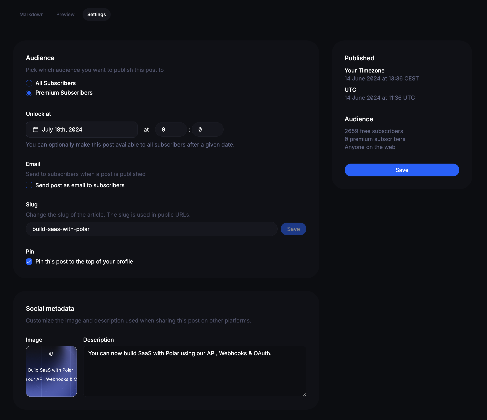
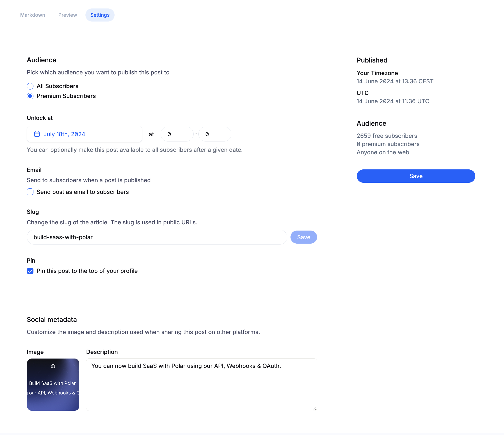

# Publishing Posts

You have full control on how to share your posts. On the right-hand side you
see a convenient overview of the impact your settings has.

## Audience

### All Subscribers

The post will be public on the internet for anyone to see.

### Premium Subscribers

The post will only be visible to paid subscribers with the `Premium Newsletter` benefit.

### Early Access

You can also automatically unlock premium posts at a certain date in the future.
Great option for open source developers seeking to balance building in public,
but simultaneously giving sponsors membership benefits.

- Select `Premium Subscribers`
- Set a future date & time under `Unlock at` for when the post should be made
  public automatically

## Send as Email

Want the post to be sent in full as an email too? Just click `Send post as email
to subscribers` (chosen audience)

## Change Slug

Customize the URL slug of the post, e.g

`https://polar.sh/polarsource/posts/<slug>`

## Pin Posts

You can pin posts to your Polar homepage too, e.g `https://polar.sh/polarsource`

## Social share settings

You can change the OG image and description of the post too which is shown on
Twitter and other social platforms.
