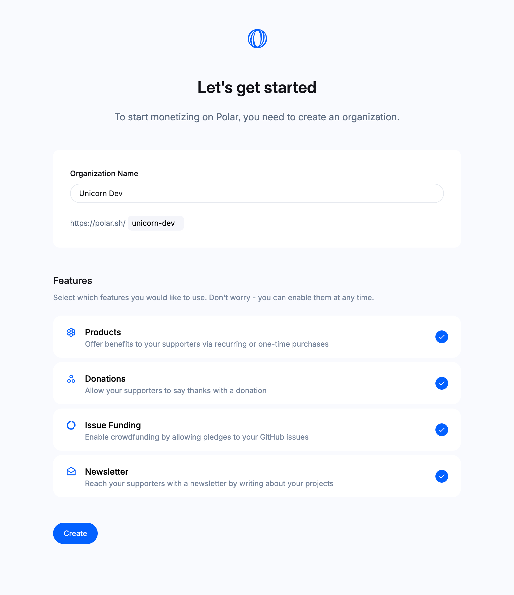

import BrowserCallout from '@/components/Feed/Markdown/Callout/BrowserCallout'
import GithubLoginButton from '@/components/Auth/GithubLoginButton'
import { UserSignupType } from '@polar-sh/sdk'

# Quick Start

Let's get you up and running with Polar in only a few minutes.

## Create an account

Signup & login on Polar is made super easy with GitHub Login (OAuth).

  <GithubLoginButton
    className="mb-8 text-white"
    size="small"
    text="Continue with GitHub"
    userSignupType={UserSignupType.MAINTAINER}
    returnTo="/dashboard"
  />

- By continuing you agree to our [Terms of Service](/legal/terms) and [Privacy Policy](/legal/privacy)
- You'll be redirected to login with GitHub (next step)

### Grant GitHub Permissions

Polar uses your GitHub Login to:

- Create a matching, public, profile for you on Polar (avatar, username, bio etc)
- Request read-only access to your primary GitHub email addresses so we can communicate with you, e.g send funding, subscription and order notifications and product updates.

<BrowserCallout type="IMPORTANT">
#### What does 'Act on my behalf' mean?

It's a default notice from GitHub for all OAuth requests [#37117](https://github.com/orgs/community/discussions/37117).

Rest assured, we do not do anything on your behalf without a delibrate action
performed by you via Polar for an explicit, clear & desired outcome by you.

</BrowserCallout>

## Create your organization

Once you've signed up, you'll be taken to a page to create your **organization**. On Polar, an organization is the space where you'll create and manage your products, receive donations from your supporters and more.

The first step is to give it a name.

A **slug** is automatically generated from the name. It's the unique identifier for your organization that'll determine your Polar URL. You can customize it as long as it doesn't already exist on Polar. **You won't be able to change it.** However, you'll be able able to change the display name later.

Then, you'll be able to select which features you want to enable to focus the Polar experience for your use case. **You can change this later too.** So no pressure or identity crisis needed :^)

## Done 🎉

Welcome to the Polar community - we're thrilled to have you onboard!

**Next Steps:**

- Explore the dashboard
- [Connect GitHub organizations (Optional)](/docs/github/install)
- [Add official Polar funding link on GitHub](/docs/github/funding-yaml)
- [Enable issue funding](/docs/issue-funding)
- [Enable donations](/docs/donations)
- [Create products and/or subscription tiers](/docs/products)
- [Start a newsletter](/docs/newsletters)

**Shape the future with us**

- [Join our Discord](https://discord.gg/BZw96tszTX)
- [Give our GitHub repo a star](https://github.com/polarsource/polar) and join the discussions
