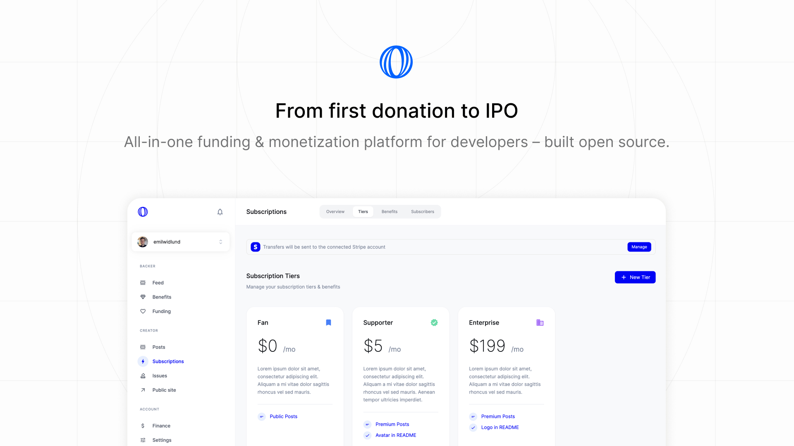
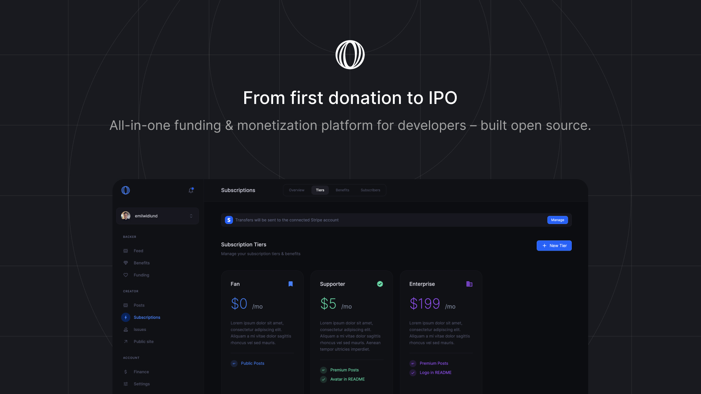

# Welcome to Polar

Focus on shipping. We'll focus on the infrastructure to get you paid - from first donation to IPO.

### Features

- GitHub Login & Official funding partner (`FUNDING.yaml`)
- Funding
  - Accept one-off donations
  - Crowdfunding behind GitHub issues - beautifully embedded
  - Reward contributors to funded issues
- Commercialization (Sponsorware to SaaS)
  - Pay once digital products, or...
  - Recurring subscriptions (monthly/annual)
  - Built-in & powerfully automated product & subscription benefits, e.g File Downloads, GitHub Repo(s) access, Discord access, Premium newsletter and more.
- Newsletters
  - Write posts with code highlighting + using GitHub flavoured markdown
  - Free, premium or early access posts (premium until set date)
- Polar is the Merchant of Record (MOR) handling billing, sales tax & EU VAT.
- Beautiful Polar page out of the box (official GitHub funding link) or...
- API & SDK for seamless integrations across docs, sites & services

You'll be up and running in 5 minutes. [Let's get started](/docs/onboarding).

### Built Open Source (Apache 2.0)

- 100% of our product, code and docs available on [GitHub](https://github.com/polarsource/polar)
- 19 contributors and growing ([Contributions welcome](/docs/contribute))
- Feature requests, feedback and issues - all in public
- Self-hosting while possible is not supported or encouraged (no MOR benefits)

### Pricing

- No fixed, monthly, costs
- 5% + 0¢ on transactions - we earn when you do
- _+ Payment & Payout fees (Stripe, Open Collective)_

### Supported countries

Polar is built on Stripe Connect and currently supports the following list of
countries for payouts:

- Austria
- Belgium
- Bulgaria
- Canada
- Croatia
- Cyprus
- Czech Republic
- Denmark
- Estonia
- Finland
- France
- Germany
- Greece
- Hungary
- Ireland
- Italy
- Latvia
- Lithuania
- Luxembourg
- Malta
- Netherlands
- Norway
- Poland
- Portugal
- Romania
- Slovakia
- Slovenia
- Spain
- Sweden
- United Kingdom
- United States
