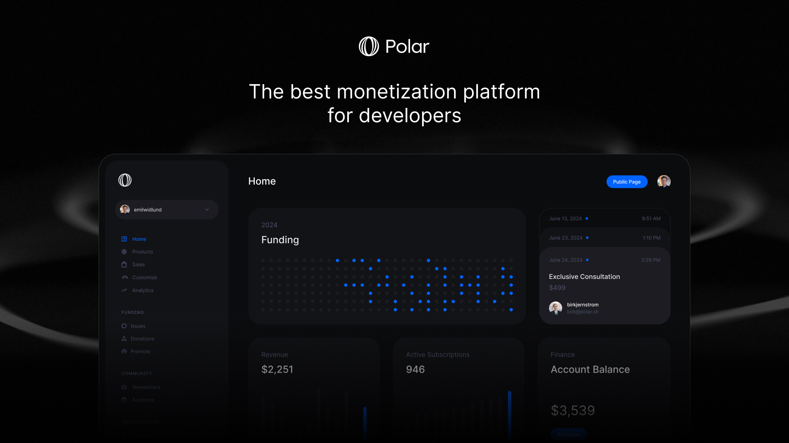

# Welcome to Polar

Focus on shipping. We'll focus on the infrastructure to get you paid - from first donation to IPO.

### Features

- GitHub Login & Official funding partner (`FUNDING.yaml`)
- Polar is the Merchant of Record (MOR) handling billing, sales tax & EU VAT.
- Funding
  - Accept one-off donations
  - Crowdfunding behind GitHub issues - beautifully embedded
  - Reward contributors to funded issues
- Commercialization (Sponsorware to SaaS)
  - Offer digital products for a pay once price, or...
  - Recurring Subscriptions (monthly/annual)
  - Built-in & powerfully automated product & subscription benefits, e.g File Downloads, GitHub Repo(s) access, Discord access, Premium newsletter and more.
- Newsletters
  - Write posts in GitHub flavoured markdown
  - Code highlighting supported out of the box
  - Share posts online and/or email
  - Free, premium or early access posts (premium until set date)
- Beautiful Polar page out of the box (official GitHub funding link) or...
- API & SDK for seamless integrations across docs, sites & services

You'll be up and running in 5 minutes.

### Built Open Source (Apache 2.0)

- 100% of our product, code and docs available on GitHub
- 19 contributors and growing (Want to [contribute](/docs/contribute)?)
- Feature requests, feedback and issues - all in public
- Self-hosting while possible is not supported or encouraged (no MOR benefits)

### Pricing

- No fixed, monthly, costs
- 5% + 0¢ on transactions - we earn when you do
- _Payment & Payout fees apply in addition (Stripe, Open Collective)_
