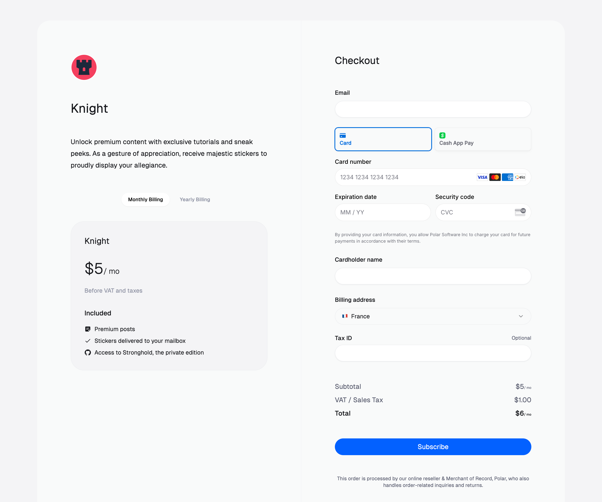
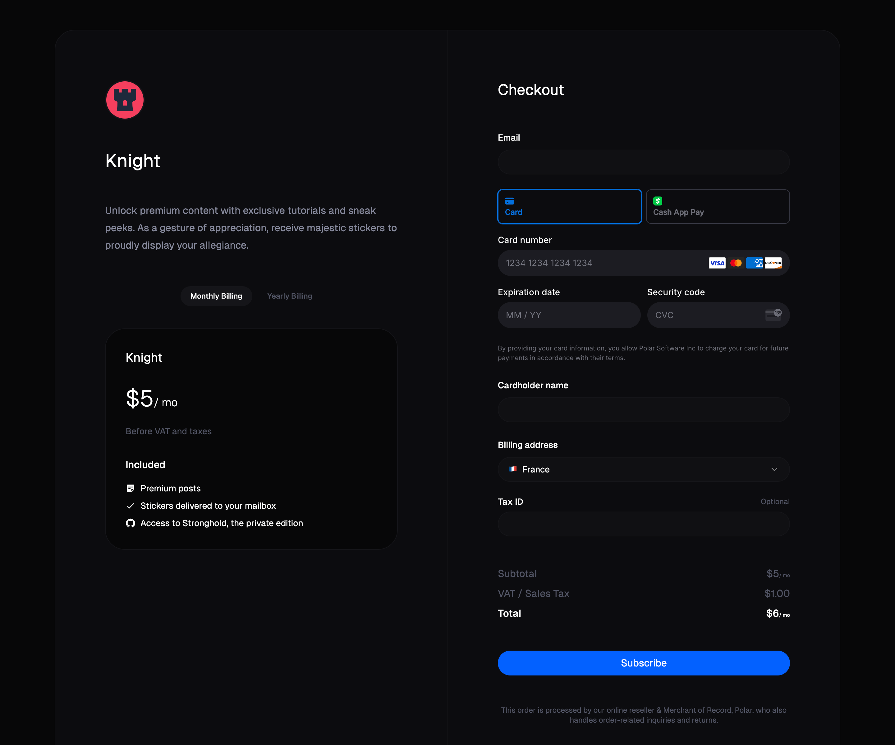
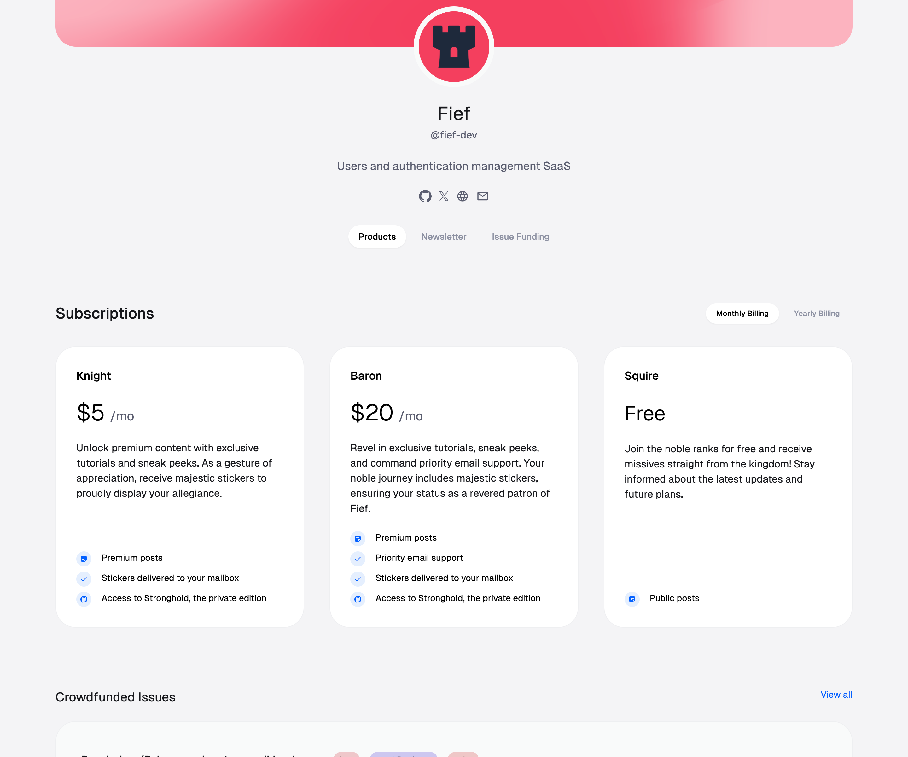
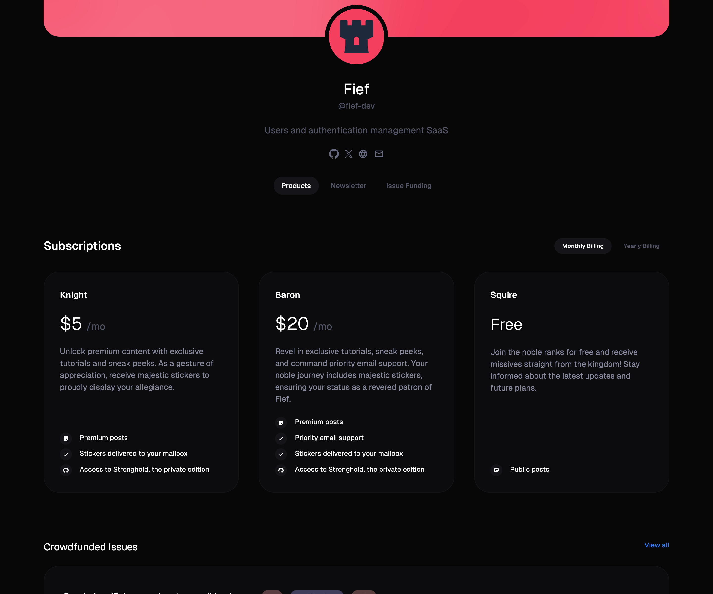
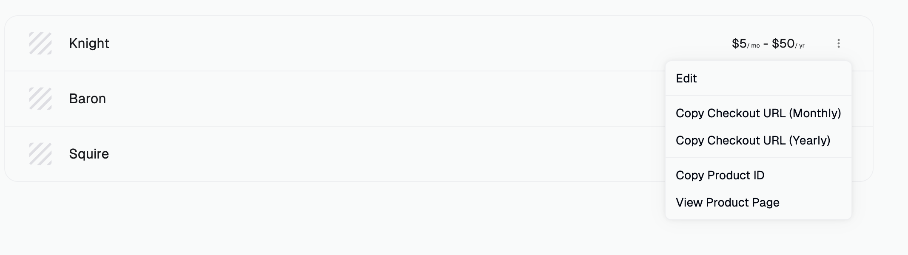
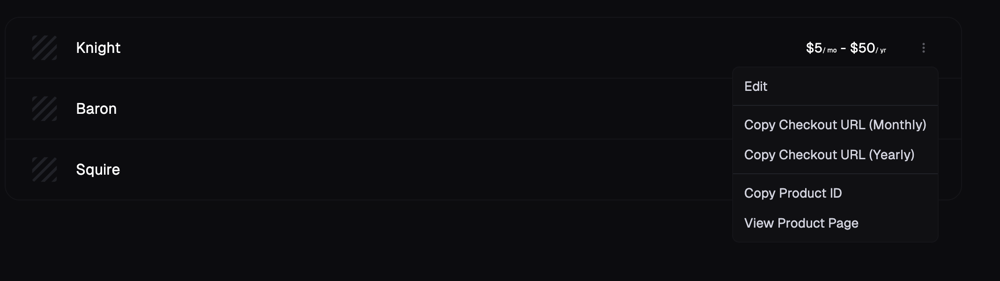

import BrowserCallout from '@/components/Feed/Markdown/Callout/BrowserCallout'

# Checkout

Checkout is the process where you customer is taken to to buy or subscribe to your products. Similar to an e-commerce website, it takes the form of a page where the customer fills their details and input their payment method before confirming their order.




On Polar, you have several ways to start a Checkout session for your customer.

## From your storefront

If the storefront is enabled on your organization, your customers can directly go to that page, browse your products and click on them to start a checkout.




## From a URL

From `Products` in your dashboard, click on the ellipsis `…` button in front of your product and click on `Copy Checkout URL`.

You'll get an URL you can share with your customers so they can directly buy your product.




<BrowserCallout type="NOTE">
  For subscription products with both a monthly and yearly pricing, you'll have
  the choice between two variants.

The customer can always switch to the billing interval from the checkout page.

</BrowserCallout>

## From the API

If you want to integrate more deeply the checkout process with your website or application, you can use our dedicated API.

The first step is to [create a Checkout session](/docs/api/v1/checkouts/custom/post). For this you'll need at least your **Product Price ID**.

<BrowserCallout type="TIP">
  You can retrieve your Product Price ID from `Products` in your dashboard,
  click on the ellipsis `…` button in front of your product and click on `Copy
  Price ID`.
</BrowserCallout>

The API will return you an object containing all the information about the session, including **an URL where you should redirect your customer** so they can complete their order.

Here is an example of an Express application using our [JavaScript SDK](/docs/api/sdk#quickstart):

```ts
import { Polar } from "@polar-sh/sdk";
import express, { Request, Response } from 'express';

const app = express();
const port = 3000;
const polar = new Polar({
    accessToken: process.env["POLAR_ACCESS_TOKEN"] ?? "",
});

app.get('/checkout', async (req: Request, res: Response) => {
    const checkout = await polar.checkouts.custom.create({
        productPriceId: "00000000-0000-0000-0000-000000000000",
    });
    res.redirect(checkout.url);
});

app.listen(port, () => {
    console.log(`Server is running on http://localhost:${port}`);
});
```

### Optional: set a success URL

By default, the customer will be redirected to a Polar success page. You can customize this so they are redirected to an URL in your application.

```ts
app.get('/checkout', async (req: Request, res: Response) => {
    const checkout = await polar.checkouts.custom.create({
        productPriceId: "00000000-0000-0000-0000-000000000000",
        successUrl: `${req.protocol}://${req.get('host')}/success?checkout_id={CHECKOUT_ID}`
    });
    res.redirect(checkout.url);
});

app.get('/success', async (req: Request, res: Response) => {
    const checkoutId = req.query.checkout_id;
    if (!checkoutId) {
        return res.status(400).send('Missing checkout_id');
    }
    const checkout = await polar.checkouts.custom.get(checkoutId);

    if (checkout.status === 'succeeded') {
        return res.send('<html><body><h1>Thank you!</h1></body></html>');
    }

    if (checkout.status === 'confirmed') {
        return res.send('<html><body><h1>Please wait while we process the payment...</h1></body></html>');
    }

    if (checkout.status === 'failed') {
        return res.send('<html><body><h1>An error occured!</h1></body></html>');
    }
});
```

Notice how you can pass the `{CHECKOUT_ID}` token to your URL: Polar will automatically replace it with the actual Checkout session ID. This allows you to retrieve the Checkout object easily on the success page.

### Optional: reconciliation with your app

In your app, it's probable you already know the customer or are in a specific state you don't want to lose during the checkout process. For this, you can pass **arbitrary metadata** to the Checkout object. This way, when you retrieve the Checkout on your success page (or through a [webhook](/docs/api/webhooks)), you can read the metadata and link with your own application state.

```ts
app.get('/checkout', async (req: Request, res: Response) => {
    const checkout = await polar.checkouts.custom.create({
        productPriceId: "00000000-0000-0000-0000-000000000000",
        successUrl: `${req.protocol}://${req.get('host')}/success?checkout_id={CHECKOUT_ID}`,
        metadata: {
            userId: 'MY_USER_ID',
        }
    });
    res.redirect(checkout.url);
});

app.get('/success', async (req: Request, res: Response) => {
    const checkoutId = req.query.checkout_id;
    if (!checkoutId) {
        return res.status(400).send('Missing checkout_id');
    }
    const checkout = await polar.checkouts.custom.get(checkoutId);
    const userId = checkout.metadata['userId'];

    if (checkout.status === 'succeeded') {
        return res.send(`<html><body><h1>Thank you ${userId}!</h1></body></html>`);
    }

    if (checkout.status === 'confirmed') {
        return res.send('<html><body><h1>Please wait while we process the payment...</h1></body></html>');
    }

    if (checkout.status === 'failed') {
        return res.send('<html><body><h1>An error occured!</h1></body></html>');
    }
});
```

<BrowserCallout type="TIP">
  The metadata you set on Checkout are **automatically copied** to the Order and/or Subscription that are created from that session.

  It means that if you listen to new orders and subscriptions from webhooks, you'll get that metadata directly. Besides, they also have a `checkout_id` reference to the origin Checkout, so you can retrieve it if needed.
</BrowserCallout>

### Optional: prefill customer information

If you already know your customer, you can prefill some of the fields to speed-up the process. You can also provide their IP address, so we can automatically guess their billing country and have VAT computed directly on first load.

```ts
app.get('/checkout', async (req: Request, res: Response) => {
    const checkout = await polar.checkouts.custom.create({
        productPriceId: "00000000-0000-0000-0000-000000000000",
        successUrl: `${req.protocol}://${req.get('host')}/success?checkout_id={CHECKOUT_ID}`,
        customerEmail: 'user@example.com',
        customerName: 'John Doe',
        customerIpAddress: req.ip,
        metadata: {
            userId: 'MY_USER_ID',
        }
    });
    res.redirect(checkout.url);
});
```
