import BrowserCallout from '@/components/Feed/Markdown/Callout/BrowserCallout'

# Create Products & Subscription Tiers

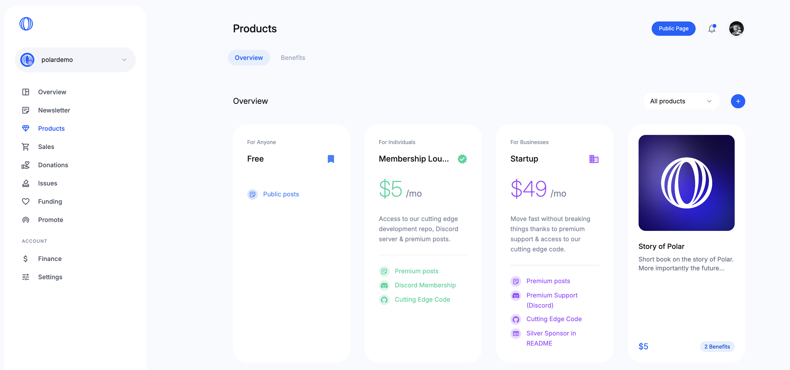
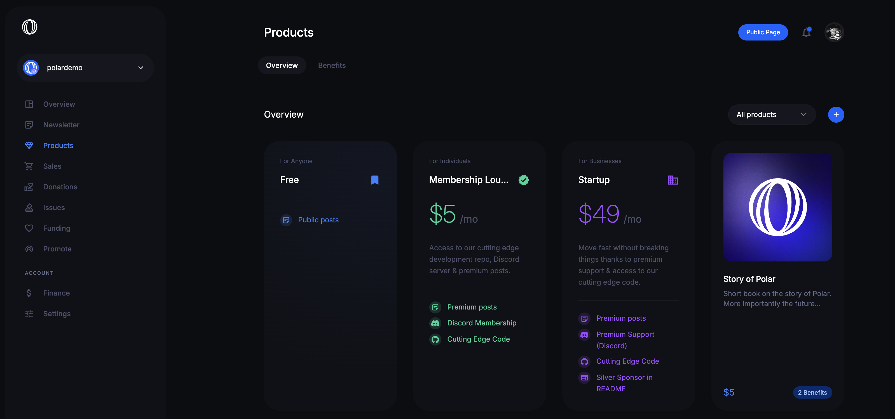

<BrowserCallout type="NOTE">
**Everything is a product**

Subscriptions or pay once products are both technically a product in Polar (API
& data model). Just with different pricing & billing logic. So both are shown &
managed under `Products` with the ability to filter based on pricing model.

</BrowserCallout>

## Create & Edit Form

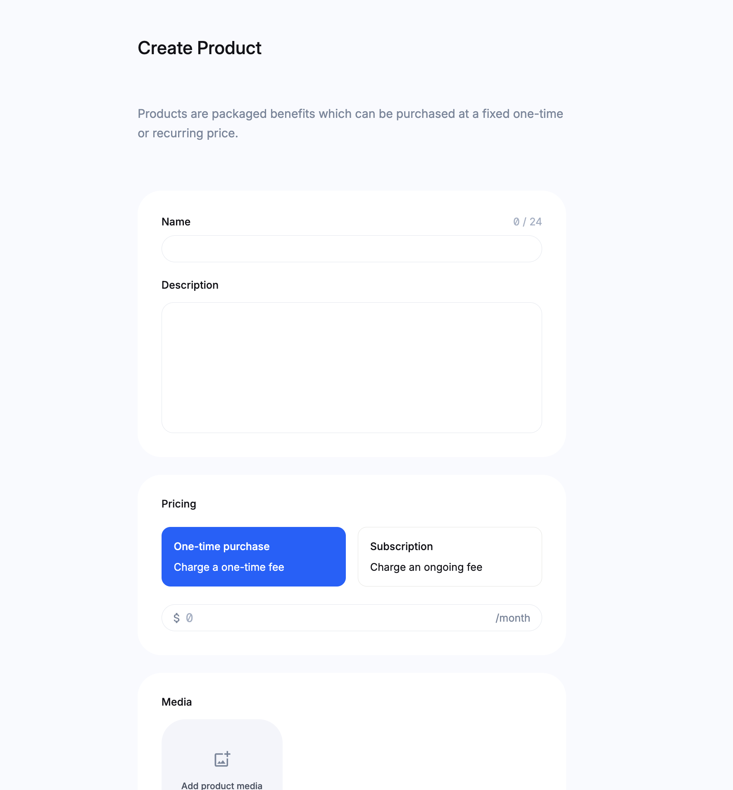
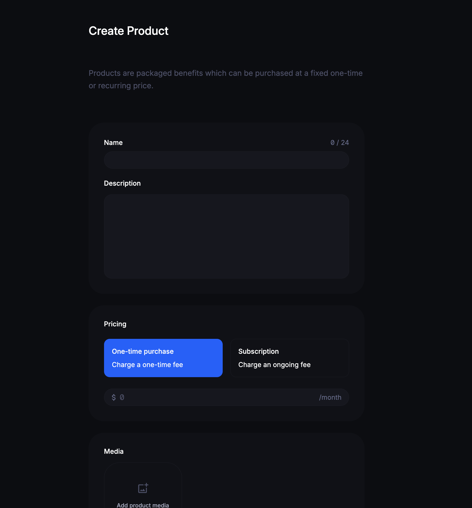

- Goto `Products` in your dashboard
- Click `+` to create a new product or subscription tier
- Or click on an existing product to edit it

### Name & Description

Starting off with the basic.

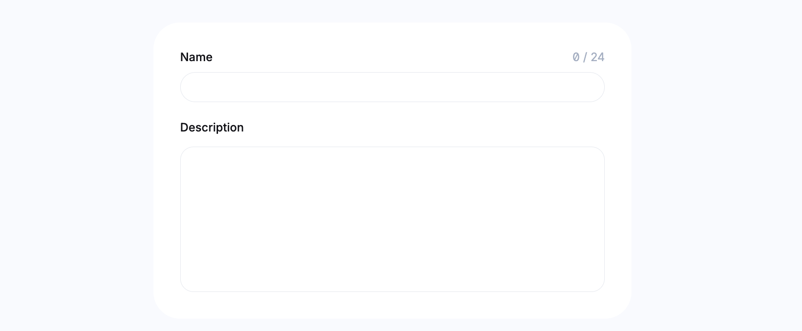
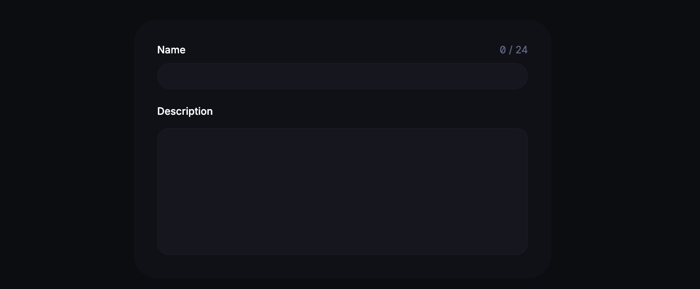

- **Name.** The title of your product.
- **Description.** Markdown is supported here too.

### Pricing

How much you want to charge and with what frequency (once or recurring).

#### Pay Once (Product)

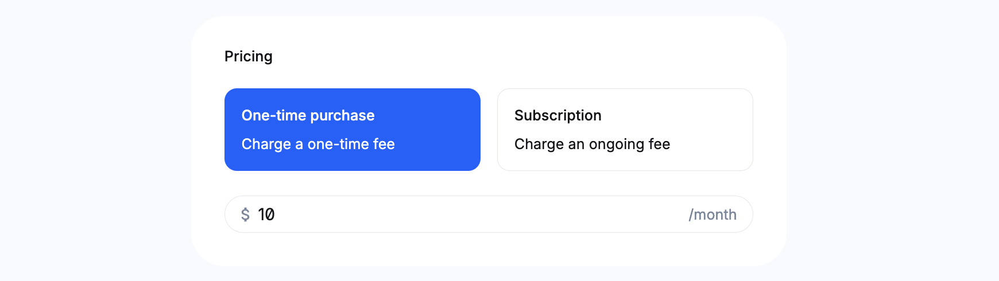
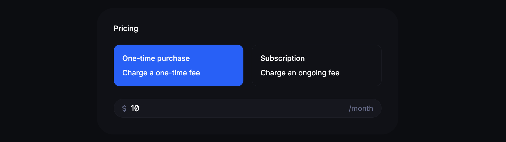

#### Subscription

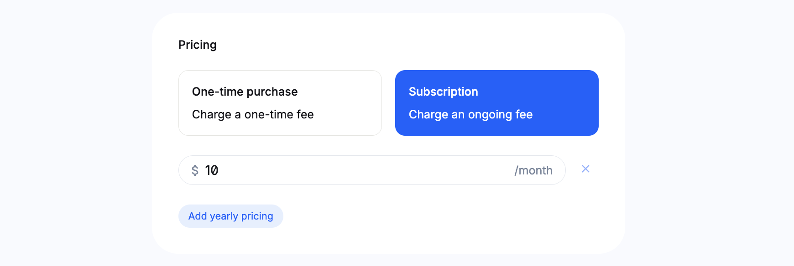
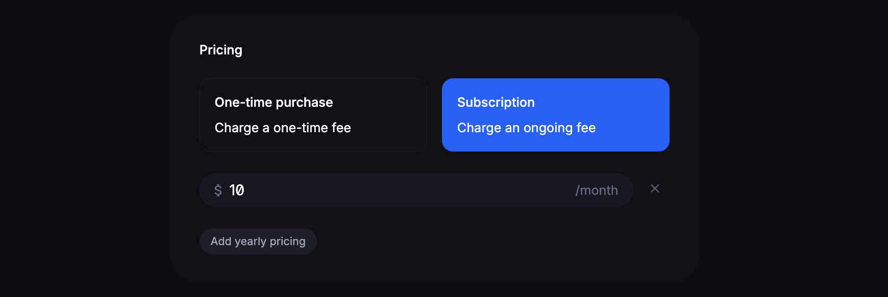

- You can `Add yearly pricing` (Annual billing upfront)
- You can remove monthly pricing too if you only want annual billing

#### Pay what you want (Soon)

We're soon going to introduce pay what you want as a pricing option.

### Subscription Audience

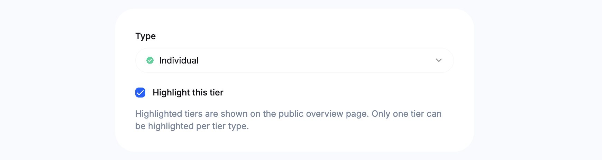
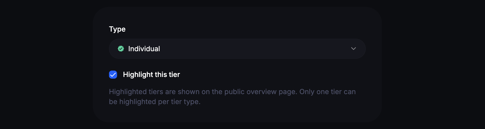

In case you chose `Subscription` pricing you'll be promoted to specify the
target audience: `Individual` or `Business`.

We use this information to clearly distinguish intended audience on your Polar
page. However, it does not impact the checkout (customers can provide their
business registration number regardless) or buyer experience.

### Product Media

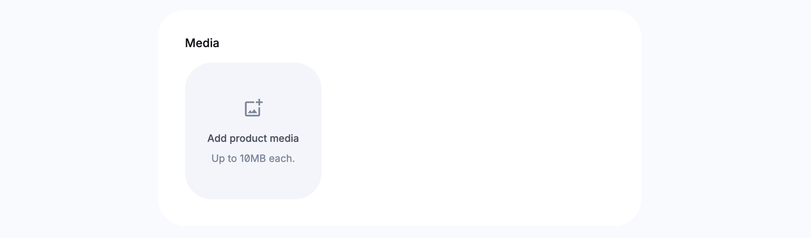
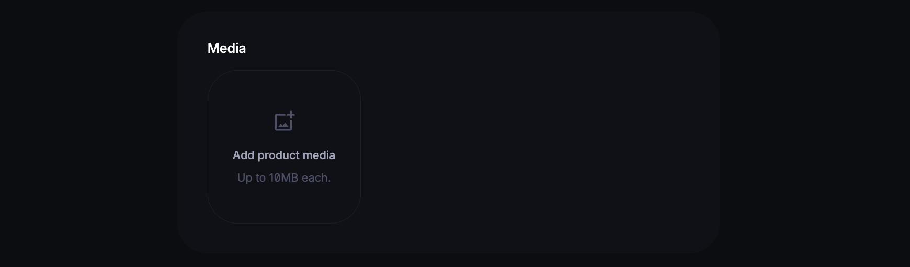

- You can upload public product images to be displayed on product pages
- They can be up to 10MB each
- First image becomes the primary shown on listing pages
- You can remove and re-arrange images

### Product Benefits

Finally, we can enable or create new benefits that we tie to the product.

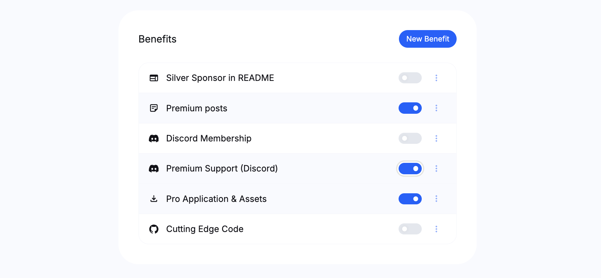
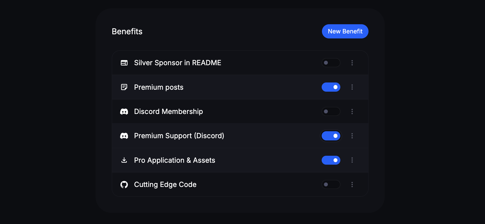

All new accounts have `Premium posts` as an available benefit to
enable. Enabling [Newsletters](/docs/newsletters) to work out of the box.

Click `New Benefit` to create your own benefits and select the desired type.
You can read more in our [product benefits guide](/docs/benefits) on how they work and how to customize the built-in ones we offer:

- Discord Invite
- GitHub Repository Access
- File Downloads
- Newsletter Ads
- Premium Newsletter Content
- Custom

### Save

Once you're done click `Create Product` and that's it 🚀
