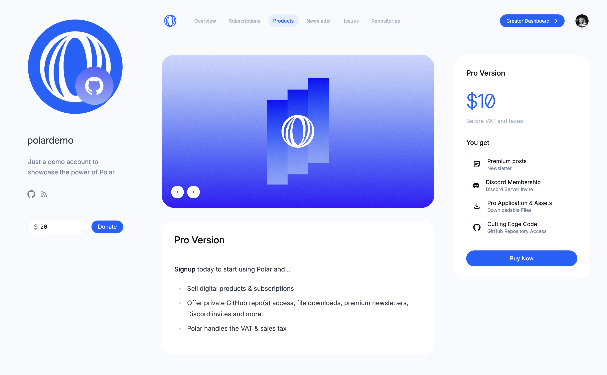

import BrowserCallout from '@/components/Feed/Markdown/Callout/BrowserCallout'

# Products & Subscriptions

You can seamlessly offer digital products, subscriptions and sponsorship with
Polar.

We've built common developer upsells and automations so you don't have to:
- Discord invites & roles
- Private GitHub repository access
- File downloads
- Premium Newsletter content
- Newsletter sponsorship
- Custom
- License keys (Soon)
- Private Docker Containers (Soon)
- Private Packages (Soon)

**We also handle US Sales tax & EU VAT so you don't have to.** Leave the boring stuff
to us and stay focused on your passion.

Finally, our product and API is built fully open source and focused on the
developer experience & ecosystem. Supporting easy & powerful integrations across
your site, docs and services.

## Customer Experience

### Polar Page

You get a beautiful Polar page out of the box. Polar is an official [GitHub
funding.yaml](/docs/github/funding-yaml) option so you can link to this page on
GitHub professionally.

**Subscription Tiers**

**Products (Pay once)**

**Product Page**

### Custom Design & Integrations

[Your Next Store](htts://yournextstore.com) is a great example of integrating
the [Polar API](/docs/api) to offer a bespoke customer experience. Without
having to build the boring stuff:
- Checkout
- Billing
- VAT & Sales tax capture & remittance
- Customer portal
- Automation of benefits

### Checkout

<BrowserCallout type="NOTE">
**Branded & Overlay Checkout Coming Soon**
Currently, we offer the standard Stripe Session Checkout. However, we're
currently working on a more custom checkout. Offer better branding capabilities
for you and embedding an overlay directly on your site.
</BrowserCallout>

### Customer Library & Portal

Customers can access their library and orders easily with Polar.
- No tedious signup. Email magic link from guest checkouts.
- Access to all their orders, invoices and accessing digital benefits

## Create your first product

[Let's create your first product](/docs/products/create) on Polar.
