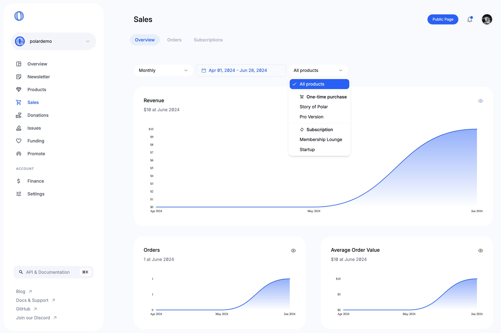
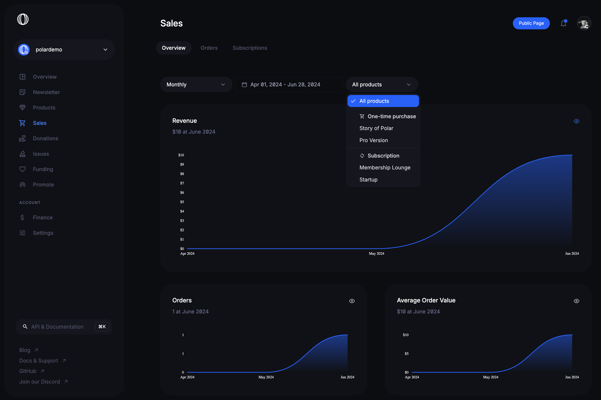

import BrowserCallout from '@/components/Feed/Markdown/Callout/BrowserCallout'

# Sales Dashboard

Polar offers a professional metrics dashboard out of the box.
So you can stay focused on increasing revenue vs. how to measure it.

**Missing any metrics?** [Let us know so we can add it.](https://github.com/orgs/polarsource/discussions/categories/feature-requests)

## Filters

You can easily slice and dice metrics with the filters below.

### Period

Change the time period in the X-axis to one of:

- Yearly
- Monthly
- Weekly
- Daily
- Hourly

### Timeframe

You can choose a date range to view all metrics for.

### Product

By default metrics reflect the total across all products. However, you can specify individual products or subscription tiers to filter metrics by.

## Metrics

<BrowserCallout type="NOTE">
**You can pin any metric to be in focus.**

Just click on the 👁️ icon next to any metric below to pin it at top - putting it front and center.
</BrowserCallout>

### Revenue

How much revenue you've earned before fees.

### Orders

How many product sales and subscription payments have been made.

### Average Order Value (AOV)

The average earning per order, i.e revenue / orders.

### One-Time Products

Amount of products sold.

### One-Time Products Revenue

Amount of revenue earned from products.

### New Subscriptions

Amount of new subscriptions.

### New Subscription Revenue

Amount of revenue earned from new subscriptions.

### Renewed Subscriptions

Amount of renewed subscriptions.

### Renewed Subscription Revenue

Amount of revenue earned from renewed subscriptions.

### Active Subscriptions

Amount of active subscriptions (new + renewed)

### Monthly Recurring Revenue (MRR)

Amount of revenue earned from active subscriptions.

