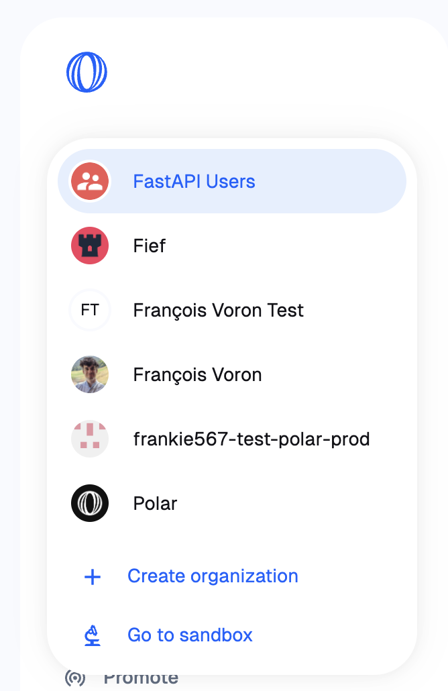
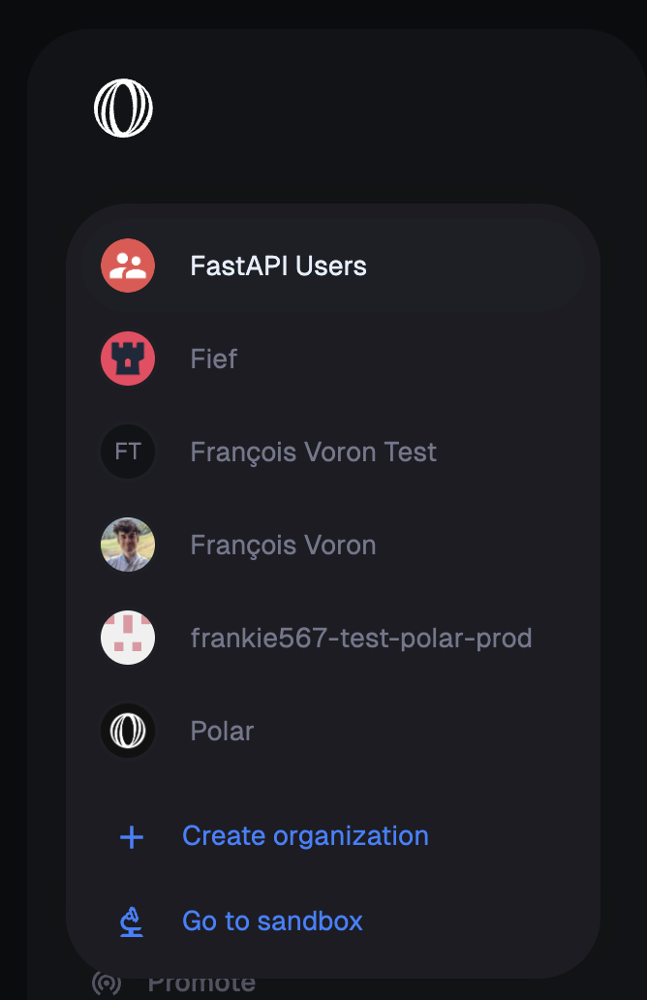
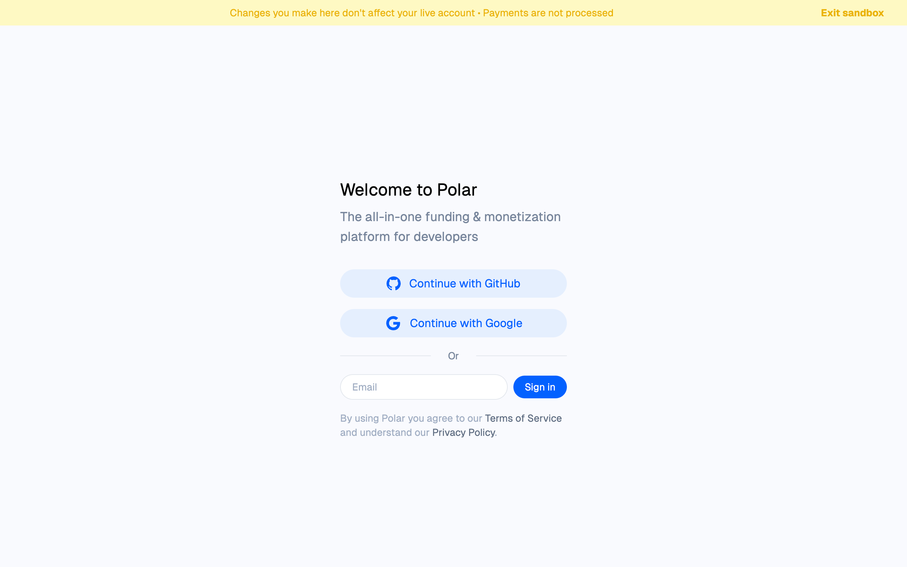
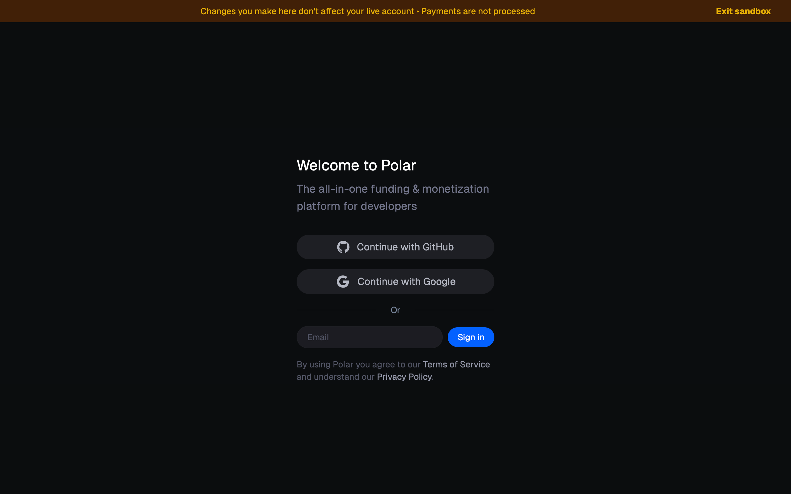
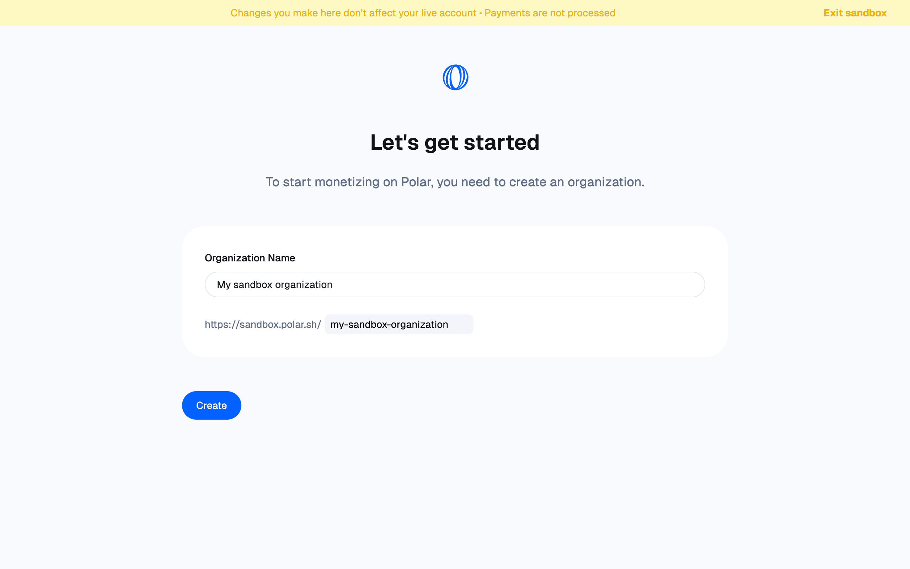
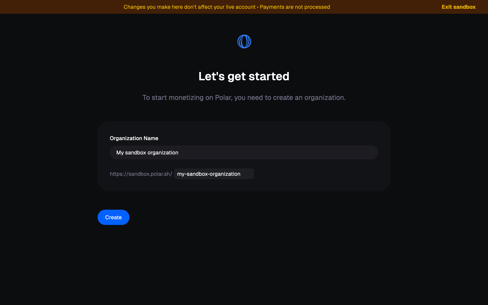

import BrowserCallout from '@/components/Feed/Markdown/Callout/BrowserCallout'

# Sandbox

To test Polar or work on your integration without worrying about actual money processing or breaking your live organization, you can use our [sandbox environment](https://sandbox.polar.sh/start).

It's a dedicated server, completely isolated from the production instance where you can do all the experiments you want!

<BrowserCallout type="NOTE">
  **Why a dedicated environment instead of a test mode?**

Since we're dealing with money and need to keep track of all movements to assure or Merchant of Records service, we found it safer to isolate live data from test data so it never interferes.

Besides, it allows you to create an unlimited number of account and organization to test lot of different scenarios. Consider it as your own development server!

</BrowserCallout>

## Get started

You can access the sandbox environment directly on [https://sandbox.polar.sh/start](https://sandbox.polar.sh/start) or by clicking on `Go to sandbox` from the organization switcher.

You'll then need to create a dedicated user account and organization, the same way described in our [Quick Start guide](/docs/onboarding).

## Testing payments

The sandbox environment allows you to experience the complete customer funnel, including the payment form. You can perform test payments using Stripe's [test card numbers](https://docs.stripe.com/testing#cards).

<BrowserCallout type="TIP">
  The easiest one to test a successful payment is `4242 4242 4242 4242` with a
  future expiration date and random CVC.
</BrowserCallout>
