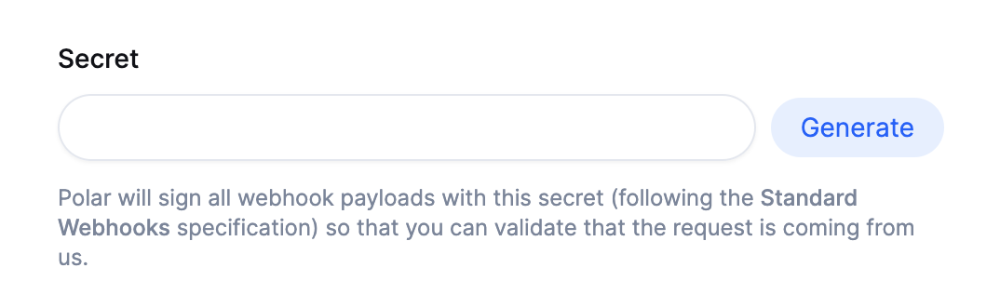

# Webhooks

Webhooks allow you to build or set up integrations that subscribe to certain Polar events. When one of those events is triggered, we'll send an HTTP POST payload to the webhook's configured URL.

Our implementation follow the [Standard Webhooks](https://www.standardwebhooks.com/) specification.

## Configuring a Webhook

Head over to your organization's settings page and click on the "Add Endpoint" button to create a new webhook.

In the dialog that appears, enter the URL to which the webhook events should be sent.

In order to verify that requests are legitimate webhook payload coming from Polar, we cryptographically sign the requests using a secret key. You can set your own or generate a random one.

Finally, select the events you want to be notified about. You can read more about the available events in the [Events](/docs/api/webhooks/events) section.

## Webhook Delivery

Once a webhook is configured, you will have access to a delivery overview page. This page shows you all the webhook events that have been sent to the configured URL. You can easily see the status of each delivery and the data which was sent.

## Verify signature

Requests sent to your webhook endpoint will include a signature so you can verify that the request is truyl coming from Polar.

As it follows the [Standard Webhooks](https://www.standardwebhooks.com/) specification, you can use one of their libraries to verify the signature: https://github.com/standard-webhooks/standard-webhooks/tree/main/libraries

## Webhook Events

Events are detailed in the dedicated [Events](/docs/api/webhooks/events) section.
