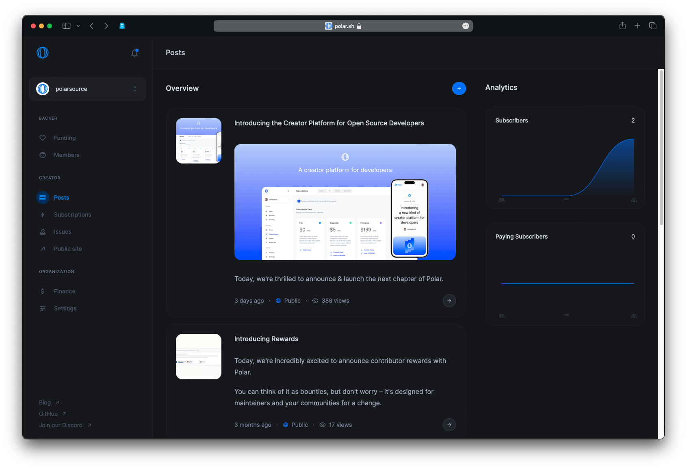
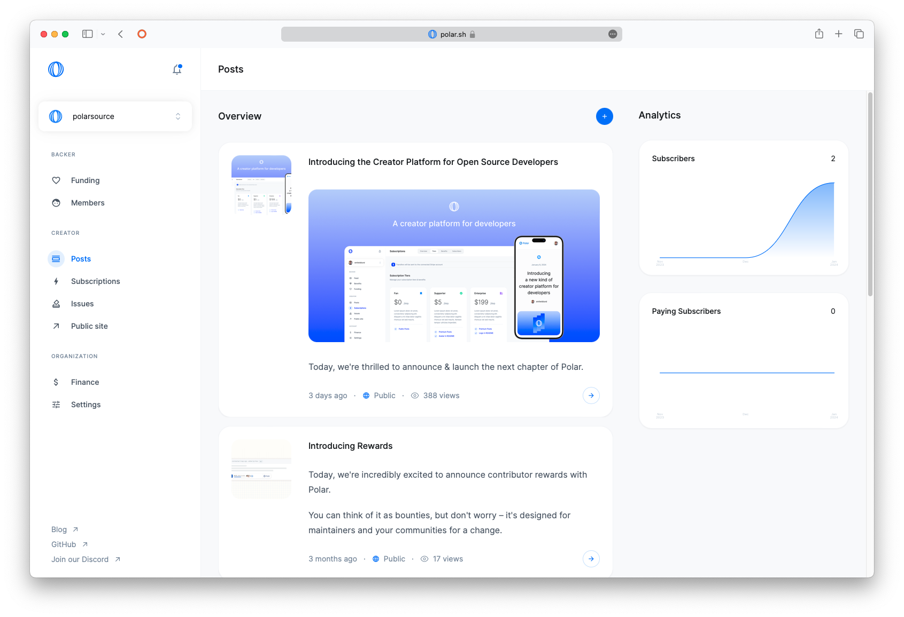
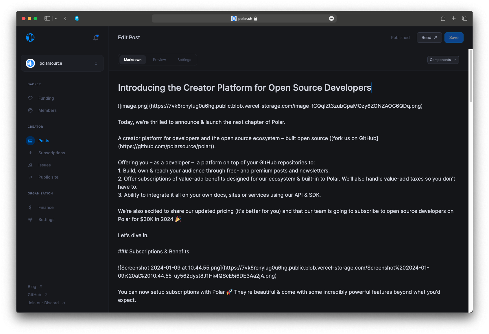
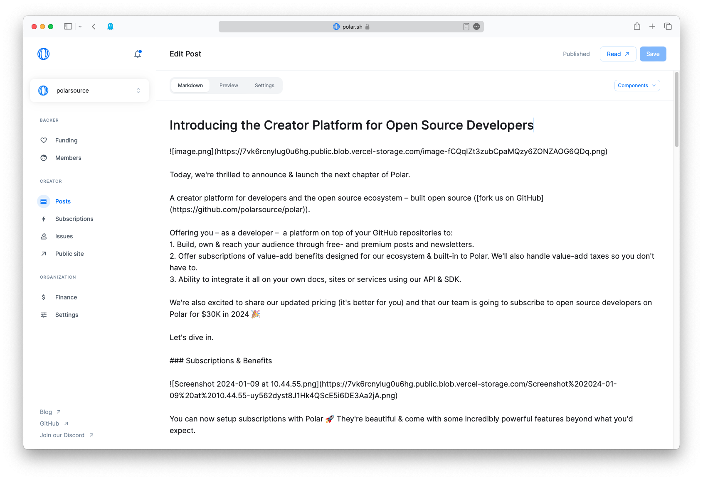
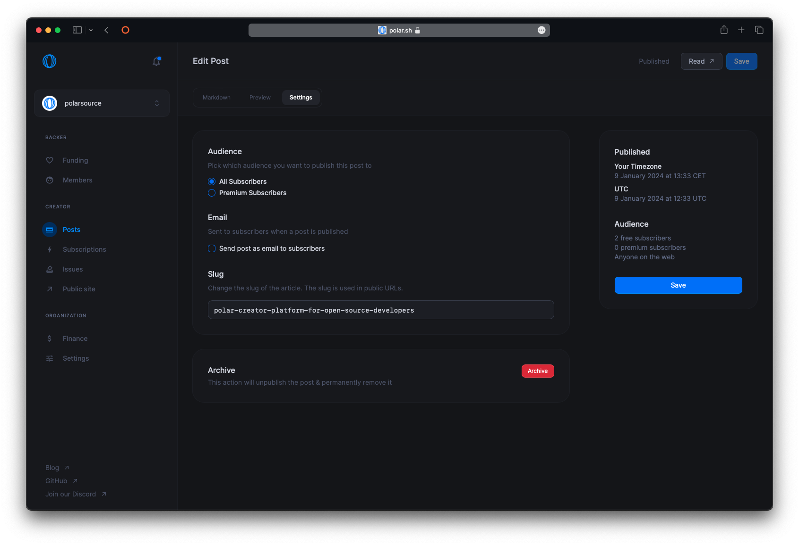
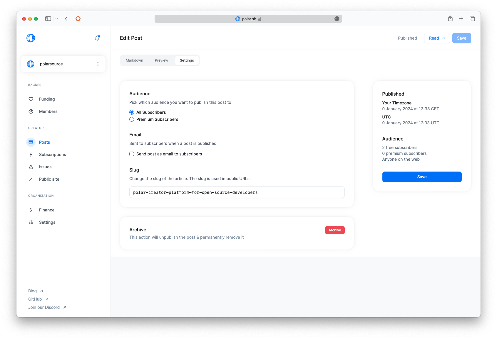

# Newsletters

Polar has a powerful blog and newsletter engine called "Newsletters".

Newsletters can be published on your site on Polar (`polar.sh/USERNAME`) and sent via emails to all of your subscribers. As an example, checkout [Polars page on Polar](https://polar.sh/polarsource).




## Editor

The editor is fully built on [Markdown](https://www.markdownguide.org/basic-syntax/) with some custom extensions.




### Custom extensions

#### `<Paywall>`

Use the Paywall element to make content available only to your paid subscribers. Non-subscribers and free subscribers will instead see a placeholder notifying them about that the content is only avaialble to paid subscribers.

```
<Paywall>
Content behind the paywall that's only available to
subscribers of a paid tier with the "Premium newsletters"
benefit.
</Paywall>
```

#### `<SubscribeNow />`

The SubscribeNow element inserts a button in the content to non-subscribers reminding them that they should subscribe to you on Polar. The button is hidden for existing subscribers.

```
<SubscribeNow />
```

## Publishing & Settings




Newsletters have multiple settings available:

### Audience

* All Subscribers – The post will be public on the internet for everyone to see
* Paid Subscrivers - The post will only be visible for your paid subscribers

### Email

Check "Send post as email to subscribers" to also send the post as a newsletter via email to your subscribers. If used together with the _Audience_ setting, the post can be restricted to be only sent to your paid subscribers.

