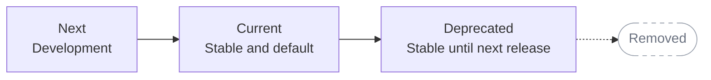

Polar uses date-based API versions to evolve the API without unexpectedly changing
the contract your integration depends on. Versions use the `YYYY-MM` format, such
as `2026-10`, and apply to API requests, responses, webhook payloads, and SDK types.

<Warning>
  Pin a version in every production integration. If you don't, your requests use
  the Current version, which changes at each quarterly release.
</Warning>

## Choosing a version

Polar maintains three API versions at a time:

| Version        | Stability                                                     | When to use it                                       |
| -------------- | ------------------------------------------------------------- | ---------------------------------------------------- |
| **Current**    | Stable and the default                                        | New production integrations                          |
| **Deprecated** | Stable until the next quarterly release, when it is removed   | Existing integrations while you migrate to Current   |
| **Next**       | In development and may introduce breaking changes at any time | Testing upcoming features before they become Current |

Don't start a new integration on Deprecated. Use Next only if you need an upcoming
feature and can adapt to changes during the development cycle.

## Version lifecycle

Polar releases a new API version during the first week of January, April, July,
and October. At each release:

1. Deprecated is removed and no longer accepts requests.
2. Current becomes Deprecated.
3. Next becomes Current and its API contract is frozen.
4. A new Next version is created for ongoing development.

Each version is supported for approximately nine months: three months as Next,
three months as Current, and three months as Deprecated.



Current and Deprecated are frozen. New endpoints and any changes to request or
response schemas (including additive changes such as a new optional field) are
introduced in Next. Bug fixes, performance improvements, and internal changes can
be released to stable versions when they don't change the public API contract.
The versioned contract includes endpoints, fields and types, validation rules,
status and error responses, and authentication requirements.

## Pinning API requests

Set the version with the `Polar-Version` request header. The base URL and endpoint
paths remain the same:

```bash
curl -i https://api.polar.sh/v1/products/ \
  -H "Authorization: Bearer $POLAR_ACCESS_TOKEN" \
  -H "Polar-Version: 2026-10" \
  -H "Accept: application/json"
```

Responses include the version used to process the request:

```http
Polar-Version: 2026-10
```

If the header is omitted, Polar uses Current. A malformed, unknown, or removed
version returns `404 Not Found`.

## Pinning webhooks

Webhook endpoints are versioned independently from API requests so their payloads
remain stable across release cycles. Set `api_version` when you create an endpoint:

```json
{
  "url": "https://example.com/webhooks",
  "format": "raw",
  "events": ["order.created"],
  "api_version": "2026-10"
}
```

If you omit `api_version`, the endpoint uses Current. Only supported API versions
are accepted.

The selected version determines which fields are included in future raw event
payloads. You can update an endpoint's `api_version`, but the change applies only
to events created afterward. Existing events retain their original version, so a
redelivery has the same payload contract as the first delivery.

Every delivery includes the selected version in the `webhook-api-version` header.
Raw JSON payloads also include it in the `api_version` field.

Use the same version for API requests and webhooks unless you intentionally support
different contracts. Updating the version used by your API client does not migrate
existing webhook endpoints; upgrade them separately.

## Pinning SDKs

The [Python SDK](/integrate/sdk/python) and
[TypeScript SDK](/integrate/sdk/typescript) include typed clients and models for
each supported API version. Importing a versioned client automatically sets the
matching `Polar-Version` header:

<Tabs>
  <Tab title="Python">

    ```py
    from polar.v2026_10 import Polar
    ```

  </Tab>
  <Tab title="JavaScript">

    ```ts
    import { createPolar } from "@polar-sh/sdk/2026-10";
    ```

  </Tab>
</Tabs>

The SDK package version and API version are separate. Updating the package can
deliver fixes without changing your API contract; changing the version in the
import path upgrades the API contract.

## Upgrading versions

Upgrade before your pinned version is removed:

1. Review the new version's API reference and release notes.
2. Change the `Polar-Version` header or versioned SDK import in your sandbox
   environment.
3. Run your integration tests and update code for changed endpoints, fields, or
   webhook payloads.
4. Upgrade webhook endpoints that should use the new contract.
5. Deploy the API client change and confirm the `Polar-Version` response header.
