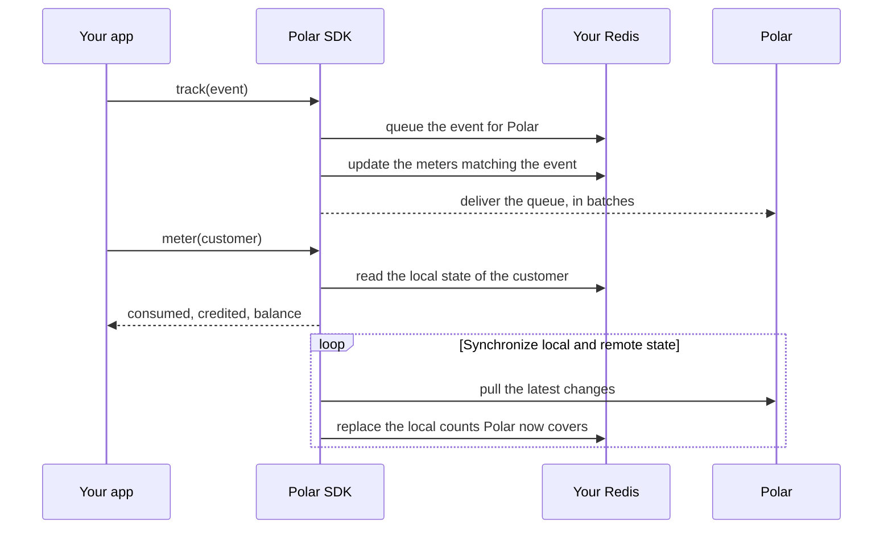

**Outpost** is the part of the Polar SDK that answers meter reads from your own Redis. It gives you two things:

- Balance checks on every request, without a call to Polar.
- Event delivery that survives network issues between you and Polar.

Outpost keeps a copy of each customer's meter usage in a Redis database you own. It updates that copy when you track an event, and answers balance reads from it. A queue in the same Redis batches your events and delivers them to Polar.

Polar stays the source of truth. When its totals change, Outpost pulls them and replaces its copy.

Use Outpost when you check a balance on every request, and a round trip to Polar on each check is too slow. In our load test at 10,000 events per second, a read took 1.7 ms at the median.

## What to expect

- A read sees every event tracked on any instance that shares the Redis, as soon as `track()` returns.
- Once Outpost knows a customer, reads stay in your Redis.
- A credit granted in Polar reaches local reads within 30 seconds.
- Polar's own meter reads catch up within minutes, once Polar has ingested the events.
- Outpost reports the balance. Your code decides whether to serve the request.

## Configuration

### Prepare Redis

Outpost needs a Redis that every instance of your application can reach. Give it a database of its own, and one per environment: sandbox and production must not share one.

The queue holds your events until Polar has them, so configure Redis to keep them:

- **Turn on AOF persistence** (`appendonly yes`). With snapshots alone, a restart loses the events queued since the last snapshot. With AOF and `appendfsync everysec`, it loses at most one second. See Redis's [persistence guide](https://redis.io/docs/latest/operate/oss_and_stack/management/persistence/).
- **Set `maxmemory-policy` to `noeviction`.** Other policies can delete queued events. With `noeviction`, a full Redis refuses new events and `track()` fails, so you see it.

### Use an access token with events:write

Outpost uses your client's token: an organization access token with the `events:write` scope, the one event ingestion already needs.

### Use the Redis queue

Outpost needs `RedisEventQueue`, on every runtime. `metering()` uses `MemoryEventQueue` by default, so pass the Redis queue yourself.

`RedisEventQueue` keeps each event in Redis until Polar has it. An event Outpost has counted reaches Polar even if the process dies, or a serverless function freezes before it sends its events.

Your instances share one queue: they send events to Polar in shared batches, and wait together when Polar is busy. Pass the queue and Outpost the same Redis URL, and they share one connection.

### Start metering

Outpost is off by default. Pass the queue and Outpost to `metering()`.

<Tabs>
  <Tab title="TypeScript">
    Outpost and `RedisEventQueue` need the optional `ioredis` and `@opentelemetry/*` peer dependencies; the rest of the SDK does not.

    ```typescript
    import { createPolar } from "@polar-sh/sdk/2026-10";
    import { RedisEventQueue } from "@polar-sh/sdk/metering/queue/redis";
    import { outpost } from "@polar-sh/sdk/outpost";

    const redisUrl = process.env.REDIS_URL!;
    const polar = createPolar({ accessToken: process.env.POLAR_ACCESS_TOKEN! });

    const metering = polar.metering({
      queue: new RedisEventQueue(redisUrl, { stream: "polar:events" }),
      outpost: outpost({ redis: redisUrl }),
    });
    ```

    `metering()` takes:

    | Option       | Default                  | Meaning                                                                   |
    | ------------ | ------------------------ | ------------------------------------------------------------------------- |
    | `queue`      | `new MemoryEventQueue()` | The queue that delivers events to Polar. Outpost needs `RedisEventQueue`. |
    | `outpost`    | `undefined`              | Outpost, from `outpost()`. Without it, reads call Polar's API.            |
    | `onAck`      | `undefined`              | Called with each batch Polar accepted; may be async.                      |
    | `onRejected` | `undefined`              | Called with the events Polar refused, and why; may be async.              |

    `outpost()` throws if neither `redis` nor `REDIS_URL` is set. It takes:

    | Option            | Default                          | Meaning                                                               |
    | ----------------- | -------------------------------- | --------------------------------------------------------------------- |
    | `redis`           | `REDIS_URL` environment variable | A Redis URL, or an `ioredis` client you own.                          |
    | `telemetry`       | `true`                           | Send Outpost metrics and traces to Polar.                             |
    | `snapshotTimeout` | `5000`                           | Milliseconds the first read of a customer waits for Polar's totals.   |

    `new RedisEventQueue(redis, { stream })` takes a Redis URL or an `ioredis` client you own, and the stream's key. Use one stream per Polar environment and organization.
  </Tab>
  <Tab title="Python">
    Outpost and `RedisEventQueue` need the `outpost` extra: `pip install "polar-sdk[outpost]"`.

    ```python
    import os

    from polar.metering.queue.redis import RedisEventQueue
    from polar.v2026_10 import PolarAsync

    redis_url = os.environ["REDIS_URL"]

    async with PolarAsync(os.environ["POLAR_ACCESS_TOKEN"]) as polar:
        async with polar.metering(
            queue=RedisEventQueue(redis_url, stream="polar:events"),
            outpost={"redis": redis_url},
        ) as metering:
            ...
    ```

    `metering()` takes:

    | Option        | Default              | Meaning                                                                                    |
    | ------------- | -------------------- | ------------------------------------------------------------------------------------------ |
    | `queue`       | `MemoryEventQueue()` | The queue that delivers events to Polar. Outpost needs `RedisEventQueue`.                  |
    | `outpost`     | `None`               | `True` to use `REDIS_URL`, or a dictionary of options. Without it, reads call Polar's API. |
    | `on_ack`      | `None`               | Async function called with each batch Polar accepted.                                      |
    | `on_rejected` | `None`               | Async function called with the events Polar refused, and why.                              |

    `outpost` raises if neither `redis` nor `REDIS_URL` is set. Its dictionary takes:

    | Option             | Default                          | Meaning                                                            |
    | ------------------ | -------------------------------- | ------------------------------------------------------------------ |
    | `redis`            | `REDIS_URL` environment variable | A Redis URL, or an asynchronous `redis` client you own.            |
    | `telemetry`        | `True`                           | Send Outpost metrics and traces to Polar.                          |
    | `snapshot_timeout` | `5`                              | Seconds the first read of a customer waits for Polar's totals.     |

    `RedisEventQueue(redis, stream=...)` takes a Redis URL or an asynchronous `redis` client you own, and the stream's key. Use one stream per Polar environment and organization.
  </Tab>
</Tabs>

### Track and read

Give each event an `external_id`, such as your request ID. Outpost counts an event once per `external_id`, so a retried request doesn't count twice. Without one, `track()` makes one up, and a retry counts again.

<Note>
  If you track an event again after Polar has stored it, Polar ignores it, but Outpost counts it once more. Outpost corrects this the next time it syncs with Polar, within a few minutes.
</Note>

Call `actor()` when a session, a conversation or an agent run starts. The first read of a customer waits for Polar's totals, up to 5 seconds. `actor()` does that wait up front, so the reads that decide whether to serve answer from Redis.

<Tabs>
  <Tab title="TypeScript">
    ```typescript
    // When the session starts
    const actor = await metering.actor({ external_customer_id: "customer_123" });

    // On each request of the session
    const meter = await actor.meter("meter_uuid");
    if (meter !== null && meter.balance <= 0) {
      // Decline the call, switch to a cheaper model, or ask for a top-up.
    }
    await actor.track({ name: "api_request", external_id: "req_42", metadata: { tokens: 42 } });
    ```
  </Tab>
  <Tab title="Python">
    ```python
    # When the session starts
    actor = await metering.actor(external_customer_id="customer_123")

    # On each request of the session
    meter = await actor.meter("meter_uuid")
    if meter is not None and meter.balance <= 0:
        ...  # Decline the call, switch to a cheaper model, or ask for a top-up.
    await actor.track(name="api_request", external_id="req_42", metadata={"tokens": 42})
    ```
  </Tab>
</Tabs>

A read returns `consumed_units`, `credited_units` and `balance` for one meter. The balance is credits minus consumption, as in Polar.

When Outpost can't answer, `meter()` asks Polar's API instead, with a round trip: the customer's totals haven't arrived yet, Redis is down, or Outpost doesn't know the meter.

### Flush in serverless functions

A long-running server sends its events every second on its own. A serverless function freezes once it answers, so flush after each response:

<Tabs>
  <Tab title="TypeScript">
    On Next.js, flush in `after()`: the function stays alive until the flush ends, and the response does not wait for it.

    ```typescript
    import { after } from "next/server";

    after(() => metering.flush());
    ```
  </Tab>
  <Tab title="Python">
    Flush before you return the response.

    ```python
    await metering.flush()
    ```
  </Tab>
</Tabs>

`flush()` sends this instance's events and doesn't wait for the rest of your instances. If a delivery fails, the events stay queued for the next flush.

### Delivery callbacks

`onAck` runs with each batch Polar accepted, and `onRejected` with the events Polar refused for good. They run on whichever instance sent the batch, so a batch can hold events from other instances' requests. An instance that stops mid-batch can run them twice on the same events: make them safe to repeat. Keep them short, because the instance waits for them before it sends its next batch. An error they throw goes to your logs.

## Performance and sizing

A local read at 10,000 events per second:

| Local read (`meter()`) | Latency |
| ---------------------- | ------- |
| Median                 | 1.7 ms  |
| p95                    | 14 ms   |
| p99                    | 25 ms   |

Measured on Polar's test environment, with the TypeScript SDK on Vercel and one Redis instance. Redis set the ceiling, near 12,000 events per second.

If you hit limits on Outpost performance, reach out [to the team](/support).

## Technical details

### How it works


```mermaid
sequenceDiagram
    participant App as Your app
    participant SDK as Polar SDK
    participant Redis as Your Redis
    participant Polar

    App->>SDK: track(event)
    SDK->>Redis: queue the event for Polar
    SDK->>Redis: update the meters matching the event
    SDK-->>Polar: deliver the queue, in batches
    App->>SDK: meter(customer)
    SDK->>Redis: read the local state of the customer
    SDK-->>App: consumed, credited, balance
    loop Synchronize local and remote state
        SDK->>Polar: pull the latest changes
        SDK->>Redis: replace the local counts Polar now covers
    end
```

Every instance of your application that uses the same Redis shares the same state and the same queue. One instance at a time pulls Polar's changes for all of them.

### When something is down

**Redis is down.** `track()` throws the Redis client's error, at once if the connection is lost, or after 5 seconds if Redis stops answering. The event is not queued. Your code decides whether to serve the request, and whether to track the event again. `meter()` asks Polar's API instead. Outpost reconnects on its own.

**Only Outpost fails.** `track()` logs a warning and returns. The event still reaches Polar, and local reads catch up at the next sync.

**Polar is down or busy.** Reads keep answering, with Polar's last totals plus every event tracked since. The queue keeps the events and retries, waiting longer each time, up to a minute. A customer Outpost has never seen can't be read until Polar answers.

**Polar is down for a long time.** The queue grows until Redis is full, then `track()` fails. Size your Redis memory for the outage you want to survive, and watch it.

**Polar refuses an event.** When Polar can never accept an event, an invalid one for example, the queue drops it and passes it to `onRejected`. Polar doesn't bill it, and Outpost stops counting it.

**Your access token stops working.** The queue keeps the events and retries. Reads fall back to Polar's API, which refuses the token too. Fix the token and delivery resumes.

**An instance restarts.** Nothing to rebuild: the state and the queue live in Redis.

**Redis restarts.** With AOF, Redis keeps everything. Without it, the events queued since the last save are lost, and Outpost reloads each customer's totals from Polar at their next read.

### Telemetry

Outpost sends Polar the latency and outcome of reads and writes, connection events, and the gap between local and Polar totals. Polar uses it to improve Outpost. It holds numbers, meter IDs and customer IDs, never your events' metadata.

To turn it off, pass `telemetry: false` to `outpost()` (`"telemetry": False` in Python), or set `POLAR_OUTPOST_TELEMETRY=0`.

### What Outpost stores in Redis

Outpost's keys start with `outpost:v1:`, and the queue's keys with the stream key you chose. A customer costs a few kilobytes, and leaves Redis a day after their last event or read.
